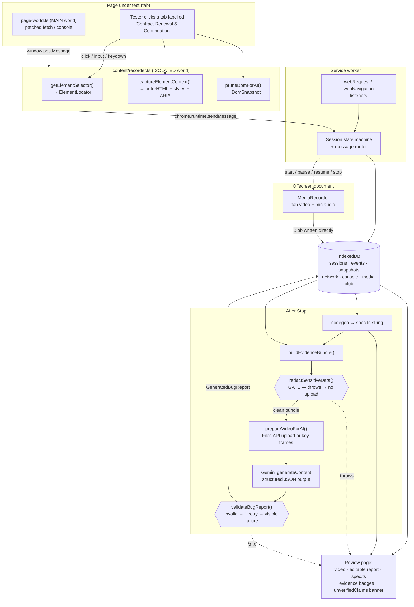

# Tester-Reporter-AI — Architecture and Build Plan

**Chromium MV3 extension that turns a manual QA session into: a video, a runnable Playwright spec, and an AI-written bug report.**

---

## 0. Read this first — honesty and verification notes

**My training cutoff is May 2026.** Both Chromium extension (MV3) capabilities and the
Google Gemini API surface change frequently — field names, model IDs, size limits and
prices have all been renamed or reshaped between releases. **Everything below marked
`⚠️ VERIFY` must be checked against the official documentation before you write production
code.** Do not trust my memory for any of it.

Throughout this document:

- **"This is how it works"** — I am confident about the platform behaviour.
- **"Proposed design"** — this is my recommendation, not a fact about the platform.
- **`⚠️ VERIFY`** — I am not certain, or the thing changes often. Check the docs.

### 0.1 The model ID — RESOLVED BY A REAL CALL

This section originally said I could not confirm that `gemini-3.5-flash` exists, and
warned that it might need replacing.

**A live integration test has since been run against the real API, and it passed 5/5.**
`gemini-3.5-flash` exists, accepts a system instruction, and honours
JSON-schema-constrained output exactly as this design assumes. The caution below was
warranted when written; it is no longer accurate, and leaving it standing would be more
misleading than the original uncertainty was.

Still genuinely unverified for this model: **video input** — the live run sent text
evidence only, so nothing here proves the Files API upload path or the accepted video
MIME types. Those remain ⚠️ VERIFY (V5, V6).

### 0.2 Master verification checklist

Do these before writing any code that touches an external API. Tick them off.

Run `npm run test:live` with a key in `.env` to settle V1–V3 in ten seconds. It has
been run, and they are settled.

| # | Thing to verify | Where | Status |
|---|---|---|---|
| V1 | `gemini-3.5-flash` exists / is GA | Gemini API model list | ✅ **CONFIRMED** by live test |
| V2 | `generateContent` endpoint path and request body shape | Gemini API reference | ✅ **CONFIRMED** by live test |
| V3 | Exact parameter names for structured JSON output (`responseMimeType` + `responseSchema` under `generationConfig`) | Gemini API structured-output docs | ✅ **CONFIRMED** by live test |
| V4 | Parameter name for thinking / reasoning level, and whether this model has one | Gemini API docs | ⬜ still open |
| V5 | Supported video MIME types and max duration | Gemini API video docs | ✅ **CONFIRMED** — a real `video/mp4;codecs=vp9,opus` recording was accepted and analysed |
| V6 | Inline base64 threshold vs. Files API, and the upload flow | Gemini API files docs | ✅ **CONFIRMED** — inline works; the resumable upload of a real browser recording reaches ACTIVE, is readable by `file_uri`, and deletes. Retention window still unread. |
| V7 | Current price per 1M input tokens, per 1M output tokens, and how video seconds are tokenised | Gemini API pricing page | ⬜ still open |
| V8 | `chrome.offscreen` reason enum values (`USER_MEDIA`, `DISPLAY_MEDIA`, `BLOBS`, …) | Chrome offscreen API docs | ✅ **CONFIRMED** — offscreen document created successfully under test |
| V9 | `chrome.tabCapture.getMediaStreamId()` signature + the `getUserMedia` constraint shape used to consume the stream ID | Chrome tabCapture docs + offscreen recording sample | ✅ **ANSWERED** — requires prior invocation (activeTab); host permissions do not satisfy it. A keyboard command counts as an invocation, and the constraint shape is confirmed working up to the compositor. |
| V10 | Whether a microphone permission prompt can be raised from an offscreen document | Chrome offscreen / permissions docs | ⬜ still open — this machine reports **zero** `audioinput` devices, so the question cannot be answered here |
| V11 | MV3 service-worker idle-termination semantics as of the Chrome version you target | Chrome service worker lifecycle docs | ✅ **EXERCISED** — worker survives a full session; state in storage.session works |
| V12 | `MediaRecorder` MP4 support in your target Chrome | Test in the browser, not the docs | ✅ **CONFIRMED** — Chromium 149 selected `video/mp4;codecs=vp9,opus` |
| V13 | `content_scripts[].world: "MAIN"` minimum Chrome version | Chrome content scripts docs | ✅ **CONFIRMED** — world: MAIN content script runs at document_start |
| V14 | Whether `chrome.webRequest` (non-blocking) still reports `statusCode` in `onCompleted`/`onErrorOccurred` in MV3 with only host permissions | Chrome webRequest docs | ✅ **CONFIRMED** — webRequest reports statusCode 500 under MV3 with host permissions |
| V15 | Whether `fetch()` to `generativelanguage.googleapis.com` from an MV3 service worker needs the host in `host_permissions` (I assume yes) | Chrome CORS-for-extensions docs | ✅ **CONFIRMED** — fetch to generativelanguage.googleapis.com works from the extension |

---

## 0.3 Constraint reasoning (this drove the architecture — read before section 1)

I worked the hard constraints out first and let them dictate the component layout. Here
they are, with the architectural consequence of each.

**C1 — An MV3 service worker has no DOM and gets terminated when idle.**
It cannot hold a `MediaRecorder`, cannot use `navigator.mediaDevices`, cannot hold a
`Blob` in memory across a 5-minute recording, and cannot be trusted to keep an in-memory
array of events. *Consequence:* the service worker is a **router and a coordinator only**.
Every piece of durable state lives in IndexedDB, written by whoever produces it.
⚠️ VERIFY (V11): exact idle behaviour in your Chrome version; the practical rule
"assume it can die between any two messages" is safe regardless.

**C2 — `MediaRecorder` must live in a real document.**
The only MV3-legal place for a long-lived invisible document is an **offscreen document**
(`chrome.offscreen`, Chrome 109+). *Consequence:* one offscreen document owns the
microphone, the tab stream, the `AudioContext` mixdown, the `MediaRecorder`, and writing
the finished `Blob` to IndexedDB.

**C3 — A page's own `fetch`/`console` can only be patched from the MAIN world.**
An isolated-world content script sees a different `window`. *Consequence:* a
`world: "MAIN"` content script at `document_start` does the patching, and talks to the
isolated content script over `window.postMessage`, because the MAIN world has no
`chrome.runtime.sendMessage`.

**C4 — Large binary data must never travel over `chrome.runtime.sendMessage`.**
Message payloads are structured-cloned and a 60 MB video would either fail or stall the
browser. *Consequence:* the offscreen document writes the video `Blob` **directly to
IndexedDB** (shared per-extension-origin) and messages only a record ID.

**C5 — A multimodal request carrying video + DOM + a script has a hard practical ceiling.**
Inline base64 has a small request-size cap (⚠️ VERIFY V6), and video is expensive in
tokens. *Consequence:* video goes through the **Files API** (upload, then reference by
URI), size is controlled **at record time** rather than by re-encoding afterwards, and
there is a **key-frame fallback** that needs no third-party encoder.

**C6 — Redaction cannot be an afterthought.**
Once a password reaches Google it cannot be recalled. *Consequence:* redaction is a
**gate**, not a filter: `buildEvidenceBundle()` calls it, and if it throws, the API call
never happens.

**C7 — The tester must never lose their recording because the AI failed.**
*Consequence:* the video and the Playwright spec are produced and persisted **before** any
network call to Gemini. AI report generation is a separate, retryable step against a
already-saved session.

---

## 1. Goal and Scope

### Goal, restated

A manual QA tester presses Record, does their normal test steps on a bilingual (EN/AR)
staging web app, narrates what looks wrong into their microphone, and presses Stop. In
under two minutes they walk away with three things: a playable video of the session, a
runnable Playwright TypeScript spec that reproduces the steps, and a written defect report
in the team's fixed template. The report is not a paraphrase of a text summary — it is
written by a multimodal model that is handed the real rendered page code, the real action
script, and the real video at the same time, and asked to work out the defect from that
evidence the way a QA lead would. Everything runs locally in the browser except the single
call to Gemini.

### In scope

- Chromium only (Chrome, Edge, Brave), Manifest V3.
- Record / Pause / Resume / Stop from a side panel.
- Interaction capture: clicks, typing, selects, checkboxes/radios, navigation, tab
  changes, reloads, URL changes, interaction-relevant scrolls, state-changing hovers,
  Enter/Tab/Escape.
- Page code capture: pruned whole-page DOM snapshots + bounded per-element context with
  computed styles, ARIA state, and `lang`/`dir`.
- Tab video + microphone audio in one file, surviving pause/resume.
- Network capture (method, URL, status, timing, bodies where feasible) and console
  errors / unhandled rejections.
- Playwright `.spec.ts` generation in the same long-explicit-boring style.
- One Gemini call producing a schema-validated `GeneratedBugReport`.
- Review page: video player, editable report, script with copy/download, evidence badges,
  delete session / clear all data.
- Redaction gate before any upload; explicit one-time consent for video upload.

### Explicitly NOT in scope (stated back, not designed for)

- No test-management platform, no Jira / Azure DevOps integration in v1.
- No Firefox or Safari. Chromium only.
- No accounts, no team collaboration, no cloud sync.
- No self-healing or AI-repaired selectors.
- No fine-tuning, no RAG over a design-spec database.
- No backend server. See the justification below.

### Why there is no backend server in v1 (the required paragraph)

A backend would buy exactly two things: it would hide the Gemini API key from the tester's
machine, and it could transcode video server-side. Neither is worth it here. The key is
the *tester's own* Google AI Studio key, entered by them and used only for their own
sessions — hiding it from its own owner protects nobody, and the realistic threat (another
person with access to the same logged-in browser profile) is not solved by a server
either. Transcoding is avoided entirely by controlling resolution, frame rate and bitrate
*at record time* and by falling back to key-frame images rather than re-encoding. Against
that, a server would add an upload of every tester's session video and full page DOM —
including staging data — to infrastructure someone must now secure, operate and pay for,
and it would put a second network hop in front of the one feature that must feel instant.
Everything stays local; the only outbound traffic is one HTTPS call from the extension to
Google. If the team later needs shared storage or centralised keys, that is a v2 decision
with a real requirement behind it, not a v1 default.

---

## 2. Architecture Overview

| Component | Responsibility (one line) |
|---|---|
| **Side panel UI** (`sidepanel/`) | Record / Pause / Resume / Stop controls, live event counter, consent checkbox, link to the review page. |
| **Review page** (`review/`) | Full extension tab: video player, editable bug report, Playwright spec with copy/download, evidence badges, delete/clear. |
| **Options page** (`options/`) | Gemini API key entry, model selection from `SUPPORTED_MODELS`, report language, redaction pattern config. |
| **Service worker** (`background/`) | The only stateful coordinator: owns the session lifecycle state machine, routes messages, creates/destroys the offscreen document, listens to `webNavigation` and `webRequest`, and runs the Gemini call. |
| **Content script — isolated world** (`content/recorder.ts`) | Listens to real user events, builds `ElementLocator`s, captures element context and DOM snapshots, forwards everything to the service worker. |
| **Injected page-world script** (`content/page-world.ts`) | Patches `fetch`, `XMLHttpRequest`, `console.error/warn`, `window.onerror` and `unhandledrejection`; posts findings to the isolated content script via `window.postMessage`. |
| **Offscreen document** (`offscreen/`) | Owns `getUserMedia` (mic) + tab stream, mixes audio, runs `MediaRecorder` with pause/resume, writes the finished `Blob` straight to IndexedDB. |
| **Storage layer** (`storage/`) | Thin, explicit IndexedDB wrapper: sessions, events, snapshots, network entries, console entries, media blobs, generated reports. |
| **DOM capture module** (`capture/`) | `pruneDomForAI()`, `captureElementContext()`, `getElementSelector()` — pure functions, no chrome APIs, unit-testable. |
| **Codegen module** (`codegen/`) | Turns the ordered `RecordedEvent[]` into a `.spec.ts` string: coalescing, waits, assertions, frame handling. |
| **Evidence-bundle builder** (`ai/bundle.ts`) | `buildEvidenceBundle()` + `redactSensitiveData()` + truncation to budget. The redaction gate lives here. |
| **Gemini client** (`ai/gemini.ts`) | Files-API upload, `generateContent` call, structured-output request, retry/backoff, `validateBugReport()`. |
| **Report formatter** (`ai/format.ts`) | `formatReportAsPlainText()` — the extension owns the layout, the model only returns data. |

---

## 3. Data Flow Diagram



**The invariant to read off this diagram:** the video Blob and the `.spec.ts` string reach
IndexedDB and the review page along paths that do not pass through Gemini. Every dotted
failure arrow still lands on the review page with the artifacts intact.

---

## 4. Folder and File Structure

```
Tester-Reporter-AI/
├─ PLAN.md                              This document.
├─ README.md                            How to build, run and read the project.
├─ package.json                         Deps + scripts (esbuild, typescript, @types/chrome, jsdom).
├─ tsconfig.json                        Strict TS config; "strict": true, no implicit any.
├─ scripts/
│  ├─ build.mjs                         One esbuild call per entry point, then a copy pass.
│  └─ build-tests.mjs                   Bundles tests/test-api.ts for the node:test suite.
├─ tests/                               78 tests; jsdom is a test-only dependency.
├─ public/
│  ├─ manifest.json                     MV3 manifest (see section 13).
│  └─ icons/                            16/32/48/128 px extension icons.
└─ src/
   ├─ shared/
   │  ├─ types.ts                       ALL shared TypeScript interfaces (section 5).
   │  ├─ constants.ts                   SUPPORTED_MODELS, budgets, size caps, timeouts.
   │  ├─ messages.ts                    Discriminated union of every cross-context message.
   │  ├─ logger.ts                      Namespaced console logging, off by default in prod.
   │  └─ time.ts                         Media-clock helpers: wall clock ↔ video offset.
   ├─ background/
   │  ├─ service-worker.ts              Entry point; wires up all listeners below.
   │  ├─ session-state.ts               The recording state machine (idle→recording→paused→stopping).
   │  ├─ message-router.ts              Typed dispatch for every MessageFromContent / MessageFromUi.
   │  ├─ offscreen-manager.ts           Create / query / close the offscreen document.
   │  ├─ navigation-listener.ts         chrome.webNavigation + chrome.tabs → navigate/url-change events.
   │  └─ network-listener.ts            chrome.webRequest → NetworkEntry status codes and timing.
   ├─ content/
   │  ├─ recorder.ts                    ISOLATED-world entry: event listeners + capture orchestration.
   │  ├─ event-handlers.ts              One small handler per DOM event type.
   │  ├─ page-world.ts                  MAIN-world entry: fetch/XHR/console patches.
   │  ├─ bridge.ts                      window.postMessage protocol between MAIN and ISOLATED.
   │  └─ snapshot-scheduler.ts          Decides WHEN a DomSnapshot is significant enough to take.
   ├─ capture/
   │  ├─ selector.ts                    getElementSelector() and the fallback chain (section 7).
   │  ├─ prune-dom.ts                   pruneDomForAI() and its policy tables (section 8).
   │  ├─ element-context.ts             captureElementContext(): ancestors, siblings, styles, ARIA.
   │  ├─ accessible-name.ts             Minimal accessible-name computation (label/aria-label/text).
   │  └─ visibility.ts                  isElementVisible(), isElementInteractive().
   ├─ offscreen/
   │  ├─ offscreen.html                 Empty document that hosts the recorder.
   │  └─ offscreen.ts                   Stream setup, audio mixdown, MediaRecorder, pause/resume.
   ├─ storage/
   │  ├─ db.ts                          openDatabase(): object stores, indexes, version upgrades.
   │  ├─ sessions.ts                    CRUD for RecordingSession.
   │  ├─ events.ts                      Append + range-read for RecordedEvent.
   │  ├─ artifacts.ts                   DomSnapshot / NetworkEntry / ConsoleEntry stores.
   │  ├─ media.ts                       Blob put/get/delete + quota checks (storeMediaBlob lives here).
   │  └─ settings.ts                    chrome.storage.local wrapper for the API key and options.
   ├─ codegen/
   │  ├─ generate-spec.ts               Top-level: RecordedEvent[] → .spec.ts source string.
   │  ├─ coalesce-events.ts             Merge keystrokes into one fill(), drop noise events.
   │  ├─ locator-to-playwright.ts       ElementLocator → Playwright locator expression string.
   │  └─ assertions.ts                  Derive waits and expect() calls instead of sleeps.
   ├─ ai/
   │  ├─ bundle.ts                      buildEvidenceBundle() + truncation rules.
   │  ├─ redact.ts                      redactSensitiveData() — the non-negotiable gate.
   │  ├─ prompt.ts                      The exact system instruction text (section 12.6).
   │  ├─ schema.ts                      GeneratedBugReport TS interface + JSON schema object.
   │  ├─ video.ts                       prepareVideoForAI() + key-frame fallback.
   │  ├─ gemini.ts                      Files upload + generateContent + retry/backoff.
   │  ├─ validate.ts                    validateBugReport().
   │  └─ format.ts                      formatReportAsPlainText().
   ├─ sidepanel/
   │  ├─ sidepanel.html                 Recording controls markup.
   │  └─ sidepanel.ts                   Button wiring + live status from the service worker.
   ├─ review/
   │  ├─ review.html                    Review/export page markup.
   │  ├─ review.ts                      Loads a session, renders video/report/spec, handles edits.
   │  ├─ evidence-badges.ts             Renders evidenceUsed as badges and unverifiedClaims banner.
   │  └─ review.css                     Styling, including RTL support for Arabic reports.
   └─ options/
      ├─ options.html                   Settings markup.
      └─ options.ts                     API key + model + language + redaction patterns.
```

---

## 5. Data Model

All of this lives in `src/shared/types.ts`. Every field is typed; nothing is `any`.

```typescript
// =============================================================================
// src/shared/types.ts
// Every interface that crosses a context boundary or is persisted lives here.
// One file, so a junior developer never has to hunt for a type definition.
// =============================================================================

// -----------------------------------------------------------------------------
// Element identification
// -----------------------------------------------------------------------------

/**
 * The named strategies we use to find an element again, in priority order.
 * WHY: the codegen and the AI both need to know HOW confident we are in a
 * locator, not just what the locator string is.
 */
export type LocatorStrategy =
  | "test-id"          // [data-testid="x"] and friends. Most stable.
  | "role-and-name"    // getByRole('button', { name: 'Save' })
  | "label"            // getByLabel('Tenant ID')
  | "placeholder"      // getByPlaceholder('Search')
  | "alt-text"         // getByAltText('Company logo')
  | "title"            // getByTitle('Close')
  | "exact-text"       // getByText('Contract Renewal & Continuation', { exact: true })
  | "css-path"         // A short, attribute-based CSS path.
  | "xpath";           // Absolute XPath. Last resort, brittle by design.

/**
 * One candidate way of finding the element. We always store several.
 * WHY: if the primary one turns out to be non-unique at replay time, the
 * junior tester has a written list of alternatives right there in the spec.
 */
export interface LocatorCandidate {
  strategy: LocatorStrategy;
  /** The raw value: the test-id, the accessible name, the CSS path, etc. */
  value: string;
  /** For "role-and-name" only: the ARIA role. Empty string otherwise. */
  role: string;
  /** How many elements matched this candidate at capture time. 1 is what we want. */
  matchCount: number;
  /** True when matchCount === 1 at capture time. */
  isUniqueAtCaptureTime: boolean;
}

/**
 * One step in the chain of iframes leading to the element.
 * WHY: Playwright needs frameLocator() calls in the same order.
 */
export interface FrameStep {
  /** Chrome's frame id, useful for correlating with webNavigation events. */
  frameId: number;
  /** A CSS selector that finds this <iframe> inside its PARENT document. */
  frameSelector: string;
  /** The frame's URL at capture time, for the human reading the spec. */
  frameUrl: string;
}

/**
 * The complete "how do I find this element again" record.
 */
export interface ElementLocator {
  /** The strategy we chose as primary. */
  strategy: LocatorStrategy;
  /** The chosen candidate. */
  primary: LocatorCandidate;
  /** Every other candidate we managed to build, best first. */
  fallbacks: LocatorCandidate[];
  /** Empty array when the element is in the top-level document. */
  framePath: FrameStep[];
  /** True when the element lives inside one or more open shadow roots. */
  isInShadowDom: boolean;
  /**
   * CSS selectors for each shadow host, outermost first.
   * WHY: Playwright's CSS engine pierces OPEN shadow roots automatically, so we
   * do not usually need these — but we record them so the spec can carry a
   * comment explaining the structure to the tester.
   */
  shadowHostSelectors: string[];
  /** The element's tag name, lower case. e.g. "button". */
  tagName: string;
  /** The element's computed ARIA role, or "" if none could be determined. */
  ariaRole: string;
  /** The visible text of the element, trimmed and capped. */
  visibleText: string;
  /** The computed accessible name, or "" if none. */
  accessibleName: string;
}

// -----------------------------------------------------------------------------
// Recorded interaction events
// -----------------------------------------------------------------------------

/**
 * Every kind of thing we record. Keep this list closed — codegen switches on it
 * exhaustively, so adding a member forces you to handle it everywhere.
 */
export type RecordedEventType =
  | "session-start"
  | "navigate"          // A real navigation (top-level document load).
  | "url-change"        // SPA history.pushState / replaceState.
  | "reload"
  | "tab-activated"
  | "click"
  | "dblclick"
  | "input"             // Coalesced typing into a text field.
  | "select-option"
  | "check"
  | "uncheck"
  | "press-key"         // Enter / Tab / Escape and other named keys.
  | "hover"             // Only recorded when it caused a visible state change.
  | "scroll"            // Only recorded when it immediately preceded an interaction.
  | "tester-note"       // Optional manual marker the tester can drop mid-session.
  | "session-stop";

/**
 * One recorded user action.
 * WHY two clocks: wallClockMs is real time; videoOffsetMs is the position in the
 * RECORDED MEDIA, which is shorter than real time because pauses are not
 * recorded. The AI is given videoOffsetMs so it can look at the right frame.
 */
export interface RecordedEvent {
  /** Monotonic within a session, starting at 0. Also the ordering key. */
  index: number;
  sessionId: string;
  type: RecordedEventType;
  /** Date.now() at capture. */
  wallClockMs: number;
  /** Position inside the recorded video, in milliseconds. -1 if unknown. */
  videoOffsetMs: number;
  /** The page URL at the moment of the event. */
  pageUrl: string;
  /** document.title at the moment of the event. */
  pageTitle: string;
  /** Chrome tab id, so multi-tab journeys can be reconstructed. */
  tabId: number;
  /** Chrome frame id; 0 for the top-level frame. */
  frameId: number;
  /** null for events with no element (navigate, reload, tab-activated). */
  locator: ElementLocator | null;
  /**
   * For "input": the FINAL value of the field, already redacted if sensitive.
   * For "select-option": the chosen option value.
   * For "press-key": the key name, e.g. "Enter".
   * For "scroll": "x,y" as a string.
   * Empty string when not applicable.
   */
  value: string;
  /** True when `value` was replaced by a redaction marker. */
  valueWasRedacted: boolean;
  /** Viewport coordinates of the interaction; -1 when not applicable. */
  clientX: number;
  clientY: number;
  /** Id of the DomSnapshot taken at this moment, or "" if none was taken. */
  domSnapshotId: string;
  /** Id of the ElementContext captured for this event, or "" if none. */
  elementContextId: string;
}

// -----------------------------------------------------------------------------
// Page code capture
// -----------------------------------------------------------------------------

/** Why we decided this moment was worth a full-page snapshot. */
export type SnapshotTrigger =
  | "first-load"
  | "navigation"
  | "url-change"
  | "interaction"
  | "console-error"
  | "network-failure"
  | "session-stop";

/**
 * A pruned whole-page HTML snapshot.
 */
export interface DomSnapshot {
  id: string;
  sessionId: string;
  /** The index of the RecordedEvent this snapshot belongs to, or -1. */
  eventIndex: number;
  trigger: SnapshotTrigger;
  wallClockMs: number;
  videoOffsetMs: number;
  pageUrl: string;
  pageTitle: string;
  /** <html lang="..."> resolved value, or "" if absent. */
  documentLang: string;
  /** <html dir="..."> resolved value: "ltr", "rtl" or "". */
  documentDir: string;
  viewportWidth: number;
  viewportHeight: number;
  /** The pruned HTML itself. */
  prunedHtml: string;
  /** Characters in prunedHtml, for budget accounting. */
  characterCount: number;
  /** True when pruning had to cut content to stay inside the budget. */
  wasTruncated: boolean;
  /** How many elements were dropped, for the tester's information. */
  droppedElementCount: number;
}

/**
 * The bounded structural context around one interacted element.
 */
export interface ElementContext {
  id: string;
  sessionId: string;
  eventIndex: number;
  /** The pruned outerHTML of the element itself. */
  elementHtml: string;
  /** Pruned outerHTML of the nearest meaningful ancestor (landmark/form/list). */
  ancestorHtml: string;
  /** How many levels up the ancestor was found. */
  ancestorDepth: number;
  /** Pruned outerHTML of up to 3 previous and 3 next siblings, in order. */
  siblingHtml: string[];
  /** Allow-listed computed styles, e.g. { display: "block", direction: "rtl" }. */
  computedStyles: Record<string, string>;
  /** ARIA and native state relevant to defects. */
  ariaState: AriaState;
  /** Nearest inherited lang / dir, resolved by walking up the tree. */
  inheritedLang: string;
  inheritedDir: string;
  /** The element's bounding box at capture time. */
  boundingBox: BoundingBox;
}

export interface AriaState {
  role: string;
  ariaLabel: string;
  ariaDescribedByText: string;   // Resolved TEXT of the described-by target, not the id.
  ariaExpanded: string;          // "true" | "false" | ""
  ariaInvalid: string;
  ariaDisabled: string;
  ariaChecked: string;
  ariaSelected: string;
  ariaHidden: string;
  isNativelyDisabled: boolean;
  isReadOnly: boolean;
  isRequired: boolean;
  /** HTMLInputElement.validationMessage, or "" for non-form elements. */
  validationMessage: string;
}

export interface BoundingBox {
  x: number;
  y: number;
  width: number;
  height: number;
}

// -----------------------------------------------------------------------------
// Network and console
// -----------------------------------------------------------------------------

/** Which mechanism produced this entry. Both may see the same request. */
export type NetworkSource = "page-world-patch" | "web-request-api";

export interface NetworkEntry {
  id: string;
  sessionId: string;
  source: NetworkSource;
  method: string;
  url: string;
  /** 0 when the request failed before a response (DNS failure, CORS block…). */
  statusCode: number;
  statusText: string;
  /** Date.now() when the request started. */
  startedAtMs: number;
  /** Milliseconds from start to response end. -1 if unknown. */
  durationMs: number;
  videoOffsetMs: number;
  /** Truncated request body, already redacted. "" when not captured. */
  requestBodyExcerpt: string;
  /** Truncated response body, already redacted. "" when not captured. */
  responseBodyExcerpt: string;
  /** Allow-listed request headers only; Authorization/Cookie are never stored. */
  requestHeaders: Record<string, string>;
  responseContentType: string;
  /** True for status >= 400 or statusCode === 0. Flagged as likely bug evidence. */
  isFailure: boolean;
  /** The page URL that initiated the request. */
  initiatorPageUrl: string;
}

export type ConsoleLevel = "error" | "warning" | "unhandled-rejection";

export interface ConsoleEntry {
  id: string;
  sessionId: string;
  level: ConsoleLevel;
  /** The message text, joined from the console arguments and truncated. */
  message: string;
  /** First few stack frames only, already redacted. "" when unavailable. */
  stackExcerpt: string;
  wallClockMs: number;
  videoOffsetMs: number;
  pageUrl: string;
}

// -----------------------------------------------------------------------------
// Media
// -----------------------------------------------------------------------------

export type MediaState =
  | "not-started"
  | "recording"
  | "paused"
  | "stopped"
  | "failed";

export interface MediaRecordInfo {
  /** IndexedDB key of the stored Blob. "" until the recording is finished. */
  mediaId: string;
  /** e.g. "video/webm;codecs=vp9,opus" — whatever MediaRecorder actually used. */
  mimeType: string;
  sizeBytes: number;
  /** Duration of the RECORDED media (pauses excluded), in milliseconds. */
  durationMs: number;
  videoWidth: number;
  videoHeight: number;
  frameRate: number;
  /** True when the microphone track was successfully added. */
  hasMicrophoneAudio: boolean;
  /** True when the tab's own audio was successfully added. */
  hasTabAudio: boolean;
  state: MediaState;
  /** Human-readable reason when state === "failed". */
  failureReason: string;
}

// -----------------------------------------------------------------------------
// Session
// -----------------------------------------------------------------------------

export type SessionStatus =
  | "recording"
  | "paused"
  | "processing"     // Stopped; generating spec + bundle.
  | "ready"          // Artifacts exist; report may or may not exist yet.
  | "report-failed"  // Artifacts exist, Gemini failed. NEVER blocks the artifacts.
  | "complete";

export type ReportLanguage = "en" | "ar";

export interface RecordingSession {
  id: string;
  /** Human label; defaults to the page title at start. Editable by the tester. */
  name: string;
  status: SessionStatus;
  startedAtMs: number;
  /** 0 while still recording. */
  stoppedAtMs: number;
  /** Total real elapsed time including pauses. */
  wallClockDurationMs: number;
  /** Recorded media time, excluding pauses. Matches MediaRecordInfo.durationMs. */
  recordedDurationMs: number;
  /** The tab we started on. */
  originTabId: number;
  originUrl: string;
  originTitle: string;
  /** Every distinct URL visited during the session, in order. */
  visitedUrls: string[];
  eventCount: number;
  domSnapshotCount: number;
  networkEntryCount: number;
  networkFailureCount: number;
  consoleErrorCount: number;
  media: MediaRecordInfo;
  /** The generated Playwright source. "" until codegen has run. */
  playwrightScript: string;
  /** The validated report, or null if not generated / failed. */
  bugReport: GeneratedBugReport | null;
  /** The tester's edited plain-text version. "" until they edit it. */
  editedReportText: string;
  reportLanguage: ReportLanguage;
  /** Set when the AI step failed, so the review page can explain why. */
  reportFailureReason: string;
  /** True once the tester has consented to uploading video for THIS install. */
  videoUploadConsentGiven: boolean;
}

// -----------------------------------------------------------------------------
// The AI evidence bundle
// -----------------------------------------------------------------------------

/** One human-readable step in the trace we hand to the model. */
export interface ActionTraceStep {
  stepNumber: number;
  actionType: RecordedEventType;
  /** e.g. 'button "Contract Renewal & Continuation" (role=tab)'. */
  elementDescription: string;
  /** Already redacted. "" when the action had no value. */
  inputValue: string;
  wasRedacted: boolean;
  pageUrl: string;
  wallClockMs: number;
  /** Where to look in the video. Formatted as "MM:SS" for the model's benefit. */
  videoTimestamp: string;
  videoOffsetMs: number;
}

export interface BundledDomSnapshot {
  snapshotId: string;
  trigger: SnapshotTrigger;
  /** Plain-English reason this moment mattered, written by the extension. */
  significanceReason: string;
  videoTimestamp: string;
  pageUrl: string;
  documentLang: string;
  documentDir: string;
  prunedHtml: string;
  wasTruncated: boolean;
}

export interface BundledElementContext {
  stepNumber: number;
  elementDescription: string;
  videoTimestamp: string;
  elementHtml: string;
  ancestorHtml: string;
  siblingHtml: string[];
  computedStyles: Record<string, string>;
  ariaState: AriaState;
  inheritedLang: string;
  inheritedDir: string;
}

/** How the video is being delivered to the model on this particular request. */
export type VideoDeliveryMode =
  | "files-api-uri"    // Uploaded to the Files API, referenced by URI.
  | "inline-base64"    // Small enough to inline.
  | "key-frames"       // Fallback: N still images instead of video.
  | "omitted";         // No video at all — report must still be produced.

export interface BundledVideo {
  deliveryMode: VideoDeliveryMode;
  /** Set for "files-api-uri". */
  fileUri: string;
  /** Set for "inline-base64". */
  base64Data: string;
  /** Set for "key-frames": base64 JPEG data URLs without the prefix. */
  keyFrameBase64: string[];
  /** For key-frames: the video offset each frame was taken at. */
  keyFrameOffsetsMs: number[];
  mimeType: string;
  durationMs: number;
  sizeBytes: number;
  /** Plain-English note explaining any downgrade, shown to the tester too. */
  downgradeReason: string;
}

export interface PageMeta {
  title: string;
  url: string;
  documentLang: string;
  documentDir: string;
  viewportWidth: number;
  viewportHeight: number;
  /** "staging" | "production" | "local" | "unknown", guessed from the hostname. */
  detectedEnvironment: string;
  userAgent: string;
}

/**
 * Everything the model is given. Nothing outside this object reaches Gemini.
 * WHY this is one flat object: it is the single thing redaction has to clean,
 * and the single thing the review page shows back to the tester.
 */
export interface AIEvidenceBundle {
  sessionId: string;
  reportLanguage: ReportLanguage;
  actionTrace: ActionTraceStep[];
  playwrightScript: string;
  domSnapshots: BundledDomSnapshot[];
  elementContext: BundledElementContext[];
  networkFailures: NetworkEntry[];
  consoleErrors: ConsoleEntry[];
  video: BundledVideo;
  pageMeta: PageMeta;
  /** True once redactSensitiveData() has run successfully. Gate flag. */
  redactionCompleted: boolean;
  /** Counts by category, shown to the tester so they can trust the gate. */
  redactionSummary: Record<string, number>;
  /** Set when truncation had to drop steps, so the model knows about the gap. */
  truncationNotes: string[];
  /** Rough token estimate computed locally before sending. */
  estimatedInputTokens: number;
}

// -----------------------------------------------------------------------------
// The model's output
// -----------------------------------------------------------------------------

export type SeverityGuess = "blocker" | "major" | "minor" | "cosmetic";

export type DefectType =
  | "ui"
  | "functional"
  | "api"
  | "content"
  | "performance"
  | "unknown";

export type ReportConfidence = "high" | "medium" | "low";

export interface EvidenceUsed {
  video: boolean;
  playwrightScript: boolean;
  pageCode: boolean;
  networkOrConsole: boolean;
}

export interface GeneratedBugReport {
  title: string;
  description: string;
  precondition: string;
  stepsToReproduce: string[];
  currentBehavior: string;
  expectedBehavior: string;
  expectedBehaviorDeterminable: boolean;
  severityGuess: SeverityGuess;
  defectType: DefectType;
  evidenceUsed: EvidenceUsed;
  supportingEvidence: string[];
  unverifiedClaims: string[];
  secondaryIssues: string[];
  confidence: ReportConfidence;
}
```

---

## 6. Component Design

### 6.0 The message contract (shared by everything)

One discriminated union, one file. Every `switch` on `message.kind` is exhaustive, so
adding a message forces the compiler to point at every place that must handle it.

```typescript
// =============================================================================
// src/shared/messages.ts
// =============================================================================

import type {
  RecordedEvent, DomSnapshot, ElementContext, NetworkEntry,
  ConsoleEntry, SessionStatus, MediaRecordInfo,
} from "./types";

// --- Sent by the side panel / review page / options page → service worker ----

export interface StartRecordingMessage {
  kind: "ui/start-recording";
  tabId: number;
  captureMicrophone: boolean;
}

export interface PauseRecordingMessage { kind: "ui/pause-recording"; }
export interface ResumeRecordingMessage { kind: "ui/resume-recording"; }
export interface StopRecordingMessage { kind: "ui/stop-recording"; }
export interface GetStatusMessage { kind: "ui/get-status"; }

export interface GenerateReportMessage {
  kind: "ui/generate-report";
  sessionId: string;
}

// --- Sent by the content script → service worker -----------------------------

export interface RecordedEventMessage {
  kind: "content/recorded-event";
  event: RecordedEvent;
}

export interface DomSnapshotMessage {
  kind: "content/dom-snapshot";
  snapshot: DomSnapshot;
}

export interface ElementContextMessage {
  kind: "content/element-context";
  context: ElementContext;
}

export interface PageNetworkMessage {
  kind: "content/network-entry";
  entry: NetworkEntry;
}

export interface PageConsoleMessage {
  kind: "content/console-entry";
  entry: ConsoleEntry;
}

/** The content script asks "should I be recording right now?" after an injection. */
export interface ContentHandshakeMessage {
  kind: "content/handshake";
}

// --- Sent by the service worker → offscreen document -------------------------

export interface OffscreenStartMessage {
  kind: "offscreen/start";
  /** Produced by chrome.tabCapture.getMediaStreamId() in the service worker. */
  tabStreamId: string;
  captureMicrophone: boolean;
  sessionId: string;
}

export interface OffscreenPauseMessage { kind: "offscreen/pause"; }
export interface OffscreenResumeMessage { kind: "offscreen/resume"; }
export interface OffscreenStopMessage { kind: "offscreen/stop"; }

// --- Sent by the offscreen document → service worker -------------------------

export interface OffscreenReadyMessage {
  kind: "offscreen/ready";
  info: MediaRecordInfo;
}

export interface OffscreenFinishedMessage {
  kind: "offscreen/finished";
  info: MediaRecordInfo;
}

export interface OffscreenErrorMessage {
  kind: "offscreen/error";
  reason: string;
}

/**
 * The offscreen document tells the service worker the current MEDIA clock
 * position, so the content script can stamp events with videoOffsetMs.
 */
export interface OffscreenClockMessage {
  kind: "offscreen/clock";
  recordedOffsetMs: number;
}

// --- Sent by the service worker → side panel ---------------------------------

export interface StatusUpdateMessage {
  kind: "sw/status";
  status: SessionStatus | "idle";
  sessionId: string;
  eventCount: number;
  recordedDurationMs: number;
  networkFailureCount: number;
  consoleErrorCount: number;
}

export type ExtensionMessage =
  | StartRecordingMessage | PauseRecordingMessage | ResumeRecordingMessage
  | StopRecordingMessage | GetStatusMessage | GenerateReportMessage
  | RecordedEventMessage | DomSnapshotMessage | ElementContextMessage
  | PageNetworkMessage | PageConsoleMessage | ContentHandshakeMessage
  | OffscreenStartMessage | OffscreenPauseMessage | OffscreenResumeMessage
  | OffscreenStopMessage | OffscreenReadyMessage | OffscreenFinishedMessage
  | OffscreenErrorMessage | OffscreenClockMessage | StatusUpdateMessage;
```

---

### 6.1 Service worker

| | |
|---|---|
| **Responsibility** | The only coordinator. Owns the session state machine, creates and destroys the offscreen document, subscribes to `webNavigation` and `webRequest`, persists everything the content script sends, and runs the post-stop pipeline. |
| **Receives** | `ui/*`, `content/*`, `offscreen/*` |
| **Sends** | `offscreen/*`, `sw/status` |
| **Lifecycle concern** | **It can be terminated at any moment.** Therefore it holds *no* authoritative in-memory state: the current session id and status live in `chrome.storage.session`, and everything else lives in IndexedDB. Every listener re-reads state on entry. ⚠️ VERIFY (V11) the idle-termination rules for your target Chrome, but write the code as if termination can happen between any two messages — that is always safe. |

```typescript
// =============================================================================
// src/background/session-state.ts
// The recording state machine. Lives in chrome.storage.session (cleared when
// the browser closes) because the service worker itself cannot be trusted to
// stay alive between two messages.
// =============================================================================

import type { SessionStatus } from "../shared/types";

const SESSION_STATE_KEY = "activeRecordingState";

export interface ActiveRecordingState {
  sessionId: string;
  status: SessionStatus;
  tabId: number;
  startedAtMs: number;
  /** Real time already spent paused, needed to compute recorded offsets. */
  accumulatedPausedMs: number;
  /** Date.now() when the current pause began; 0 when not paused. */
  pauseStartedAtMs: number;
  eventCount: number;
}

/**
 * Reads the current recording state, or null when nothing is being recorded.
 * WHY: every service-worker listener must start by asking this, because the
 * worker may have been restarted since the last message.
 */
export async function readActiveState(): Promise<ActiveRecordingState | null> {
  const stored = await chrome.storage.session.get(SESSION_STATE_KEY);
  const value: unknown = stored[SESSION_STATE_KEY];
  if (value === undefined || value === null) {
    return null;
  }
  return value as ActiveRecordingState;
}

/**
 * Writes the recording state. Small object, safe to write often.
 */
export async function writeActiveState(state: ActiveRecordingState): Promise<void> {
  await chrome.storage.session.set({ [SESSION_STATE_KEY]: state });
}

/**
 * Clears the recording state after a session stops.
 */
export async function clearActiveState(): Promise<void> {
  await chrome.storage.session.remove(SESSION_STATE_KEY);
}

/**
 * Converts a wall-clock timestamp into a position inside the RECORDED media.
 * WHY this exists: MediaRecorder.pause() does not record the paused interval,
 * so the video is shorter than real elapsed time. Without this correction every
 * video timestamp we hand to the AI after the first pause would be wrong.
 */
export function wallClockToVideoOffsetMs(
  state: ActiveRecordingState,
  wallClockMs: number,
): number {
  let pausedSoFar: number = state.accumulatedPausedMs;
  if (state.pauseStartedAtMs > 0) {
    pausedSoFar = pausedSoFar + (wallClockMs - state.pauseStartedAtMs);
  }
  const offset: number = wallClockMs - state.startedAtMs - pausedSoFar;
  if (offset < 0) {
    return 0;
  }
  return offset;
}
```

```typescript
// =============================================================================
// src/background/offscreen-manager.ts
// Creating, checking and closing the single offscreen document.
// =============================================================================

const OFFSCREEN_DOCUMENT_PATH = "src/offscreen/offscreen.html";

/**
 * Returns true when our offscreen document already exists.
 * WHY: chrome.offscreen.createDocument() throws if one already exists, and only
 * ONE offscreen document is allowed per extension.
 *
 * ⚠️ VERIFY: chrome.offscreen.hasDocument() exists in your target Chrome. If it
 * does not, the documented alternative is to query clients via
 * chrome.runtime.getContexts({ contextTypes: ["OFFSCREEN_DOCUMENT"] }).
 */
export async function isOffscreenDocumentOpen(): Promise<boolean> {
  const contexts = await chrome.runtime.getContexts({
    contextTypes: ["OFFSCREEN_DOCUMENT" as chrome.runtime.ContextType],
  });
  return contexts.length > 0;
}

/**
 * Creates the offscreen document if it is not already open.
 *
 * ⚠️ VERIFY (V8): the exact reason enum members. I am using USER_MEDIA (for the
 * microphone) and BLOBS (for holding and storing the recording). If the enum
 * names differ in your Chrome version, fix them here — this is the only place
 * they appear.
 */
export async function ensureOffscreenDocument(): Promise<void> {
  const alreadyOpen: boolean = await isOffscreenDocumentOpen();
  if (alreadyOpen) {
    return;
  }
  await chrome.offscreen.createDocument({
    url: OFFSCREEN_DOCUMENT_PATH,
    reasons: [
      "USER_MEDIA" as chrome.offscreen.Reason,
      "BLOBS" as chrome.offscreen.Reason,
    ],
    justification:
      "Records tab video and microphone audio for a QA session, and holds the " +
      "resulting media Blob while it is written to storage.",
  });
}

/**
 * Closes the offscreen document once recording is finished.
 * WHY: an open offscreen document keeps the microphone indicator lit and holds
 * memory. Close it as soon as the Blob is safely in IndexedDB.
 */
export async function closeOffscreenDocument(): Promise<void> {
  const isOpen: boolean = await isOffscreenDocumentOpen();
  if (!isOpen) {
    return;
  }
  await chrome.offscreen.closeDocument();
}
```

```typescript
// =============================================================================
// src/background/service-worker.ts (abridged to the shape — the full router
// simply has one case per message kind)
// =============================================================================

import type { ExtensionMessage } from "../shared/messages";
import { readActiveState, writeActiveState, clearActiveState,
         wallClockToVideoOffsetMs } from "./session-state";
import { ensureOffscreenDocument, closeOffscreenDocument } from "./offscreen-manager";
import { createSession, updateSession } from "../storage/sessions";
import { appendEvent } from "../storage/events";
import { putDomSnapshot, putElementContext,
         putNetworkEntry, putConsoleEntry } from "../storage/artifacts";

/**
 * Starts a recording session on the given tab.
 * WHY the tabCapture stream id is obtained HERE: chrome.tabCapture is only
 * available in the service worker (and extension pages), not in an offscreen
 * document, so the worker mints the id and hands it over.
 *
 * ⚠️ VERIFY (V9): the exact signature of chrome.tabCapture.getMediaStreamId and
 * whether it must be called in direct response to a user gesture. My
 * understanding is that the extension must have been invoked on the tab (which
 * the side panel button click satisfies), but confirm this.
 */
async function handleStartRecording(tabId: number,
                                    captureMicrophone: boolean): Promise<void> {
  const existing = await readActiveState();
  if (existing !== null) {
    throw new Error("A recording is already in progress.");
  }

  const tab: chrome.tabs.Tab = await chrome.tabs.get(tabId);
  const sessionId: string = crypto.randomUUID();
  const startedAtMs: number = Date.now();

  await createSession({
    id: sessionId,
    name: tab.title ?? "Untitled session",
    originTabId: tabId,
    originUrl: tab.url ?? "",
    originTitle: tab.title ?? "",
    startedAtMs: startedAtMs,
  });

  await writeActiveState({
    sessionId: sessionId,
    status: "recording",
    tabId: tabId,
    startedAtMs: startedAtMs,
    accumulatedPausedMs: 0,
    pauseStartedAtMs: 0,
    eventCount: 0,
  });

  await ensureOffscreenDocument();

  const tabStreamId: string = await chrome.tabCapture.getMediaStreamId({
    targetTabId: tabId,
  });

  await chrome.runtime.sendMessage({
    kind: "offscreen/start",
    tabStreamId: tabStreamId,
    captureMicrophone: captureMicrophone,
    sessionId: sessionId,
  });
}

/**
 * Pauses capture. Both the media recorder and the event recorder stop.
 * WHY we track pauseStartedAtMs: so video offsets stay correct afterwards.
 */
async function handlePauseRecording(): Promise<void> {
  const state = await readActiveState();
  if (state === null || state.status !== "recording") {
    return;
  }
  state.status = "paused";
  state.pauseStartedAtMs = Date.now();
  await writeActiveState(state);
  await chrome.runtime.sendMessage({ kind: "offscreen/pause" });
}

/**
 * Resumes capture and folds the pause duration into the accumulated total.
 */
async function handleResumeRecording(): Promise<void> {
  const state = await readActiveState();
  if (state === null || state.status !== "paused") {
    return;
  }
  const pausedForMs: number = Date.now() - state.pauseStartedAtMs;
  state.accumulatedPausedMs = state.accumulatedPausedMs + pausedForMs;
  state.pauseStartedAtMs = 0;
  state.status = "recording";
  await writeActiveState(state);
  await chrome.runtime.sendMessage({ kind: "offscreen/resume" });
}

/**
 * Persists one recorded event and stamps it with the corrected video offset.
 * WHY the offset is computed here and not in the content script: the content
 * script does not know how long the session has been paused for.
 */
async function handleRecordedEvent(message: ExtensionMessage): Promise<void> {
  if (message.kind !== "content/recorded-event") {
    return;
  }
  const state = await readActiveState();
  if (state === null || state.status !== "recording") {
    return; // Dropped on purpose: we are paused or not recording.
  }

  const stampedEvent = { ...message.event };
  stampedEvent.sessionId = state.sessionId;
  stampedEvent.index = state.eventCount;
  stampedEvent.videoOffsetMs = wallClockToVideoOffsetMs(state, stampedEvent.wallClockMs);

  await appendEvent(stampedEvent);

  state.eventCount = state.eventCount + 1;
  await writeActiveState(state);
}
```

> **Note on `chrome.runtime.sendMessage` to the offscreen document:** messages sent this
> way go to *every* extension context, so the offscreen document, the side panel and the
> review page all receive them. Each listener must check the `kind` prefix and ignore
> messages that are not addressed to it. That is why the message kinds are namespaced.
> ⚠️ VERIFY: whether your Chrome version supports a targeted send; if it does, prefer it.

---

### 6.2 Content script — isolated world (`content/recorder.ts`)

| | |
|---|---|
| **Responsibility** | Listen to real user events in the capture phase, build an `ElementLocator`, capture element context, decide when to take a full DOM snapshot, and forward everything to the service worker. |
| **Receives** | `window.postMessage` from the MAIN-world script; nothing else. |
| **Sends** | `content/recorded-event`, `content/dom-snapshot`, `content/element-context`, `content/network-entry`, `content/console-entry`, `content/handshake` |
| **Lifecycle concern** | Re-injected on every navigation and in every frame (`all_frames: true`). On load it sends a handshake and only starts listening if a session is active. It must **never** mutate the page under test — no added attributes, no scroll changes, no focus changes. |

```typescript
// =============================================================================
// src/content/recorder.ts
// =============================================================================

import type { RecordedEvent, RecordedEventType } from "../shared/types";
import { getElementSelector } from "../capture/selector";
import { captureElementContext } from "../capture/element-context";
import { maybeTakeSnapshot } from "./snapshot-scheduler";
import { getVisibleText, getAriaRole, getAccessibleName } from "../capture/accessible-name";

/** Set by the handshake reply. We do nothing at all when this is false. */
let isRecordingActive: boolean = false;

/** Buffers typing so N keystrokes become ONE "input" event. */
interface PendingInput {
  element: HTMLElement;
  latestValue: string;
  flushTimerId: number;
}
let pendingInput: PendingInput | null = null;

const INPUT_COALESCE_DELAY_MS: number = 600;

/**
 * Builds the common part of a RecordedEvent. Every handler calls this so the
 * shared fields are filled in exactly one way.
 */
function createBaseEvent(type: RecordedEventType): RecordedEvent {
  return {
    index: -1,                 // Assigned by the service worker.
    sessionId: "",             // Assigned by the service worker.
    type: type,
    wallClockMs: Date.now(),
    videoOffsetMs: -1,         // Assigned by the service worker.
    pageUrl: window.location.href,
    pageTitle: document.title,
    tabId: -1,                 // Filled in by the service worker from sender.tab.
    frameId: -1,               // Filled in by the service worker from sender.frameId.
    locator: null,
    value: "",
    valueWasRedacted: false,
    clientX: -1,
    clientY: -1,
    domSnapshotId: "",
    elementContextId: "",
  };
}

/**
 * Sends one event to the service worker. Fire and forget: if the worker is
 * asleep it will be woken by the message.
 */
function sendEventToBackground(event: RecordedEvent): void {
  chrome.runtime.sendMessage({ kind: "content/recorded-event", event: event });
}

/**
 * Resolves the true event target, piercing OPEN shadow roots.
 * WHY: event.target reports the shadow HOST, not the button the user actually
 * clicked. composedPath()[0] is the real element. Closed shadow roots cannot be
 * pierced at all — see the limitations in section 7.
 */
function getRealEventTarget(event: Event): HTMLElement | null {
  const path: EventTarget[] = event.composedPath();
  for (let index = 0; index < path.length; index = index + 1) {
    const candidate: EventTarget = path[index];
    if (candidate instanceof HTMLElement) {
      return candidate;
    }
  }
  if (event.target instanceof HTMLElement) {
    return event.target;
  }
  return null;
}

/**
 * Handles a click. Captures the locator, the element context and (via the
 * scheduler) possibly a full DOM snapshot.
 */
function handleClick(nativeEvent: MouseEvent): void {
  if (!isRecordingActive) {
    return;
  }
  const target: HTMLElement | null = getRealEventTarget(nativeEvent);
  if (target === null) {
    return;
  }

  flushPendingInput(); // Typing before a click must be recorded first.

  const event: RecordedEvent = createBaseEvent("click");
  event.locator = getElementSelector(target);
  event.clientX = nativeEvent.clientX;
  event.clientY = nativeEvent.clientY;

  const context = captureElementContext(target);
  event.elementContextId = context.id;
  chrome.runtime.sendMessage({ kind: "content/element-context", context: context });

  const snapshotId: string = maybeTakeSnapshot("interaction");
  event.domSnapshotId = snapshotId;

  sendEventToBackground(event);
}

/**
 * Buffers typing. WHY: recording every keystroke would produce a 40-line
 * Playwright script for one search box and would bury the AI in noise. We keep
 * only the final value of the field.
 */
function handleInput(nativeEvent: Event): void {
  if (!isRecordingActive) {
    return;
  }
  const target: HTMLElement | null = getRealEventTarget(nativeEvent);
  if (target === null) {
    return;
  }

  let currentValue: string = "";
  if (target instanceof HTMLInputElement) {
    currentValue = target.value;
  } else if (target instanceof HTMLTextAreaElement) {
    currentValue = target.value;
  } else if (target.isContentEditable) {
    currentValue = target.innerText;
  } else {
    return;
  }

  if (pendingInput !== null && pendingInput.element !== target) {
    flushPendingInput();
  }

  if (pendingInput === null) {
    pendingInput = { element: target, latestValue: currentValue, flushTimerId: 0 };
  } else {
    pendingInput.latestValue = currentValue;
    window.clearTimeout(pendingInput.flushTimerId);
  }

  pendingInput.flushTimerId = window.setTimeout(flushPendingInput,
                                                INPUT_COALESCE_DELAY_MS);
}

/**
 * Emits the buffered typing as a single "input" event.
 * Redaction of the VALUE happens here, at the earliest possible moment, so a
 * password never even reaches IndexedDB.
 */
function flushPendingInput(): void {
  if (pendingInput === null) {
    return;
  }
  window.clearTimeout(pendingInput.flushTimerId);

  const element: HTMLElement = pendingInput.element;
  const rawValue: string = pendingInput.latestValue;
  pendingInput = null;

  const event: RecordedEvent = createBaseEvent("input");
  event.locator = getElementSelector(element);

  if (isSensitiveField(element)) {
    event.value = "[REDACTED:password]";
    event.valueWasRedacted = true;
  } else {
    event.value = rawValue;
    event.valueWasRedacted = false;
  }

  const context = captureElementContext(element);
  event.elementContextId = context.id;
  chrome.runtime.sendMessage({ kind: "content/element-context", context: context });

  sendEventToBackground(event);
}

/**
 * True when a field should never have its typed value stored.
 * WHY it is duplicated here as well as in redact.ts: defence in depth. This one
 * stops the value reaching disk; redact.ts stops anything that slipped through
 * reaching the network.
 */
function isSensitiveField(element: HTMLElement): boolean {
  if (element instanceof HTMLInputElement && element.type === "password") {
    return true;
  }
  const identifyingText: string = [
    element.getAttribute("name") ?? "",
    element.getAttribute("id") ?? "",
    element.getAttribute("autocomplete") ?? "",
    element.getAttribute("aria-label") ?? "",
    element.getAttribute("placeholder") ?? "",
  ].join(" ").toLowerCase();

  const sensitiveWords: string[] = [
    "password", "passwd", "otp", "one-time", "cvv", "cvc", "card",
    "cardnumber", "iban", "national-id", "nationalid", "nid", "ssn",
    "secret", "token", "pin",
  ];

  for (let index = 0; index < sensitiveWords.length; index = index + 1) {
    if (identifyingText.includes(sensitiveWords[index])) {
      return true;
    }
  }
  return false;
}

/**
 * Records Enter / Tab / Escape only. WHY only these three: they are the keys
 * that change application state on their own. Every other keystroke is already
 * represented by the coalesced "input" event.
 */
function handleKeyDown(nativeEvent: KeyboardEvent): void {
  if (!isRecordingActive) {
    return;
  }
  const interestingKeys: string[] = ["Enter", "Tab", "Escape"];
  if (!interestingKeys.includes(nativeEvent.key)) {
    return;
  }
  if (nativeEvent.key === "Enter") {
    flushPendingInput();
  }

  const target: HTMLElement | null = getRealEventTarget(nativeEvent);
  const event: RecordedEvent = createBaseEvent("press-key");
  event.value = nativeEvent.key;
  if (target !== null) {
    event.locator = getElementSelector(target);
  }
  sendEventToBackground(event);
}

/**
 * Records select / checkbox / radio changes.
 */
function handleChange(nativeEvent: Event): void {
  if (!isRecordingActive) {
    return;
  }
  const target: HTMLElement | null = getRealEventTarget(nativeEvent);
  if (target === null) {
    return;
  }

  if (target instanceof HTMLSelectElement) {
    const event: RecordedEvent = createBaseEvent("select-option");
    event.locator = getElementSelector(target);
    event.value = target.value;
    sendEventToBackground(event);
    return;
  }

  if (target instanceof HTMLInputElement) {
    if (target.type === "checkbox" || target.type === "radio") {
      let eventType: RecordedEventType = "uncheck";
      if (target.checked) {
        eventType = "check";
      }
      const event: RecordedEvent = createBaseEvent(eventType);
      event.locator = getElementSelector(target);
      event.value = target.value;
      sendEventToBackground(event);
    }
  }
}

/**
 * Installs every listener in the CAPTURE phase.
 * WHY capture phase: an application that calls stopPropagation() in a bubbling
 * handler would otherwise hide the event from us entirely.
 */
function installEventListeners(): void {
  document.addEventListener("click", handleClick, true);
  document.addEventListener("input", handleInput, true);
  document.addEventListener("change", handleChange, true);
  document.addEventListener("keydown", handleKeyDown, true);
  window.addEventListener("beforeunload", flushPendingInput, true);
}

/**
 * Asks the service worker whether a session is active, then starts listening.
 * WHY: the content script is re-injected on every page load, including loads
 * that happen when nothing is being recorded.
 */
async function initialiseRecorder(): Promise<void> {
  const reply: unknown = await chrome.runtime.sendMessage({ kind: "content/handshake" });
  const typedReply = reply as { isRecording: boolean } | undefined;
  if (typedReply !== undefined && typedReply.isRecording) {
    isRecordingActive = true;
    installEventListeners();
    maybeTakeSnapshot("first-load");
  }
}

void initialiseRecorder();
```

**Decision on hover (as required by the spec).** We record a hover **only when it caused a
visible change**, and we detect that with a short-lived `MutationObserver`: on
`mouseover` we start observing `document.body` for 250 ms (childList, attributes,
subtree); if any mutation lands inside the hovered element's subtree or a newly attached
element becomes visible near it, we emit a `hover` event; otherwise we discard it and
record nothing. **Rationale:** unconditional hover recording produces dozens of events per
minute of pointer movement, which floods both the Playwright spec and the AI's token
budget with noise, while tooltip/menu/dropdown-on-hover defects are a real and common bug
class that would be invisible without it. This is a heuristic and it will occasionally
miss a hover effect implemented purely in CSS with no DOM change — a CSS-only `:hover`
colour change produces no mutation and we will not record it. That limitation is listed
honestly in section 16.

---

### 6.3 Injected page-world script (`content/page-world.ts`)

| | |
|---|---|
| **Responsibility** | Patch `fetch`, `XMLHttpRequest`, `console.error`, `console.warn`, `window.onerror` and `unhandledrejection` inside the page's own JavaScript realm. |
| **Receives** | Nothing (it has no `chrome.runtime`). |
| **Sends** | `window.postMessage` with a namespaced envelope. |
| **Lifecycle concern** | Must run at `document_start` in the MAIN world, before the application's own code captures references to the originals. It must be *transparent*: patched functions always call through to the original and never change return values or throw. ⚠️ VERIFY (V13) the minimum Chrome version for `world: "MAIN"` in `content_scripts`. |

```typescript
// =============================================================================
// src/content/page-world.ts
// Runs in the PAGE's JavaScript realm. It has NO access to chrome.* APIs, so it
// talks to the isolated content script over window.postMessage.
// =============================================================================

/** Namespace so the page's own postMessage traffic is never confused with ours. */
const BRIDGE_CHANNEL: string = "TESTER_REPORTER_AI_BRIDGE";

const MAX_BODY_EXCERPT_CHARACTERS: number = 2000;
const MAX_STACK_EXCERPT_CHARACTERS: number = 800;

interface BridgeEnvelope {
  channel: string;
  payloadKind: "network" | "console";
  payload: Record<string, unknown>;
}

/**
 * Sends one finding across the bridge to the isolated-world content script.
 */
function postToBridge(payloadKind: "network" | "console",
                      payload: Record<string, unknown>): void {
  const envelope: BridgeEnvelope = {
    channel: BRIDGE_CHANNEL,
    payloadKind: payloadKind,
    payload: payload,
  };
  window.postMessage(envelope, window.location.origin);
}

/**
 * Cuts a long string down to a fixed budget and marks that it was cut.
 * WHY: response bodies can be megabytes; we only need enough to recognise an
 * error message.
 */
function truncateText(text: string, maxCharacters: number): string {
  if (text.length <= maxCharacters) {
    return text;
  }
  return text.slice(0, maxCharacters) + "\n…[truncated]";
}

/**
 * Replaces window.fetch with a wrapper that reports method, URL, status and a
 * body excerpt, then returns the original response untouched.
 * WHY we clone the response: reading the body consumes the stream, and the
 * application must still be able to read it.
 */
function patchFetch(): void {
  const originalFetch: typeof window.fetch = window.fetch;

  window.fetch = async function patchedFetch(
    input: RequestInfo | URL,
    init?: RequestInit,
  ): Promise<Response> {
    const startedAtMs: number = Date.now();
    let requestUrl: string = "";
    let requestMethod: string = "GET";

    if (typeof input === "string") {
      requestUrl = input;
    } else if (input instanceof URL) {
      requestUrl = input.href;
    } else {
      requestUrl = input.url;
      requestMethod = input.method;
    }
    if (init !== undefined && init.method !== undefined) {
      requestMethod = init.method;
    }

    let requestBodyExcerpt: string = "";
    if (init !== undefined && typeof init.body === "string") {
      requestBodyExcerpt = truncateText(init.body, MAX_BODY_EXCERPT_CHARACTERS);
    }

    try {
      const response: Response = await originalFetch.call(window, input, init);
      let responseBodyExcerpt: string = "";
      try {
        const clonedResponse: Response = response.clone();
        const bodyText: string = await clonedResponse.text();
        responseBodyExcerpt = truncateText(bodyText, MAX_BODY_EXCERPT_CHARACTERS);
      } catch (bodyReadError: unknown) {
        responseBodyExcerpt = "";  // Opaque or streaming response; not our problem.
      }

      postToBridge("network", {
        method: requestMethod,
        url: requestUrl,
        statusCode: response.status,
        statusText: response.statusText,
        startedAtMs: startedAtMs,
        durationMs: Date.now() - startedAtMs,
        requestBodyExcerpt: requestBodyExcerpt,
        responseBodyExcerpt: responseBodyExcerpt,
        responseContentType: response.headers.get("content-type") ?? "",
      });

      return response;
    } catch (networkError: unknown) {
      postToBridge("network", {
        method: requestMethod,
        url: requestUrl,
        statusCode: 0,
        statusText: String(networkError),
        startedAtMs: startedAtMs,
        durationMs: Date.now() - startedAtMs,
        requestBodyExcerpt: requestBodyExcerpt,
        responseBodyExcerpt: "",
        responseContentType: "",
      });
      throw networkError;   // The page must still see its own error.
    }
  };
}

/**
 * Reports console.error / console.warn calls without swallowing them.
 */
function patchConsole(): void {
  const originalError: (...args: unknown[]) => void = console.error;
  const originalWarn: (...args: unknown[]) => void = console.warn;

  console.error = function patchedError(...args: unknown[]): void {
    postToBridge("console", {
      level: "error",
      message: truncateText(args.map(stringifyArgument).join(" "),
                            MAX_BODY_EXCERPT_CHARACTERS),
      stackExcerpt: truncateText(new Error().stack ?? "",
                                 MAX_STACK_EXCERPT_CHARACTERS),
      wallClockMs: Date.now(),
      pageUrl: window.location.href,
    });
    originalError.apply(console, args);
  };

  console.warn = function patchedWarn(...args: unknown[]): void {
    postToBridge("console", {
      level: "warning",
      message: truncateText(args.map(stringifyArgument).join(" "),
                            MAX_BODY_EXCERPT_CHARACTERS),
      stackExcerpt: "",
      wallClockMs: Date.now(),
      pageUrl: window.location.href,
    });
    originalWarn.apply(console, args);
  };
}

/**
 * Turns any console argument into a readable string without throwing.
 */
function stringifyArgument(argument: unknown): string {
  if (typeof argument === "string") {
    return argument;
  }
  if (argument instanceof Error) {
    return argument.message;
  }
  try {
    return JSON.stringify(argument);
  } catch (serialisationError: unknown) {
    return String(argument);
  }
}

/**
 * Reports uncaught errors and unhandled promise rejections.
 */
function installGlobalErrorListeners(): void {
  window.addEventListener("error", function onGlobalError(event: ErrorEvent): void {
    postToBridge("console", {
      level: "error",
      message: truncateText(event.message, MAX_BODY_EXCERPT_CHARACTERS),
      stackExcerpt: truncateText(event.error instanceof Error
                                 ? (event.error.stack ?? "") : "",
                                 MAX_STACK_EXCERPT_CHARACTERS),
      wallClockMs: Date.now(),
      pageUrl: window.location.href,
    });
  });

  window.addEventListener("unhandledrejection",
    function onRejection(event: PromiseRejectionEvent): void {
      postToBridge("console", {
        level: "unhandled-rejection",
        message: truncateText(stringifyArgument(event.reason),
                              MAX_BODY_EXCERPT_CHARACTERS),
        stackExcerpt: truncateText(event.reason instanceof Error
                                   ? (event.reason.stack ?? "") : "",
                                   MAX_STACK_EXCERPT_CHARACTERS),
        wallClockMs: Date.now(),
        pageUrl: window.location.href,
      });
    });
}

patchFetch();
patchConsole();
installGlobalErrorListeners();
// XMLHttpRequest is patched by the same pattern; omitted here for length but it
// is required, because many older enterprise apps still use XHR exclusively.
```

---

### 6.4 Offscreen document

Covered in full in **section 9 (Media Recording Design)** — its responsibility, messages
and lifecycle are inseparable from the media design, so they are documented together
there rather than duplicated.

---

### 6.5 Storage layer

| | |
|---|---|
| **Responsibility** | One IndexedDB database, seven object stores, no ORM, no abstraction beyond thin typed functions. |
| **Lifecycle concern** | IndexedDB at `chrome-extension://<id>` is shared by the service worker, the offscreen document and every extension page, so the offscreen document can write the video Blob and the review page can read it with no message passing. This is the key fact that makes constraint **C4** solvable. |

```typescript
// =============================================================================
// src/storage/db.ts
// =============================================================================

const DATABASE_NAME: string = "tester-reporter-ai";
const DATABASE_VERSION: number = 1;

export const STORE_SESSIONS: string = "sessions";
export const STORE_EVENTS: string = "events";
export const STORE_DOM_SNAPSHOTS: string = "domSnapshots";
export const STORE_ELEMENT_CONTEXTS: string = "elementContexts";
export const STORE_NETWORK: string = "networkEntries";
export const STORE_CONSOLE: string = "consoleEntries";
export const STORE_MEDIA: string = "media";

/**
 * Opens (and on first run creates) the database.
 * WHY a hand-written wrapper instead of a library: the schema is seven flat
 * stores keyed by id with one index each. A library would be more code to read,
 * not less.
 */
export function openDatabase(): Promise<IDBDatabase> {
  return new Promise<IDBDatabase>(function executor(resolve, reject): void {
    const request: IDBOpenDBRequest = indexedDB.open(DATABASE_NAME, DATABASE_VERSION);

    request.onupgradeneeded = function onUpgrade(): void {
      const database: IDBDatabase = request.result;

      if (!database.objectStoreNames.contains(STORE_SESSIONS)) {
        database.createObjectStore(STORE_SESSIONS, { keyPath: "id" });
      }
      if (!database.objectStoreNames.contains(STORE_EVENTS)) {
        const store = database.createObjectStore(STORE_EVENTS,
                                                 { keyPath: ["sessionId", "index"] });
        store.createIndex("bySession", "sessionId", { unique: false });
      }
      if (!database.objectStoreNames.contains(STORE_DOM_SNAPSHOTS)) {
        const store = database.createObjectStore(STORE_DOM_SNAPSHOTS, { keyPath: "id" });
        store.createIndex("bySession", "sessionId", { unique: false });
      }
      if (!database.objectStoreNames.contains(STORE_ELEMENT_CONTEXTS)) {
        const store = database.createObjectStore(STORE_ELEMENT_CONTEXTS, { keyPath: "id" });
        store.createIndex("bySession", "sessionId", { unique: false });
      }
      if (!database.objectStoreNames.contains(STORE_NETWORK)) {
        const store = database.createObjectStore(STORE_NETWORK, { keyPath: "id" });
        store.createIndex("bySession", "sessionId", { unique: false });
      }
      if (!database.objectStoreNames.contains(STORE_CONSOLE)) {
        const store = database.createObjectStore(STORE_CONSOLE, { keyPath: "id" });
        store.createIndex("bySession", "sessionId", { unique: false });
      }
      if (!database.objectStoreNames.contains(STORE_MEDIA)) {
        database.createObjectStore(STORE_MEDIA, { keyPath: "mediaId" });
      }
    };

    request.onsuccess = function onSuccess(): void { resolve(request.result); };
    request.onerror = function onError(): void { reject(request.error); };
  });
}

/**
 * Puts one record into one store. Used by every storage helper.
 */
export function putRecord<T>(storeName: string, record: T): Promise<void> {
  return new Promise<void>(async function executor(resolve, reject): Promise<void> {
    const database: IDBDatabase = await openDatabase();
    const transaction: IDBTransaction = database.transaction(storeName, "readwrite");
    const store: IDBObjectStore = transaction.objectStore(storeName);
    const request: IDBRequest = store.put(record);
    request.onsuccess = function onSuccess(): void { resolve(); };
    request.onerror = function onError(): void { reject(request.error); };
  });
}

/**
 * Reads every record for one session out of one store, in insertion order.
 */
export function readAllForSession<T>(storeName: string,
                                     sessionId: string): Promise<T[]> {
  return new Promise<T[]>(async function executor(resolve, reject): Promise<void> {
    const database: IDBDatabase = await openDatabase();
    const transaction: IDBTransaction = database.transaction(storeName, "readonly");
    const store: IDBObjectStore = transaction.objectStore(storeName);
    const index: IDBIndex = store.index("bySession");
    const request: IDBRequest = index.getAll(IDBKeyRange.only(sessionId));
    request.onsuccess = function onSuccess(): void { resolve(request.result as T[]); };
    request.onerror = function onError(): void { reject(request.error); };
  });
}
```

---

### 6.6 Side panel UI

| | |
|---|---|
| **Responsibility** | Four buttons, a live counter, the video-upload consent checkbox, and a link to the review page. |
| **Receives** | `sw/status` |
| **Sends** | `ui/start-recording`, `ui/pause-recording`, `ui/resume-recording`, `ui/stop-recording`, `ui/get-status` |
| **Lifecycle concern** | The side panel stays open across navigations (a popup would not — this is exactly why the side panel is used for controls). It still may be closed by the tester mid-session, so it holds no state: on open it asks `ui/get-status` and renders whatever the service worker reports. |

**Why the side panel and not the popup:** a popup closes the instant the tester clicks
back into the page, which is every single interaction they are trying to record. The
`chrome.sidePanel` API (Chrome 114+) gives a persistent surface. ⚠️ VERIFY the minimum
Chrome version against your support matrix; Edge and Brave track Chromium but confirm.

---

### 6.7 Review page

| | |
|---|---|
| **Responsibility** | Show the artifacts and let the tester fix them. Full extension tab, opened with `chrome.tabs.create({ url: chrome.runtime.getURL("src/review/review.html?session=<id>") })`. |
| **Receives** | Nothing over messaging; it reads IndexedDB directly. |
| **Sends** | `ui/generate-report` when the tester asks for a retry. |
| **Lifecycle concern** | Must render usefully even when `session.bugReport === null`. The video is loaded with `URL.createObjectURL(blob)` and the object URL is revoked on unload. |

**Step list synced to the video timeline: yes, this is feasible and it ships in v1.** Each
`RecordedEvent` already carries `videoOffsetMs`, so the step list is a plain list where
clicking a row sets `videoElement.currentTime = event.videoOffsetMs / 1000`. The one
caveat is that WebM produced by `MediaRecorder` frequently lacks duration metadata in its
header, which makes some players refuse to seek. The standard workaround is to set
`currentTime` to a very large value once on `loadedmetadata` to force the browser to
compute the duration, then seek normally. ⚠️ VERIFY that this workaround is still needed
in your target Chrome — it may have been fixed. We also store the true duration ourselves
in `MediaRecordInfo.durationMs`, so the UI never has to trust the file's header.

---

## 7. Selector Strategy

This is the hardest part of the whole extension, so it gets its own rules.

### 7.1 The ordered fallback chain

We build **every** candidate we can, score them, and pick the best one that was unique at
capture time. We keep the rest as `fallbacks` so a failing spec can be repaired by hand.

| # | Strategy | Used when | Why it is at this position |
|---|---|---|---|
| 1 | **test-id** — `data-testid`, `data-test`, `data-qa`, `data-cy` | The attribute exists and is unique in the document | It is the only identifier a developer put there *deliberately for testing*. It survives redesigns, translation and CSS refactors. If the team has these, nothing else should be used. |
| 2 | **role-and-name** — `getByRole('tab', { name: 'Contract Renewal & Continuation' })` | The element has a determinable ARIA role and a non-empty accessible name | This is what a *user* perceives, which is what a QA test should assert on. It survives DOM restructuring. It is language-dependent, which matters for an EN/AR app — see 7.4. |
| 3 | **label** — `getByLabel('Tenant ID')` | Form control with an associated `<label>`, `aria-label` or `aria-labelledby` | Same reasoning as role+name, but more precise for inputs, and it reads better in a spec a non-developer has to understand. |
| 4 | **placeholder** | Input has a placeholder and no label | Common in modern designs that (wrongly) omit labels. Weaker because placeholders are decorative and change often. |
| 5 | **alt-text** | `` / `<area>` with `alt` | Only meaningful for images. |
| 6 | **title** | `title` attribute present | Rare, often only on icon buttons. Weak, but better than a CSS path. |
| 7 | **exact-text** — `getByText('…', { exact: true })` | The element has short, unique visible text | Readable and robust to class changes, but breaks the moment the app is translated, and matches ancestors too. Hence low. |
| 8 | **css-path** | Nothing above was unique | Built only from *stable* attributes (`id`, `name`, `type`, `role`, `data-*`) and tag names — never from generated class names. Includes `:nth-of-type()` only where unavoidable. |
| 9 | **xpath** | Everything else failed | Absolute positional path. Deliberately last: it breaks on any structural change. We generate it anyway so the spec is never *unrunnable*, and we put a `// FRAGILE` comment above it in the generated code. |

**We never use a raw class selector.** Not at any level. See 7.4.

### 7.2 Shadow DOM

- **Detection:** we walk up from the element via `getRootNode()`; if the result is a
  `ShadowRoot`, we record the host and keep walking. `isInShadowDom` is set and
  `shadowHostSelectors` lists each host, outermost first.
- **Capture:** `event.composedPath()[0]` gives the real element even when `event.target`
  reports only the host. This is why `getRealEventTarget()` exists.
- **Replay:** Playwright's CSS and text engines **pierce open shadow roots
  automatically**, so `page.getByRole('button', { name: 'Save' })` finds a button inside an
  open shadow root with no extra syntax. This is how it works today; ⚠️ VERIFY against the
  Playwright version you pin, because it is a behaviour worth confirming rather than
  assuming.
- **Closed shadow roots:** we **cannot** pierce them. `composedPath()` stops at the host.
  When we detect that the click target is a shadow host whose `shadowRoot` property is
  `null`, we record the host as the element, set a flag, and the generated spec gets an
  explicit comment: `// NOTE: this component uses a CLOSED shadow root. Playwright cannot
  reach inside it; this locator targets the host element only.` This is an honest
  limitation, not something to work around.

### 7.3 iframes

- Content scripts run in every frame (`all_frames: true`), so the capture happens in the
  frame that owns the element.
- The frame chain is reconstructed in the service worker from `sender.frameId` plus
  `chrome.webNavigation.getAllFrames({ tabId })`, which gives each frame's `parentFrameId`
  and `url`. ⚠️ VERIFY the exact shape of the `getAllFrames` result.
- To build `frameSelector` we need a selector for the `<iframe>` element *inside its
  parent document*. The frame itself cannot see its own `<iframe>` tag. Our approach: the
  parent frame's content script enumerates `document.querySelectorAll('iframe')` on
  handshake and reports `{ src, name, id, index }` for each; the service worker matches by
  URL. **⚠️ This matching is by URL and is imperfect when a page embeds the same URL
  twice** — in that case we fall back to `:nth-of-type()` on the iframe index, and the
  generated spec carries a comment saying so.
- **Cross-origin iframes:** capture still works because content scripts are injected per
  frame with host permissions. Replay works because Playwright's `frameLocator()` is not
  restricted by same-origin policy.

### 7.4 Dynamic class names (CSS-in-JS, Tailwind soup)

**Policy: class attributes are never used to build a selector, at any level of the chain.**

- Emotion/styled-components produce `css-1x2y3z4` — regenerated on every build.
- Tailwind produces `flex items-center gap-2 rounded-md px-3 py-1.5 text-sm font-medium
  ring-offset-background transition-colors …` — 40 classes that describe appearance, not
  identity, and change whenever a designer adjusts padding.

We still *store* a truncated class attribute in the DOM snapshot (capped at 120
characters) because it helps the AI recognise a component visually, but it never enters
`ElementLocator`.

**The bilingual (EN/AR) wrinkle, which matters a lot here:** `role-and-name` and
`exact-text` locators embed the *rendered text*, so a spec recorded in English will not
run against the Arabic build of the same app. This is a genuine trade-off, not a bug. Our
handling: when a test-id exists we prefer it (language-independent); when we fall back to
a text-based locator we emit a comment in the generated spec —
`// This locator matches the ENGLISH label. Re-record or edit for the Arabic build.` —
so the tester is not surprised. Automatic bilingual locator synthesis is explicitly out of
scope for v1.

### 7.5 Lists where index-based selectors break

The problem: the tester clicks the third row of a search-results table. `nth(2)` is
meaningless the next time the data changes.

Our rules, in order:

1. If the row or cell contains **unique, data-derived text** (a tenant ID, a contract
   number), prefer a locator anchored on that text scoped to the list:
   `page.getByRole('row').filter({ hasText: 'TN-40192' }).getByRole('button', { name: 'View' })`.
   This is what a human tester means when they say "the row for tenant TN-40192".
2. If no unique text exists but the row has a test-id, use it.
3. Only if neither exists do we emit `.nth(index)`, and we emit it **with a warning
   comment**: `// WARNING: positional locator. This will target whatever is in position 3,
   which may not be the same row after the data changes.`

We detect "this element is inside a repeated list" by checking whether the element's
parent has three or more sibling elements with the same tag name and a similar attribute
signature. That heuristic is in `isInsideRepeatedList()` below.

### 7.6 The implementation

```typescript
// =============================================================================
// src/capture/selector.ts
// Builds an ElementLocator: every candidate we can produce, scored, best first.
// Pure functions only — no chrome.* APIs — so this file is unit-testable in
// plain jsdom without loading the extension.
// =============================================================================

import type { ElementLocator, LocatorCandidate, LocatorStrategy } from "../shared/types";
import { getAriaRole, getAccessibleName, getVisibleText } from "./accessible-name";

/** Attributes a team may have used for test ids, in the order we trust them. */
const TEST_ID_ATTRIBUTES: string[] = [
  "data-testid",
  "data-test-id",
  "data-test",
  "data-qa",
  "data-cy",
  "data-automation-id",
];

/** Attributes that are safe to build a CSS path from: stable and semantic. */
const STABLE_PATH_ATTRIBUTES: string[] = [
  "id", "name", "type", "role", "href", "for", "aria-label",
];

const MAX_VISIBLE_TEXT_CHARACTERS: number = 120;
const MAX_CSS_PATH_DEPTH: number = 6;

/**
 * Escapes a string so it can sit inside a CSS attribute selector.
 * WHY it exists: tenant names and Arabic labels routinely contain quotes and
 * brackets that would otherwise produce an invalid selector.
 */
function escapeForCssAttributeValue(value: string): string {
  let escaped: string = "";
  for (let index = 0; index < value.length; index = index + 1) {
    const character: string = value.charAt(index);
    if (character === '"' || character === "\\") {
      escaped = escaped + "\\" + character;
    } else {
      escaped = escaped + character;
    }
  }
  return escaped;
}

/**
 * Counts how many elements in the element's own root match a CSS selector.
 * WHY the root and not `document`: for an element inside a shadow root, the
 * correct scope for uniqueness is that shadow root, not the whole page.
 */
function countMatches(element: Element, cssSelector: string): number {
  const root: Document | ShadowRoot = getSearchRootFor(element);
  try {
    return root.querySelectorAll(cssSelector).length;
  } catch (invalidSelectorError: unknown) {
    return 0;   // An unescapable selector counts as "no match", never as unique.
  }
}

/**
 * Returns the Document or ShadowRoot that owns the element.
 */
function getSearchRootFor(element: Element): Document | ShadowRoot {
  const root: Node = element.getRootNode();
  if (root instanceof ShadowRoot) {
    return root;
  }
  return element.ownerDocument;
}

/**
 * Builds the test-id candidate, or null when the element has no test id.
 */
function buildTestIdCandidate(element: Element): LocatorCandidate | null {
  for (let index = 0; index < TEST_ID_ATTRIBUTES.length; index = index + 1) {
    const attributeName: string = TEST_ID_ATTRIBUTES[index];
    const attributeValue: string | null = element.getAttribute(attributeName);
    if (attributeValue !== null && attributeValue.trim() !== "") {
      const selector: string =
        "[" + attributeName + '="' + escapeForCssAttributeValue(attributeValue) + '"]';
      const matchCount: number = countMatches(element, selector);
      return {
        strategy: "test-id",
        value: selector,
        role: "",
        matchCount: matchCount,
        isUniqueAtCaptureTime: matchCount === 1,
      };
    }
  }
  return null;
}

/**
 * Builds the role+accessible-name candidate, or null when either is missing.
 */
function buildRoleAndNameCandidate(element: Element): LocatorCandidate | null {
  const role: string = getAriaRole(element);
  const accessibleName: string = getAccessibleName(element);
  if (role === "" || accessibleName === "") {
    return null;
  }
  const matchCount: number = countElementsWithRoleAndName(element, role, accessibleName);
  return {
    strategy: "role-and-name",
    value: accessibleName,
    role: role,
    matchCount: matchCount,
    isUniqueAtCaptureTime: matchCount === 1,
  };
}

/**
 * Counts elements in the same root with the same role AND accessible name.
 * WHY we compute it ourselves: there is no querySelector for "role + name", and
 * we need the count to know whether the locator will be ambiguous at replay.
 */
function countElementsWithRoleAndName(element: Element,
                                      role: string,
                                      accessibleName: string): number {
  const root: Document | ShadowRoot = getSearchRootFor(element);
  const allElements: NodeListOf<Element> = root.querySelectorAll("*");
  let count: number = 0;
  for (let index = 0; index < allElements.length; index = index + 1) {
    const candidate: Element = allElements[index];
    if (getAriaRole(candidate) === role
        && getAccessibleName(candidate) === accessibleName) {
      count = count + 1;
    }
  }
  return count;
}

/**
 * Builds the label candidate for form controls.
 */
function buildLabelCandidate(element: Element): LocatorCandidate | null {
  if (!(element instanceof HTMLInputElement)
      && !(element instanceof HTMLTextAreaElement)
      && !(element instanceof HTMLSelectElement)) {
    return null;
  }
  const labelText: string = getAssociatedLabelText(element);
  if (labelText === "") {
    return null;
  }
  const matchCount: number = countFormControlsWithLabel(element, labelText);
  return {
    strategy: "label",
    value: labelText,
    role: "",
    matchCount: matchCount,
    isUniqueAtCaptureTime: matchCount === 1,
  };
}

/**
 * Finds the visible label text for a form control, checking every mechanism.
 */
function getAssociatedLabelText(control: HTMLElement): string {
  const ariaLabel: string | null = control.getAttribute("aria-label");
  if (ariaLabel !== null && ariaLabel.trim() !== "") {
    return ariaLabel.trim();
  }

  const labelledBy: string | null = control.getAttribute("aria-labelledby");
  if (labelledBy !== null && labelledBy.trim() !== "") {
    const referenced: Element | null =
      control.ownerDocument.getElementById(labelledBy.trim());
    if (referenced !== null) {
      return (referenced.textContent ?? "").trim();
    }
  }

  if (control.id !== "") {
    const selector: string = 'label[for="' + escapeForCssAttributeValue(control.id) + '"]';
    const labelElement: Element | null = getSearchRootFor(control).querySelector(selector);
    if (labelElement !== null) {
      return (labelElement.textContent ?? "").trim();
    }
  }

  const wrappingLabel: HTMLLabelElement | null = control.closest("label");
  if (wrappingLabel !== null) {
    return (wrappingLabel.textContent ?? "").trim();
  }

  return "";
}

/**
 * Counts form controls in the same root that share a label text.
 */
function countFormControlsWithLabel(element: Element, labelText: string): number {
  const root: Document | ShadowRoot = getSearchRootFor(element);
  const controls: NodeListOf<Element> = root.querySelectorAll("input, textarea, select");
  let count: number = 0;
  for (let index = 0; index < controls.length; index = index + 1) {
    const control: Element = controls[index];
    if (control instanceof HTMLElement
        && getAssociatedLabelText(control) === labelText) {
      count = count + 1;
    }
  }
  return count;
}

/**
 * Builds a simple attribute-based candidate for placeholder / alt / title.
 */
function buildAttributeCandidate(element: Element,
                                 attributeName: string,
                                 strategy: LocatorStrategy): LocatorCandidate | null {
  const attributeValue: string | null = element.getAttribute(attributeName);
  if (attributeValue === null || attributeValue.trim() === "") {
    return null;
  }
  const selector: string =
    "[" + attributeName + '="' + escapeForCssAttributeValue(attributeValue) + '"]';
  const matchCount: number = countMatches(element, selector);
  return {
    strategy: strategy,
    value: attributeValue.trim(),
    role: "",
    matchCount: matchCount,
    isUniqueAtCaptureTime: matchCount === 1,
  };
}

/**
 * Builds the exact-visible-text candidate for short text elements.
 * WHY the length cap: getByText with a 400-character paragraph is unreadable in
 * a spec and matches nothing reliably.
 */
function buildExactTextCandidate(element: Element): LocatorCandidate | null {
  const visibleText: string = getVisibleText(element);
  if (visibleText === "" || visibleText.length > MAX_VISIBLE_TEXT_CHARACTERS) {
    return null;
  }
  const matchCount: number = countElementsWithExactText(element, visibleText);
  return {
    strategy: "exact-text",
    value: visibleText,
    role: "",
    matchCount: matchCount,
    isUniqueAtCaptureTime: matchCount === 1,
  };
}

/**
 * Counts elements whose OWN trimmed text equals the given text.
 */
function countElementsWithExactText(element: Element, text: string): number {
  const root: Document | ShadowRoot = getSearchRootFor(element);
  const allElements: NodeListOf<Element> = root.querySelectorAll("*");
  let count: number = 0;
  for (let index = 0; index < allElements.length; index = index + 1) {
    if (getVisibleText(allElements[index]) === text) {
      count = count + 1;
    }
  }
  return count;
}

/**
 * Builds a short CSS path from STABLE attributes only.
 * WHY it never touches class names: see section 7.4 — generated class names
 * change on every build and Tailwind classes describe appearance, not identity.
 */
function buildCssPathCandidate(element: Element): LocatorCandidate {
  const pathSegments: string[] = [];
  let currentElement: Element | null = element;
  let depth: number = 0;

  while (currentElement !== null && depth < MAX_CSS_PATH_DEPTH) {
    const segment: string = buildCssPathSegment(currentElement);
    pathSegments.unshift(segment);

    const joinedSoFar: string = pathSegments.join(" > ");
    if (countMatches(element, joinedSoFar) === 1) {
      break;   // Short and unique is better than long and unique.
    }

    currentElement = currentElement.parentElement;
    depth = depth + 1;
  }

  const finalSelector: string = pathSegments.join(" > ");
  const matchCount: number = countMatches(element, finalSelector);
  return {
    strategy: "css-path",
    value: finalSelector,
    role: "",
    matchCount: matchCount,
    isUniqueAtCaptureTime: matchCount === 1,
  };
}

/**
 * Builds one segment of the CSS path: tag plus at most one stable attribute,
 * plus :nth-of-type() only when the element has same-tag siblings.
 */
function buildCssPathSegment(element: Element): string {
  const tagName: string = element.tagName.toLowerCase();

  if (element.id !== "" && !looksLikeGeneratedIdentifier(element.id)) {
    return tagName + "#" + CSS.escape(element.id);
  }

  for (let index = 0; index < STABLE_PATH_ATTRIBUTES.length; index = index + 1) {
    const attributeName: string = STABLE_PATH_ATTRIBUTES[index];
    if (attributeName === "id") {
      continue;
    }
    const attributeValue: string | null = element.getAttribute(attributeName);
    if (attributeValue !== null && attributeValue.trim() !== ""
        && attributeValue.length < 80) {
      return tagName + "[" + attributeName + '="'
             + escapeForCssAttributeValue(attributeValue) + '"]';
    }
  }

  const nthPosition: number = getPositionAmongSameTagSiblings(element);
  if (nthPosition > 0) {
    return tagName + ":nth-of-type(" + String(nthPosition) + ")";
  }
  return tagName;
}

/**
 * Returns the element's 1-based position among siblings of the same tag, or 0
 * when it is the only one (in which case :nth-of-type is pointless noise).
 */
function getPositionAmongSameTagSiblings(element: Element): number {
  const parent: Element | null = element.parentElement;
  if (parent === null) {
    return 0;
  }
  let position: number = 0;
  let sameTagCount: number = 0;
  for (let index = 0; index < parent.children.length; index = index + 1) {
    const sibling: Element = parent.children[index];
    if (sibling.tagName === element.tagName) {
      sameTagCount = sameTagCount + 1;
      if (sibling === element) {
        position = sameTagCount;
      }
    }
  }
  if (sameTagCount <= 1) {
    return 0;
  }
  return position;
}

/**
 * Guesses whether an id was generated by a framework rather than written by a
 * developer. WHY: React and MUI produce ids like ":r3:" and "mui-1842" that
 * change on every render and must not go into a locator.
 */
function looksLikeGeneratedIdentifier(identifier: string): boolean {
  if (identifier.startsWith(":") && identifier.endsWith(":")) {
    return true;                                   // React useId, e.g. ":r3:"
  }
  if (/^mui-\d+$/.test(identifier)) {
    return true;
  }
  if (/^[a-z]*[0-9a-f]{8,}$/i.test(identifier)) {
    return true;                                   // Long hex blobs.
  }
  if (/\d{4,}$/.test(identifier)) {
    return true;                                   // Trailing counters.
  }
  return false;
}

/**
 * Builds an absolute XPath. Last-resort candidate, always generated so the
 * spec is never left with nothing at all.
 */
function buildXPathCandidate(element: Element): LocatorCandidate {
  const segments: string[] = [];
  let currentElement: Element | null = element;

  while (currentElement !== null && currentElement.nodeType === Node.ELEMENT_NODE) {
    const tagName: string = currentElement.tagName.toLowerCase();
    const position: number = getPositionAmongSameTagSiblings(currentElement);
    if (position > 0) {
      segments.unshift(tagName + "[" + String(position) + "]");
    } else {
      segments.unshift(tagName);
    }
    currentElement = currentElement.parentElement;
  }

  const xpath: string = "/" + segments.join("/");
  return {
    strategy: "xpath",
    value: xpath,
    role: "",
    matchCount: 1,   // An absolute XPath matches at most one node by construction.
    isUniqueAtCaptureTime: true,
  };
}

/**
 * True when the element sits inside what looks like a repeated list or table.
 * WHY: it changes how codegen writes the locator — see section 7.5.
 */
export function isInsideRepeatedList(element: Element): boolean {
  let currentElement: Element | null = element;
  let depth: number = 0;

  while (currentElement !== null && depth < 5) {
    const parent: Element | null = currentElement.parentElement;
    if (parent !== null) {
      let sameTagSiblingCount: number = 0;
      for (let index = 0; index < parent.children.length; index = index + 1) {
        if (parent.children[index].tagName === currentElement.tagName) {
          sameTagSiblingCount = sameTagSiblingCount + 1;
        }
      }
      if (sameTagSiblingCount >= 3) {
        return true;
      }
      const parentRole: string = parent.getAttribute("role") ?? "";
      if (parentRole === "list" || parentRole === "rowgroup" || parentRole === "table") {
        return true;
      }
      if (parent.tagName === "UL" || parent.tagName === "OL"
          || parent.tagName === "TBODY") {
        return true;
      }
    }
    currentElement = parent;
    depth = depth + 1;
  }
  return false;
}

/**
 * Collects the chain of OPEN shadow hosts above an element, outermost first.
 */
function collectShadowHostSelectors(element: Element): string[] {
  const hostSelectors: string[] = [];
  let currentNode: Node = element;

  while (true) {
    const root: Node = currentNode.getRootNode();
    if (!(root instanceof ShadowRoot)) {
      break;
    }
    const host: Element = root.host;
    hostSelectors.unshift(buildCssPathSegment(host));
    currentNode = host;
  }
  return hostSelectors;
}

/**
 * THE entry point. Builds every candidate, orders them by strategy priority,
 * promotes the first UNIQUE one to primary, and keeps the rest as fallbacks.
 *
 * WHY the primary is "first unique" rather than "first available": a
 * getByRole locator that matches 7 elements is worse than a css-path that
 * matches 1, even though role ranks higher in principle.
 */
export function getElementSelector(element: Element): ElementLocator {
  const candidates: LocatorCandidate[] = [];

  const testIdCandidate: LocatorCandidate | null = buildTestIdCandidate(element);
  if (testIdCandidate !== null) {
    candidates.push(testIdCandidate);
  }

  const roleCandidate: LocatorCandidate | null = buildRoleAndNameCandidate(element);
  if (roleCandidate !== null) {
    candidates.push(roleCandidate);
  }

  const labelCandidate: LocatorCandidate | null = buildLabelCandidate(element);
  if (labelCandidate !== null) {
    candidates.push(labelCandidate);
  }

  const placeholderCandidate: LocatorCandidate | null =
    buildAttributeCandidate(element, "placeholder", "placeholder");
  if (placeholderCandidate !== null) {
    candidates.push(placeholderCandidate);
  }

  const altCandidate: LocatorCandidate | null =
    buildAttributeCandidate(element, "alt", "alt-text");
  if (altCandidate !== null) {
    candidates.push(altCandidate);
  }

  const titleCandidate: LocatorCandidate | null =
    buildAttributeCandidate(element, "title", "title");
  if (titleCandidate !== null) {
    candidates.push(titleCandidate);
  }

  const textCandidate: LocatorCandidate | null = buildExactTextCandidate(element);
  if (textCandidate !== null) {
    candidates.push(textCandidate);
  }

  candidates.push(buildCssPathCandidate(element));
  candidates.push(buildXPathCandidate(element));

  // Choose the first candidate that was unique at capture time.
  let primaryCandidate: LocatorCandidate = candidates[candidates.length - 1];
  for (let index = 0; index < candidates.length; index = index + 1) {
    if (candidates[index].isUniqueAtCaptureTime) {
      primaryCandidate = candidates[index];
      break;
    }
  }

  const fallbackCandidates: LocatorCandidate[] = [];
  for (let index = 0; index < candidates.length; index = index + 1) {
    if (candidates[index] !== primaryCandidate) {
      fallbackCandidates.push(candidates[index]);
    }
  }

  const shadowHostSelectors: string[] = collectShadowHostSelectors(element);

  return {
    strategy: primaryCandidate.strategy,
    primary: primaryCandidate,
    fallbacks: fallbackCandidates,
    framePath: [],                       // Filled in by the service worker.
    isInShadowDom: shadowHostSelectors.length > 0,
    shadowHostSelectors: shadowHostSelectors,
    tagName: element.tagName.toLowerCase(),
    ariaRole: getAriaRole(element),
    visibleText: getVisibleText(element),
    accessibleName: getAccessibleName(element),
  };
}
```

---

## 8. Page Code Capture Design

### 8.1 The design target

Before writing a single pruning rule I used the reference bug report from the
specification as the acceptance test:

> *"The tabs read `Initiating the Rental Relationship`, `Contract Renewal & Continuation`,
> `Managing Contract Parties & Authorizations` and `Ending the Rental Relationship`."*

For the model to produce that sentence, the pruned DOM **must still contain every tab
label as literal text, in order, including the ones the tester had to scroll to reach**.
Every rule below is checked against that requirement. Concretely this means: text nodes
are sacred, `role` is sacred, sibling order is preserved, and nothing is dropped merely
for being off-screen.

### 8.2 The pruning policy

| Category | Decision | Why |
|---|---|---|
| Text nodes | **KEEP**, whitespace-collapsed, capped at 2,000 chars per node | This is the payload. The reference report is entirely about text. |
| `role`, `aria-*` | **KEEP** all | The AI reasons about state (`aria-invalid`, `aria-expanded`) and identity (`role="tab"`). |
| `lang`, `dir` | **KEEP** all, and also emit the resolved inherited value on the root | EN/AR rendering bugs are invisible without these. |
| `data-testid` family | **KEEP** | Lets the model correlate the DOM with the Playwright script. |
| `id`, `name`, `type`, `for`, `href`, `alt`, `title`, `placeholder`, `value` | **KEEP**, values capped at 200 chars | Identity and form semantics. `href` is truncated because tracking URLs get enormous. |
| `disabled`, `checked`, `selected`, `readonly`, `required`, `open`, `hidden` | **KEEP** | Directly relevant to functional defects. |
| `class` | **KEEP but truncate to 120 chars**, append `…` | Helps the model recognise a component; full Tailwind soup is 40 useless tokens per element. |
| `style` attribute | **DROP** | Inline styles are usually framework-generated transforms. Real styling reaches the model through `computedStyles` in `ElementContext`. |
| Other `data-*` | **DROP** | React/Vue serialise entire prop objects into `data-*`. Pure noise, sometimes megabytes. |
| `<script>`, `<style>`, `<noscript>`, `<link>`, `<template>` | **DROP** entirely | No rendered content. Section 8.5 explains why we do not fetch bundles either. |
| `<svg>` subtree | **DROP children**, keep `<svg>` with `aria-label`/`role`/`class` | A single icon can be 4 KB of path data and contributes nothing. |
| `<canvas>`, `<video>`, `<audio>` | **KEEP tag, DROP `src`** | The tag's presence matters; the blob URL does not. |
| `` | **KEEP tag, replace `src` with `data:[stripped]`** | Base64 images are the single biggest source of DOM bloat. |
| `<iframe>` | **KEEP tag with `src`, do NOT recurse** | Each frame gets its own snapshot from its own content script. |
| Known analytics / chat widgets | **DROP subtree** | Matched against a small host/id allow-list (`gtm`, `hotjar`, `intercom`, `zendesk`, `drift`, `_hj`). Never part of the app under test. |
| Elements hidden with **no text** | **DROP subtree** | Nothing to say about them. |
| Elements hidden **with text** | **KEEP**, tagged `data-qa-hidden="true"` | A hidden error message *is* the bug more often than not. This rule is deliberate. |
| Single-child wrapper `<div>`s with no attributes worth keeping | **COLLAPSE** (emit the child instead) | React div soup can be 8 levels deep between two meaningful nodes. |
| Comment nodes | **DROP** | Framework hydration markers only. |

### 8.3 Size budget

| Artifact | Budget | Rationale |
|---|---|---|
| One full-page `DomSnapshot` | **40,000 characters** (~10,000 tokens at ~4 chars/token) | A typical enterprise page prunes to 15–30 K, so most snapshots fit comfortably. |
| Snapshots sent to the AI | **at most 4** | First load, the last navigation before the failure, the failure moment, session stop. |
| One `ElementContext` | **6,000 characters** total (element 2,000 + ancestor 3,000 + siblings 1,000) | Enough for a component in context. |
| Element contexts sent to the AI | **at most 12** | Prioritised: every context within ±3 steps of a failure, then the most recent. |
| **Total page-code budget** | **≈ 232,000 characters ≈ 58,000 tokens** | Leaves room for the video, which dominates. See section 12.4. |

These are constants in `src/shared/constants.ts` and are enforced in code, not by
convention.

### 8.4 Snapshot triggers

`snapshot-scheduler.ts` decides when a moment is significant. A full-page snapshot is
taken on:

1. `first-load` — once per document, on content-script initialisation.
2. `navigation` — a real document load.
3. `url-change` — SPA route change detected via `history.pushState` patching in the MAIN
   world plus `popstate`.
4. `interaction` — but **throttled**: at most one snapshot per 1,500 ms, and skipped
   entirely if the DOM has not changed since the last snapshot (tracked with a cheap
   `document.body.childElementCount` + `document.body.textContent.length` fingerprint).
   Without this a fast typist generates 40 snapshots of an identical page.
5. `console-error` and `network-failure` — the moment something breaks is exactly the
   moment we want the page code, so these bypass the throttle.
6. `session-stop` — the final state of the page.

`ElementContext` is captured on **every** interaction with no throttling, because it is
small and it is the highest-value evidence per byte.

### 8.5 Should we fetch the page's own script and style bundles? **No, not in v1.**

Stated plainly, as required: fetching external bundles is **not worth it**. A modern app's
JavaScript bundle is 1–5 MB of minified, tree-shaken, variable-mangled output in which the
string `"Contract Renewal & Continuation"` — if it is even there and not in a separate
translation file loaded at runtime — appears once with no surrounding context. It would
consume the entire token budget and displace the rendered DOM, which already contains the
answer in readable form. We **do** record the list of script and stylesheet URLs in
`PageMeta` (cheap, occasionally useful for identifying the framework and build hash), but
we never fetch their contents. Revisit only if a concrete class of defect turns out to be
undiagnosable without them.

### 8.6 `pruneDomForAI()` — the implementation

**Design note:** this function serialises the **live** DOM directly rather than cloning it
first. That is deliberate and worth the extra code: `getComputedStyle()` only works on
live nodes, so a clone-then-prune approach would lose the visibility information that
several rules depend on. Serialising directly also guarantees we never mutate the page
under test.

```typescript
// =============================================================================
// src/capture/prune-dom.ts
// Turns a live document into a compact HTML string an LLM can actually read.
// Serialises the LIVE tree (never a clone) so getComputedStyle() is available,
// and never mutates the page under test.
// =============================================================================

import type { DomSnapshot, SnapshotTrigger } from "../shared/types";

export interface PruneOptions {
  /** Hard ceiling on the returned HTML string. */
  maxTotalCharacters: number;
  /** Longest single text node we keep before truncating it. */
  maxTextNodeCharacters: number;
  /** Longest class attribute we keep. */
  maxClassAttributeCharacters: number;
  /** Longest value for any other kept attribute. */
  maxAttributeValueCharacters: number;
}

export const DEFAULT_PRUNE_OPTIONS: PruneOptions = {
  maxTotalCharacters: 40000,
  maxTextNodeCharacters: 2000,
  maxClassAttributeCharacters: 120,
  maxAttributeValueCharacters: 200,
};

export interface PruneResult {
  prunedHtml: string;
  characterCount: number;
  wasTruncated: boolean;
  droppedElementCount: number;
}

/** Tags whose entire subtree carries no rendered meaning. */
const DROPPED_TAGS: string[] = [
  "SCRIPT", "STYLE", "NOSCRIPT", "LINK", "META", "TEMPLATE", "BASE", "HEAD",
];

/** Tags we keep but never recurse into. */
const NON_RECURSED_TAGS: string[] = ["SVG", "IFRAME", "CANVAS", "VIDEO", "AUDIO"];

/** Attributes we always keep, subject to the length cap. */
const KEPT_ATTRIBUTES: string[] = [
  "id", "name", "type", "role", "href", "src", "alt", "title", "placeholder",
  "value", "lang", "dir", "for", "colspan", "rowspan", "tabindex",
  "data-testid", "data-test-id", "data-test", "data-qa", "data-cy",
  "data-automation-id", "contenteditable",
];

/** Boolean attributes: their presence alone is the signal. */
const KEPT_BOOLEAN_ATTRIBUTES: string[] = [
  "disabled", "checked", "selected", "readonly", "required", "open", "hidden",
  "multiple", "autofocus",
];

/** Substrings that identify third-party widgets we never care about. */
const THIRD_PARTY_MARKERS: string[] = [
  "googletagmanager", "google-analytics", "gtm-", "hotjar", "_hj",
  "intercom", "zendesk", "drift-", "livechat", "facebook-pixel", "clarity",
];

/**
 * Escapes text so the pruned output is valid, parseable HTML.
 * WHY: the model is told the payload is HTML; unescaped angle brackets in a
 * tenant name would silently corrupt the structure it reads.
 */
function escapeHtmlText(text: string): string {
  let result: string = "";
  for (let index = 0; index < text.length; index = index + 1) {
    const character: string = text.charAt(index);
    if (character === "&") {
      result = result + "&amp;";
    } else if (character === "<") {
      result = result + "&lt;";
    } else if (character === ">") {
      result = result + "&gt;";
    } else {
      result = result + character;
    }
  }
  return result;
}

/**
 * Escapes a value so it can sit inside a double-quoted HTML attribute.
 */
function escapeHtmlAttribute(value: string): string {
  return escapeHtmlText(value).split('"').join("&quot;");
}

/**
 * Collapses runs of whitespace and trims. WHY: pretty-printed HTML is roughly
 * 30% whitespace, and none of it means anything to the model.
 */
function collapseWhitespace(text: string): string {
  let collapsed: string = "";
  let previousWasSpace: boolean = false;
  for (let index = 0; index < text.length; index = index + 1) {
    const character: string = text.charAt(index);
    const isSpace: boolean = character === " " || character === "\n"
                          || character === "\t" || character === "\r";
    if (isSpace) {
      if (!previousWasSpace) {
        collapsed = collapsed + " ";
      }
      previousWasSpace = true;
    } else {
      collapsed = collapsed + character;
      previousWasSpace = false;
    }
  }
  return collapsed.trim();
}

/**
 * True when the element is visually hidden right now.
 * WHY it matters: hidden-with-no-text is noise; hidden-with-text is often the
 * defect itself (an error message that should be showing but is not).
 */
function isElementHidden(element: Element): boolean {
  if (!(element instanceof HTMLElement)) {
    return false;
  }
  if (element.hasAttribute("hidden")) {
    return true;
  }
  if (element.getAttribute("aria-hidden") === "true") {
    return true;
  }
  const styles: CSSStyleDeclaration = window.getComputedStyle(element);
  if (styles.display === "none") {
    return true;
  }
  if (styles.visibility === "hidden" || styles.visibility === "collapse") {
    return true;
  }
  if (styles.opacity === "0") {
    return true;
  }
  return false;
}

/**
 * True when the element belongs to a third-party widget we always drop.
 */
function isThirdPartyWidget(element: Element): boolean {
  const signature: string = [
    element.id,
    element.getAttribute("src") ?? "",
    element.getAttribute("data-widget") ?? "",
    element.className instanceof String ? String(element.className) : "",
  ].join(" ").toLowerCase();

  for (let index = 0; index < THIRD_PARTY_MARKERS.length; index = index + 1) {
    if (signature.includes(THIRD_PARTY_MARKERS[index])) {
      return true;
    }
  }
  return false;
}

/**
 * True when the element has any text content at all, at any depth.
 */
function hasAnyTextContent(element: Element): boolean {
  const text: string = element.textContent ?? "";
  return collapseWhitespace(text).length > 0;
}

/**
 * Decides whether a plain wrapper element can be skipped entirely.
 * WHY: React apps routinely nest six attribute-free <div>s between two nodes
 * that mean something. Collapsing them saves 15-20% of the budget.
 */
function isCollapsibleWrapper(element: Element): boolean {
  if (element.tagName !== "DIV" && element.tagName !== "SPAN") {
    return false;
  }
  if (element.children.length !== 1) {
    return false;
  }
  for (let index = 0; index < KEPT_ATTRIBUTES.length; index = index + 1) {
    if (element.hasAttribute(KEPT_ATTRIBUTES[index])) {
      return false;
    }
  }
  if (element.attributes.length > 0) {
    // Only class survives at this point; a class-only wrapper is still noise.
    for (let index = 0; index < element.attributes.length; index = index + 1) {
      if (element.attributes[index].name !== "class") {
        return false;
      }
    }
  }
  // If the wrapper holds direct text of its own, it is not a pure wrapper.
  for (let index = 0; index < element.childNodes.length; index = index + 1) {
    const child: ChildNode = element.childNodes[index];
    if (child.nodeType === Node.TEXT_NODE) {
      if (collapseWhitespace(child.textContent ?? "") !== "") {
        return false;
      }
    }
  }
  return true;
}

/**
 * Truncates a string to a cap, appending an explicit marker so the model knows
 * content was removed rather than absent.
 */
function capString(value: string, maxCharacters: number): string {
  if (value.length <= maxCharacters) {
    return value;
  }
  return value.slice(0, maxCharacters) + "…";
}

/**
 * Builds the attribute string for one element according to the policy table.
 */
function buildAttributeString(element: Element, options: PruneOptions): string {
  let attributeString: string = "";

  for (let index = 0; index < KEPT_ATTRIBUTES.length; index = index + 1) {
    const attributeName: string = KEPT_ATTRIBUTES[index];
    const rawValue: string | null = element.getAttribute(attributeName);
    if (rawValue === null) {
      continue;
    }
    let value: string = rawValue;
    if (attributeName === "src" && value.startsWith("data:")) {
      value = "data:[stripped]";
    }
    if (attributeName === "src"
        && (element.tagName === "CANVAS" || element.tagName === "VIDEO"
            || element.tagName === "AUDIO")) {
      continue;
    }
    value = capString(value, options.maxAttributeValueCharacters);
    attributeString = attributeString + " " + attributeName
                    + '="' + escapeHtmlAttribute(value) + '"';
  }

  // Every aria-* attribute is kept, whatever its name.
  for (let index = 0; index < element.attributes.length; index = index + 1) {
    const attribute: Attr = element.attributes[index];
    if (attribute.name.startsWith("aria-")) {
      const value: string = capString(attribute.value,
                                      options.maxAttributeValueCharacters);
      attributeString = attributeString + " " + attribute.name
                      + '="' + escapeHtmlAttribute(value) + '"';
    }
  }

  for (let index = 0; index < KEPT_BOOLEAN_ATTRIBUTES.length; index = index + 1) {
    const attributeName: string = KEPT_BOOLEAN_ATTRIBUTES[index];
    if (element.hasAttribute(attributeName)) {
      attributeString = attributeString + " " + attributeName;
    }
  }

  const classValue: string | null = element.getAttribute("class");
  if (classValue !== null && classValue.trim() !== "") {
    const cappedClass: string = capString(classValue.trim(),
                                          options.maxClassAttributeCharacters);
    attributeString = attributeString + ' class="'
                    + escapeHtmlAttribute(cappedClass) + '"';
  }

  return attributeString;
}

/** Mutable accounting shared by the recursive serialiser. */
interface PruneState {
  outputParts: string[];
  charactersUsed: number;
  droppedElementCount: number;
  budgetExhausted: boolean;
}

/**
 * Appends a chunk of output if there is budget left; otherwise flips the
 * exhausted flag so the whole walk unwinds cleanly.
 */
function appendOutput(state: PruneState, chunk: string,
                      options: PruneOptions): void {
  if (state.budgetExhausted) {
    return;
  }
  if (state.charactersUsed + chunk.length > options.maxTotalCharacters) {
    state.outputParts.push("<!-- BUDGET EXHAUSTED: remaining page content omitted -->");
    state.budgetExhausted = true;
    return;
  }
  state.outputParts.push(chunk);
  state.charactersUsed = state.charactersUsed + chunk.length;
}

/**
 * Serialises one node and, unless the policy says otherwise, its children.
 * This is the heart of the pruner: every rule from section 8.2 lands here.
 */
function serialiseNode(node: Node, state: PruneState, options: PruneOptions): void {
  if (state.budgetExhausted) {
    return;
  }

  if (node.nodeType === Node.TEXT_NODE) {
    const text: string = collapseWhitespace(node.textContent ?? "");
    if (text !== "") {
      appendOutput(state, escapeHtmlText(capString(text, options.maxTextNodeCharacters)),
                   options);
    }
    return;
  }

  if (node.nodeType === Node.COMMENT_NODE) {
    return;                                  // Hydration markers only.
  }

  if (node.nodeType !== Node.ELEMENT_NODE) {
    return;
  }

  const element: Element = node as Element;

  if (DROPPED_TAGS.includes(element.tagName)) {
    state.droppedElementCount = state.droppedElementCount + 1;
    return;
  }

  if (isThirdPartyWidget(element)) {
    state.droppedElementCount = state.droppedElementCount + 1;
    return;
  }

  const hidden: boolean = isElementHidden(element);
  if (hidden && !hasAnyTextContent(element)) {
    state.droppedElementCount = state.droppedElementCount + 1;
    return;
  }

  if (isCollapsibleWrapper(element)) {
    state.droppedElementCount = state.droppedElementCount + 1;
    serialiseNode(element.children[0], state, options);
    return;
  }

  const tagName: string = element.tagName.toLowerCase();
  let attributeString: string = buildAttributeString(element, options);
  if (hidden) {
    attributeString = attributeString + ' data-qa-hidden="true"';
  }

  appendOutput(state, "<" + tagName + attributeString + ">", options);

  if (NON_RECURSED_TAGS.includes(element.tagName)) {
    appendOutput(state, "</" + tagName + ">", options);
    return;
  }

  // Open shadow roots are serialised inline, marked so the model understands
  // that this content is not reachable by ordinary CSS from the light DOM.
  if (element.shadowRoot !== null) {
    appendOutput(state, "<!-- open shadow root -->", options);
    for (let index = 0; index < element.shadowRoot.childNodes.length; index = index + 1) {
      serialiseNode(element.shadowRoot.childNodes[index], state, options);
    }
  }

  for (let index = 0; index < element.childNodes.length; index = index + 1) {
    serialiseNode(element.childNodes[index], state, options);
  }

  appendOutput(state, "</" + tagName + ">", options);
}

/**
 * Prunes a whole document down to an LLM-readable HTML string.
 * WHY it exists: a raw outerHTML of a modern enterprise page is 500 KB to 3 MB,
 * 90% of which is class soup, inline SVG and framework data attributes. This
 * reduces it to roughly 20-40 KB while guaranteeing that every rendered string
 * and every ARIA state survives.
 */
export function pruneDomForAI(documentToPrune: Document,
                              options: PruneOptions): PruneResult {
  const state: PruneState = {
    outputParts: [],
    charactersUsed: 0,
    droppedElementCount: 0,
    budgetExhausted: false,
  };

  const rootElement: Element | null = documentToPrune.body;
  if (rootElement === null) {
    return {
      prunedHtml: "",
      characterCount: 0,
      wasTruncated: false,
      droppedElementCount: 0,
    };
  }

  // Emit the document-level language direction first: the model needs it before
  // it reads a single Arabic string.
  const htmlElement: HTMLElement = documentToPrune.documentElement;
  const documentLang: string = htmlElement.getAttribute("lang") ?? "";
  const documentDir: string = htmlElement.getAttribute("dir") ?? "";
  appendOutput(state,
    '<document lang="' + escapeHtmlAttribute(documentLang)
    + '" dir="' + escapeHtmlAttribute(documentDir)
    + '" title="' + escapeHtmlAttribute(documentToPrune.title) + '">',
    options);

  serialiseNode(rootElement, state, options);
  appendOutput(state, "</document>", options);

  const prunedHtml: string = state.outputParts.join("");
  return {
    prunedHtml: prunedHtml,
    characterCount: prunedHtml.length,
    wasTruncated: state.budgetExhausted,
    droppedElementCount: state.droppedElementCount,
  };
}
```

**Does this pass the acceptance test?** Walk the reference case through it: the category
tabs are `<button role="tab">Contract Renewal &amp; Continuation</button>` (or
`<a role="tab">`) inside a `<div role="tablist">`. `role` is kept, the text node is kept,
sibling order is preserved, the Tailwind class attribute is truncated but harmless, and
tabs that are off-screen are still in the DOM and still visible (not `display:none`), so
none of them are dropped. The pruned output contains every label verbatim. ✅

**The one case where it fails, stated honestly:** if the tab strip is **virtualised** (only
the visible tabs exist in the DOM at all), the off-screen labels are simply not there to
capture. Our partial mitigation is that scroll-then-interact triggers additional snapshots,
so the union of snapshots covers more of the list than any single one — but the model is
never told to merge them into a complete list, and it should not guess. This is listed in
section 16 as a real limitation.

### 8.7 `captureElementContext()`

```typescript
// =============================================================================
// src/capture/element-context.ts
// The bounded structural neighbourhood of one interacted element.
// =============================================================================

import type { ElementContext, AriaState, BoundingBox } from "../shared/types";
import { pruneDomForAI, DEFAULT_PRUNE_OPTIONS } from "./prune-dom";

const MAX_ELEMENT_HTML_CHARACTERS: number = 2000;
const MAX_ANCESTOR_HTML_CHARACTERS: number = 3000;
const MAX_SIBLING_HTML_CHARACTERS: number = 400;
const SIBLINGS_EACH_SIDE: number = 3;
const MAX_ANCESTOR_LEVELS: number = 6;

/** Computed styles that can actually explain a defect. Nothing else is sent. */
const INTERESTING_COMPUTED_STYLES: string[] = [
  "display", "visibility", "opacity", "direction", "text-align",
  "color", "background-color", "font-family", "font-size", "font-weight",
  "pointer-events", "cursor", "overflow", "position", "z-index",
  "white-space", "text-overflow", "unicode-bidi",
];

/** Tags/roles that mean "this is a meaningful container". */
const LANDMARK_SELECTOR: string =
  "form, table, ul, ol, dialog, nav, main, header, footer, section, article, " +
  "fieldset, [role], [data-testid]";

/**
 * Serialises one element (and its subtree) with the standard pruning rules but
 * a much smaller budget. WHY it reuses pruneDomForAI: one pruning policy, one
 * place to change it.
 */
function pruneSingleElement(element: Element, maxCharacters: number): string {
  const temporaryDocument: Document =
    document.implementation.createHTMLDocument("context");
  // We cannot import the LIVE element into another document without detaching
  // it from the page, so we serialise in place using the same node walker via a
  // small wrapper. pruneDomForAI takes a Document, so we call the shared
  // serialiser through a document-shaped facade.
  const facade = {
    body: element,
    documentElement: document.documentElement,
    title: document.title,
  } as unknown as Document;
  // eslint-disable-next-line @typescript-eslint/no-unused-vars
  void temporaryDocument;

  const result = pruneDomForAI(facade, {
    ...DEFAULT_PRUNE_OPTIONS,
    maxTotalCharacters: maxCharacters,
  });
  return result.prunedHtml;
}

/**
 * Walks up to find the nearest container that means something structurally.
 * WHY: showing the AI a bare <button> tells it nothing; showing it the
 * <div role="tablist"> the button sits in tells it the button is one tab of
 * several, which is exactly what the reference defect is about.
 */
function findMeaningfulAncestor(element: Element): { ancestor: Element | null;
                                                    depth: number } {
  let currentElement: Element | null = element.parentElement;
  let depth: number = 1;

  while (currentElement !== null && depth <= MAX_ANCESTOR_LEVELS) {
    if (currentElement.matches(LANDMARK_SELECTOR)) {
      return { ancestor: currentElement, depth: depth };
    }
    currentElement = currentElement.parentElement;
    depth = depth + 1;
  }
  return { ancestor: element.parentElement, depth: 1 };
}

/**
 * Collects up to three previous and three next siblings, in document order.
 * WHY: for the tab-labels defect, the siblings ARE the evidence — the model
 * needs to see the other tabs to notice that the whole set is wrong.
 */
function collectSiblingHtml(element: Element): string[] {
  const siblingHtml: string[] = [];
  const parent: Element | null = element.parentElement;
  if (parent === null) {
    return siblingHtml;
  }

  const allSiblings: Element[] = [];
  for (let index = 0; index < parent.children.length; index = index + 1) {
    allSiblings.push(parent.children[index]);
  }

  const elementPosition: number = allSiblings.indexOf(element);
  const startIndex: number = Math.max(0, elementPosition - SIBLINGS_EACH_SIDE);
  const endIndex: number = Math.min(allSiblings.length - 1,
                                    elementPosition + SIBLINGS_EACH_SIDE);

  for (let index = startIndex; index <= endIndex; index = index + 1) {
    if (index === elementPosition) {
      continue;
    }
    siblingHtml.push(pruneSingleElement(allSiblings[index],
                                        MAX_SIBLING_HTML_CHARACTERS));
  }
  return siblingHtml;
}

/**
 * Reads the allow-listed computed styles for the element.
 */
function collectComputedStyles(element: Element): Record<string, string> {
  const styles: Record<string, string> = {};
  if (!(element instanceof HTMLElement)) {
    return styles;
  }
  const computed: CSSStyleDeclaration = window.getComputedStyle(element);
  for (let index = 0; index < INTERESTING_COMPUTED_STYLES.length; index = index + 1) {
    const propertyName: string = INTERESTING_COMPUTED_STYLES[index];
    styles[propertyName] = computed.getPropertyValue(propertyName);
  }
  return styles;
}

/**
 * Reads every ARIA and native state flag that can explain a functional defect.
 * WHY aria-describedby is RESOLVED to text: an id is meaningless to the model,
 * but "Tenant ID must be 8 digits" is the error message the report needs.
 */
function collectAriaState(element: Element): AriaState {
  let validationMessage: string = "";
  let isNativelyDisabled: boolean = false;
  let isReadOnly: boolean = false;
  let isRequired: boolean = false;

  if (element instanceof HTMLInputElement
      || element instanceof HTMLTextAreaElement
      || element instanceof HTMLSelectElement) {
    validationMessage = element.validationMessage;
    isNativelyDisabled = element.disabled;
    isRequired = element.required;
    if (element instanceof HTMLInputElement
        || element instanceof HTMLTextAreaElement) {
      isReadOnly = element.readOnly;
    }
  } else if (element instanceof HTMLButtonElement) {
    isNativelyDisabled = element.disabled;
  }

  let describedByText: string = "";
  const describedByIds: string | null = element.getAttribute("aria-describedby");
  if (describedByIds !== null) {
    const idList: string[] = describedByIds.split(" ");
    for (let index = 0; index < idList.length; index = index + 1) {
      const referenced: Element | null =
        element.ownerDocument.getElementById(idList[index].trim());
      if (referenced !== null) {
        describedByText = describedByText + " " + (referenced.textContent ?? "").trim();
      }
    }
    describedByText = describedByText.trim();
  }

  return {
    role: element.getAttribute("role") ?? "",
    ariaLabel: element.getAttribute("aria-label") ?? "",
    ariaDescribedByText: describedByText,
    ariaExpanded: element.getAttribute("aria-expanded") ?? "",
    ariaInvalid: element.getAttribute("aria-invalid") ?? "",
    ariaDisabled: element.getAttribute("aria-disabled") ?? "",
    ariaChecked: element.getAttribute("aria-checked") ?? "",
    ariaSelected: element.getAttribute("aria-selected") ?? "",
    ariaHidden: element.getAttribute("aria-hidden") ?? "",
    isNativelyDisabled: isNativelyDisabled,
    isReadOnly: isReadOnly,
    isRequired: isRequired,
    validationMessage: validationMessage,
  };
}

/**
 * Walks up the tree to find the nearest lang / dir that actually applies.
 * WHY this is not optional for this product: an English label inside an
 * Arabic-direction container is one of the most common defects in a bilingual
 * app, and it is invisible unless both values are captured.
 */
function resolveInheritedAttribute(element: Element, attributeName: string): string {
  let currentElement: Element | null = element;
  while (currentElement !== null) {
    const value: string | null = currentElement.getAttribute(attributeName);
    if (value !== null && value.trim() !== "") {
      return value.trim();
    }
    currentElement = currentElement.parentElement;
  }
  return "";
}

/**
 * Reads the element's on-screen rectangle.
 */
function readBoundingBox(element: Element): BoundingBox {
  const rectangle: DOMRect = element.getBoundingClientRect();
  return {
    x: Math.round(rectangle.x),
    y: Math.round(rectangle.y),
    width: Math.round(rectangle.width),
    height: Math.round(rectangle.height),
  };
}

/**
 * Captures the complete bounded context for one interacted element.
 * This is the highest-value-per-byte evidence in the whole bundle.
 */
export function captureElementContext(element: Element): ElementContext {
  const ancestorResult = findMeaningfulAncestor(element);
  let ancestorHtml: string = "";
  if (ancestorResult.ancestor !== null) {
    ancestorHtml = pruneSingleElement(ancestorResult.ancestor,
                                      MAX_ANCESTOR_HTML_CHARACTERS);
  }

  return {
    id: crypto.randomUUID(),
    sessionId: "",                    // Filled in by the service worker.
    eventIndex: -1,                   // Filled in by the service worker.
    elementHtml: pruneSingleElement(element, MAX_ELEMENT_HTML_CHARACTERS),
    ancestorHtml: ancestorHtml,
    ancestorDepth: ancestorResult.depth,
    siblingHtml: collectSiblingHtml(element),
    computedStyles: collectComputedStyles(element),
    ariaState: collectAriaState(element),
    inheritedLang: resolveInheritedAttribute(element, "lang"),
    inheritedDir: resolveInheritedAttribute(element, "dir"),
    boundingBox: readBoundingBox(element),
  };
}
```

> **Implementation honesty note:** `pruneSingleElement()` above uses a small structural
> facade to reuse `pruneDomForAI`'s node walker on a subtree. That is slightly awkward.
> When you build this for real, the clean fix is to export the internal `serialiseNode()`
> and the `PruneState` type from `prune-dom.ts` and have both entry points call it
> directly. I left the facade visible rather than hiding it, because a junior developer
> reading a plan should see where the seams are.

---

## 9. Media Recording Design

### 9.1 Where the recorder lives, and why it has to live there

`MediaRecorder` and `navigator.mediaDevices` are DOM APIs. An MV3 service worker has
neither. A content script has both, but it dies on every navigation, which would shred the
recording. A popup has both, but it closes the moment the tester clicks the page.

That leaves exactly one legal home: an **offscreen document**
(`chrome.offscreen.createDocument`, Chrome 109+). It is a real, invisible document owned
by the extension; it survives page navigation, tab switching and side-panel closes; and it
shares the extension origin's IndexedDB with everyone else. **This is how it works** —
it is the documented, intended mechanism for exactly this problem.

⚠️ VERIFY (V8): the `reasons` enum members. ⚠️ VERIFY: only **one** offscreen document may
exist per extension at a time — plan for that (we do; `ensureOffscreenDocument()` is
idempotent).

### 9.2 Video source: tab capture, not screen capture

**v1 records the tab, using `chrome.tabCapture.getMediaStreamId()`.**

| | Tab capture | Screen / `desktopCapture` |
|---|---|---|
| Picker dialog | None — starts instantly | OS-level picker every session |
| Captures other tabs | No | Yes |
| Captures browser chrome / DevTools | No | Yes |
| Privacy exposure | Only the tab under test | Whatever else is on screen |
| Fits "one user journey, 1–8 min" | Yes | Overkill |

Tab capture wins for v1 because the tester is testing one app in one tab, and because
every extra pixel captured is extra sensitive data we cannot redact. **Screen capture is a
v2 option** for journeys that legitimately span tabs (e.g. an OTP arriving in a webmail
tab); the mechanism would be `chrome.desktopCapture.chooseDesktopMedia()` in the service
worker, handing a stream id to the same offscreen document. ⚠️ VERIFY that
`chooseDesktopMedia` is callable from an MV3 service worker in your target Chrome.

**Known tab-capture gotcha:** when you capture a tab's audio, Chrome mutes it for the user
unless you explicitly play the captured audio back. Our offscreen document routes the tab
audio into an `<audio>` element as well as into the recorder, precisely to avoid the
tester wondering why the app went silent. ⚠️ VERIFY this is still required.

### 9.3 Microphone

`navigator.mediaDevices.getUserMedia({ audio: true })` is called **in the offscreen
document**.

> ⚠️ VERIFY (V10) — this is the single most likely thing in section 9 to bite you: my
> understanding is that an offscreen document **cannot raise a permission prompt**, so the
> microphone permission must already have been granted to the extension origin before the
> offscreen document asks for the stream. The standard pattern is to request it once from
> a normal extension page (our options page) where a prompt *can* be shown, after which
> the grant is remembered for the extension origin. Design accordingly: the options page
> has a **"Enable microphone narration"** button that calls `getUserMedia` once, and the
> side panel refuses to start with `captureMicrophone: true` until
> `navigator.permissions.query({ name: "microphone" })` reports `"granted"`. If your
> testing shows the offscreen document can prompt directly, you can simplify — but build
> it this way first, because the failure mode otherwise is a silent recording with no
> explanation.

### 9.4 Mixing tab audio and microphone audio

Two audio tracks in one `MediaStream` is not portable and most players ignore the second.
We mix them into one track with the Web Audio API — this is the only "pattern" in the
whole design, and it is required because there is no other way to produce a single-track
mixdown in the browser.

```typescript
// =============================================================================
// src/offscreen/offscreen.ts
// Owns the streams, the mixdown, and the MediaRecorder. The ONLY place in the
// extension where media APIs are touched.
// =============================================================================

import type { MediaRecordInfo } from "../shared/types";
import { storeMediaBlob } from "./media-store";

/** Chunks arrive from MediaRecorder and are held until stop. */
let recordedChunks: Blob[] = [];
let mediaRecorder: MediaRecorder | null = null;
let combinedStream: MediaStream | null = null;
let audioContext: AudioContext | null = null;
let currentSessionId: string = "";

/** Recorded (pause-excluding) duration accounting. */
let recordingStartedAtMs: number = 0;
let accumulatedRecordedMs: number = 0;
let isCurrentlyPaused: boolean = false;

/** Capture settings — deliberately modest, see section 9.6 for why. */
const TARGET_VIDEO_WIDTH: number = 1280;
const TARGET_VIDEO_HEIGHT: number = 720;
const TARGET_FRAME_RATE: number = 10;
const TARGET_VIDEO_BITS_PER_SECOND: number = 1_000_000;
const TARGET_AUDIO_BITS_PER_SECOND: number = 64_000;
const CHUNK_INTERVAL_MS: number = 2000;

/**
 * Picks the best container/codec this browser can actually record.
 * WHY the ordered list: MP4 is far more likely to be accepted by a multimodal
 * API and by every player, but Chrome only gained MP4 recording relatively
 * recently, so WebM must remain the fallback.
 *
 * ⚠️ VERIFY (V12): run MediaRecorder.isTypeSupported() in YOUR target Chrome.
 * Do not assume from this list.
 * ⚠️ VERIFY (V5): that the chosen MIME type is on the Gemini supported-video
 * list. If video/webm is NOT accepted and MP4 is unavailable, the key-frame
 * fallback in section 12.3 is what saves the feature.
 */
function chooseRecordingMimeType(): string {
  const preferredMimeTypes: string[] = [
    'video/mp4;codecs="avc1.42E01E,mp4a.40.2"',
    "video/mp4",
    'video/webm;codecs="vp9,opus"',
    'video/webm;codecs="vp8,opus"',
    "video/webm",
  ];

  for (let index = 0; index < preferredMimeTypes.length; index = index + 1) {
    const mimeType: string = preferredMimeTypes[index];
    if (MediaRecorder.isTypeSupported(mimeType)) {
      return mimeType;
    }
  }
  return "";   // Let the browser pick. Recorded mimeType is read back afterwards.
}

/**
 * Turns a tabCapture stream id into a real MediaStream.
 *
 * ⚠️ VERIFY (V9): this constraint shape. The `mandatory.chromeMediaSource` form
 * is a long-standing Chrome-specific extension to getUserMedia and it is what
 * the official offscreen-recording sample uses, but it is non-standard and the
 * exact key names must be confirmed against current documentation.
 */
async function openTabStream(tabStreamId: string): Promise<MediaStream> {
  // `any` is genuinely unavoidable here: chromeMediaSource / chromeMediaSourceId
  // are Chrome-only constraint keys that are not in the standard TypeScript
  // MediaTrackConstraints type, so the object cannot be typed accurately.
  const chromeConstraints = {
    audio: {
      mandatory: {
        chromeMediaSource: "tab",
        chromeMediaSourceId: tabStreamId,
      },
    },
    video: {
      mandatory: {
        chromeMediaSource: "tab",
        chromeMediaSourceId: tabStreamId,
        maxWidth: TARGET_VIDEO_WIDTH,
        maxHeight: TARGET_VIDEO_HEIGHT,
        maxFrameRate: TARGET_FRAME_RATE,
      },
    },
  } as unknown as MediaStreamConstraints;

  return await navigator.mediaDevices.getUserMedia(chromeConstraints);
}

/**
 * Opens the microphone, or returns null if it is unavailable or denied.
 * WHY it returns null instead of throwing: losing the microphone must degrade
 * the session to a silent video, never cancel the recording.
 */
async function openMicrophoneStream(): Promise<MediaStream | null> {
  try {
    return await navigator.mediaDevices.getUserMedia({
      audio: {
        echoCancellation: true,
        noiseSuppression: true,
      },
      video: false,
    });
  } catch (microphoneError: unknown) {
    console.warn("Microphone unavailable; recording video only.", microphoneError);
    return null;
  }
}

/**
 * Mixes tab audio and microphone audio into ONE audio track.
 * WHY a mixdown is required: a MediaStream with two audio tracks records
 * unreliably and most players (and most APIs) only read the first track, so the
 * tester's narration would silently disappear.
 */
function mixAudioTracks(tabStream: MediaStream,
                        microphoneStream: MediaStream | null): MediaStreamTrack | null {
  const tabAudioTracks: MediaStreamTrack[] = tabStream.getAudioTracks();
  const microphoneAudioTracks: MediaStreamTrack[] =
    microphoneStream === null ? [] : microphoneStream.getAudioTracks();

  if (tabAudioTracks.length === 0 && microphoneAudioTracks.length === 0) {
    return null;
  }

  audioContext = new AudioContext();
  const destination: MediaStreamAudioDestinationNode =
    audioContext.createMediaStreamDestination();

  if (tabAudioTracks.length > 0) {
    const tabSource: MediaStreamAudioSourceNode =
      audioContext.createMediaStreamSource(new MediaStream(tabAudioTracks));
    tabSource.connect(destination);
    // Also play the tab audio back to the speakers, otherwise capturing it
    // mutes the tab for the tester. ⚠️ VERIFY this is still necessary.
    tabSource.connect(audioContext.destination);
  }

  if (microphoneAudioTracks.length > 0) {
    const microphoneSource: MediaStreamAudioSourceNode =
      audioContext.createMediaStreamSource(new MediaStream(microphoneAudioTracks));
    microphoneSource.connect(destination);
    // Deliberately NOT connected to audioContext.destination — that would
    // echo the tester's own voice back at them.
  }

  const mixedTracks: MediaStreamTrack[] = destination.stream.getAudioTracks();
  if (mixedTracks.length === 0) {
    return null;
  }
  return mixedTracks[0];
}

/**
 * Starts recording. Called once per session.
 */
async function startRecording(tabStreamId: string,
                              captureMicrophone: boolean,
                              sessionId: string): Promise<MediaRecordInfo> {
  currentSessionId = sessionId;
  recordedChunks = [];
  accumulatedRecordedMs = 0;
  isCurrentlyPaused = false;

  const tabStream: MediaStream = await openTabStream(tabStreamId);

  let microphoneStream: MediaStream | null = null;
  if (captureMicrophone) {
    microphoneStream = await openMicrophoneStream();
  }

  const videoTracks: MediaStreamTrack[] = tabStream.getVideoTracks();
  const mixedAudioTrack: MediaStreamTrack | null =
    mixAudioTracks(tabStream, microphoneStream);

  const tracksForRecording: MediaStreamTrack[] = [];
  for (let index = 0; index < videoTracks.length; index = index + 1) {
    tracksForRecording.push(videoTracks[index]);
  }
  if (mixedAudioTrack !== null) {
    tracksForRecording.push(mixedAudioTrack);
  }

  combinedStream = new MediaStream(tracksForRecording);

  const mimeType: string = chooseRecordingMimeType();
  const recorderOptions: MediaRecorderOptions = {
    videoBitsPerSecond: TARGET_VIDEO_BITS_PER_SECOND,
    audioBitsPerSecond: TARGET_AUDIO_BITS_PER_SECOND,
  };
  if (mimeType !== "") {
    recorderOptions.mimeType = mimeType;
  }

  mediaRecorder = new MediaRecorder(combinedStream, recorderOptions);

  mediaRecorder.ondataavailable = function onDataAvailable(event: BlobEvent): void {
    if (event.data.size > 0) {
      recordedChunks.push(event.data);
    }
  };

  mediaRecorder.onerror = function onRecorderError(event: Event): void {
    chrome.runtime.sendMessage({
      kind: "offscreen/error",
      reason: "MediaRecorder error: " + String(event),
    });
  };

  // timeslice > 0 makes chunks arrive continuously instead of only at stop.
  // WHY that matters: if the browser crashes mid-session we still hold most of
  // the recording in memory-backed chunks rather than losing everything.
  mediaRecorder.start(CHUNK_INTERVAL_MS);
  recordingStartedAtMs = Date.now();

  const videoSettings: MediaTrackSettings =
    videoTracks.length > 0 ? videoTracks[0].getSettings() : {};

  return {
    mediaId: "",
    mimeType: mediaRecorder.mimeType,
    sizeBytes: 0,
    durationMs: 0,
    videoWidth: videoSettings.width ?? TARGET_VIDEO_WIDTH,
    videoHeight: videoSettings.height ?? TARGET_VIDEO_HEIGHT,
    frameRate: videoSettings.frameRate ?? TARGET_FRAME_RATE,
    hasMicrophoneAudio: microphoneStream !== null,
    hasTabAudio: tabStream.getAudioTracks().length > 0,
    state: "recording",
    failureReason: "",
  };
}

/**
 * Pauses recording. MediaRecorder.pause() stops emitting data WITHOUT closing
 * the file, so the resulting single Blob stays valid — this is exactly the
 * behaviour the specification asks for.
 */
function pauseRecording(): void {
  if (mediaRecorder === null || mediaRecorder.state !== "recording") {
    return;
  }
  mediaRecorder.pause();
  accumulatedRecordedMs = accumulatedRecordedMs + (Date.now() - recordingStartedAtMs);
  isCurrentlyPaused = true;
}

/**
 * Resumes recording into the SAME file.
 */
function resumeRecording(): void {
  if (mediaRecorder === null || mediaRecorder.state !== "paused") {
    return;
  }
  mediaRecorder.resume();
  recordingStartedAtMs = Date.now();
  isCurrentlyPaused = false;
}

/**
 * Stops recording, assembles the single Blob, and writes it to IndexedDB.
 * WHY the Blob is written here and not sent to the service worker: a 60 MB
 * structured clone across the message channel would stall or fail outright.
 */
async function stopRecording(): Promise<MediaRecordInfo> {
  if (mediaRecorder === null) {
    throw new Error("stopRecording called with no active recorder.");
  }

  const recorder: MediaRecorder = mediaRecorder;
  const finalMimeType: string = recorder.mimeType;

  const stopPromise: Promise<void> = new Promise<void>(function executor(resolve): void {
    recorder.onstop = function onStop(): void { resolve(); };
  });

  if (!isCurrentlyPaused) {
    accumulatedRecordedMs = accumulatedRecordedMs + (Date.now() - recordingStartedAtMs);
  }

  recorder.stop();
  await stopPromise;

  const finalBlob: Blob = new Blob(recordedChunks, { type: finalMimeType });
  const mediaId: string = await storeMediaBlob(currentSessionId, finalBlob);

  stopAllTracks();

  return {
    mediaId: mediaId,
    mimeType: finalMimeType,
    sizeBytes: finalBlob.size,
    durationMs: accumulatedRecordedMs,
    videoWidth: TARGET_VIDEO_WIDTH,
    videoHeight: TARGET_VIDEO_HEIGHT,
    frameRate: TARGET_FRAME_RATE,
    hasMicrophoneAudio: true,
    hasTabAudio: true,
    state: "stopped",
    failureReason: "",
  };
}

/**
 * Releases every track and closes the AudioContext.
 * WHY it matters: leaving a microphone track live keeps the browser's recording
 * indicator lit, which testers correctly find alarming.
 */
function stopAllTracks(): void {
  if (combinedStream !== null) {
    const tracks: MediaStreamTrack[] = combinedStream.getTracks();
    for (let index = 0; index < tracks.length; index = index + 1) {
      tracks[index].stop();
    }
    combinedStream = null;
  }
  if (audioContext !== null) {
    void audioContext.close();
    audioContext = null;
  }
  mediaRecorder = null;
  recordedChunks = [];
}
```

### 9.5 Storing the Blob

```typescript
// =============================================================================
// src/offscreen/media-store.ts
// =============================================================================

import { putRecord, STORE_MEDIA } from "../storage/db";

export interface StoredMedia {
  mediaId: string;
  sessionId: string;
  blob: Blob;
  createdAtMs: number;
}

/**
 * Writes the finished recording to IndexedDB and returns its key.
 * WHY IndexedDB and not chrome.storage.local: chrome.storage stores JSON and is
 * capped at roughly 10 MB by default; IndexedDB stores Blob objects natively
 * and, with the "unlimitedStorage" permission, is bounded only by disk quota.
 */
export async function storeMediaBlob(sessionId: string, blob: Blob): Promise<string> {
  const mediaId: string = crypto.randomUUID();
  const record: StoredMedia = {
    mediaId: mediaId,
    sessionId: sessionId,
    blob: blob,
    createdAtMs: Date.now(),
  };
  await putRecord<StoredMedia>(STORE_MEDIA, record);
  return mediaId;
}
```

### 9.6 Why the capture settings are deliberately modest

720p at 10 fps and 1 Mbps looks low if you are thinking about a demo reel. It is the right
choice here for three reasons: (1) the video's job is to show *what changed on screen and
when*, and UI state changes are perfectly legible at 10 fps; (2) file size is the binding
constraint on whether the video can be sent to the model at all — see the arithmetic in
12.4; (3) the model samples video at a low frame rate anyway (⚠️ VERIFY the sampling rate
in the Gemini video docs), so paying for 30 fps buys nothing at the AI end. An 8-minute
session at these settings lands around **60–70 MB**, which is comfortably inside the Files
API limit but far outside any inline-base64 limit — which is why 12.3 chooses upload.

### 9.7 Pause/resume correctness — the two clocks

This trips people up, so it is worth being explicit:

| Clock | What it measures | Where it is tracked |
|---|---|---|
| **Wall clock** | Real elapsed time including pauses | `Date.now()` everywhere |
| **Media clock** | Position inside the recorded file, pauses excluded | `accumulatedRecordedMs` in the offscreen doc, mirrored by `wallClockToVideoOffsetMs()` in the service worker |

Every `RecordedEvent` stores both. The AI is given the **media clock** value formatted as
`MM:SS`, because that is the number that means something when it looks at a video frame.
If you only track wall clock, every timestamp after the first pause points at the wrong
frame and the model will confidently describe the wrong moment.

---

## 10. Network and Console Capture Design

### 10.1 The three available mechanisms, and what each actually gives you

| Mechanism | Bodies? | Sees all requests? | Cost |
|---|---|---|---|
| **MAIN-world patch** of `fetch`/`XHR` | **Yes** — request and response | No: misses navigations, `sendBeacon`, `EventSource`, requests made by a page service worker, and anything issued before our script ran | Free, invisible to the user |
| **`chrome.webRequest`** (observational, MV3) | **No** — headers and status only | Yes, including navigations and subresources | Needs host permissions; `<all_urls>` looks alarming at review time |
| **`chrome.debugger` + CDP `Network`** | **Yes**, via `Network.getResponseBody` | Yes | Shows a persistent **"…is debugging this browser"** banner, blocks DevTools from attaching, and is a hard sell to a tester |

### 10.2 The chosen design: patch + webRequest, together

**v1 uses the MAIN-world patch as the primary source and `chrome.webRequest` as a
corroborating source.** Neither alone is sufficient:

- The patch gives us **response bodies**, which is what turns `POST /api/contracts → 500`
  into `POST /api/contracts → 500 {"error":"tenant_not_found"}`. That string is often the
  entire bug report.
- `webRequest` gives us **completeness**: it sees the requests the patch cannot, and it
  independently confirms status codes even when the page swallows its own errors.

They are merged in `network-listener.ts` by `(method, url, startedAtMs ± 500 ms)`. When
both sources describe the same request, the patch's body is kept and the `webRequest`
status is preferred (it comes from the network stack, not from application code that may
have rewritten the response object).

`chrome.debugger` is **explicitly deferred to v2** as an opt-in "Deep capture" toggle, and
the UI will say plainly what the banner means. ⚠️ VERIFY (V14) that observational
`webRequest` still reports `statusCode` in `onCompleted` under MV3 with host permissions
only — I believe it does, since only the *blocking* variants were removed, but confirm.

### 10.3 Console capture

Patching `console.error`, `console.warn`, `window.onerror` and `unhandledrejection` in the
MAIN world at `document_start` (see 6.3). This covers the overwhelming majority of real
cases.

**Stated limitations, honestly:**

1. **Errors logged before our script runs are missed.** `document_start` in the MAIN world
   is very early, but a synchronous inline script in `<head>` can still beat us.
2. **Browser-generated console messages are missed entirely** — CSP violations, mixed
   content warnings, 404s for images, CORS refusals. These are printed by the *browser*,
   not by page JavaScript, so no amount of patching sees them. Only `chrome.debugger`
   would. This is a real gap and it is listed in section 16.
3. **A page that captures `console.error` into its own logger before us** will still work
   (we patch first at `document_start`), but a page that *replaces* `console` wholesale
   afterwards will shadow our patch.
4. Errors inside cross-origin iframes are captured only if our content script was injected
   into that frame, which requires the host permission to cover it.

### 10.4 The failure flag

```typescript
// =============================================================================
// src/background/network-listener.ts (the classification rule)
// =============================================================================

import type { NetworkEntry } from "../shared/types";

/**
 * Decides whether a network entry is likely bug evidence.
 * WHY it is a named function and not an inline condition: this rule is quoted
 * to the tester in the UI and to the model in the prompt, so it must have
 * exactly one definition.
 */
export function isLikelyBugEvidence(entry: NetworkEntry): boolean {
  if (entry.statusCode === 0) {
    return true;                    // Request never completed at all.
  }
  if (entry.statusCode >= 400) {
    return true;                    // Any 4xx or 5xx.
  }
  return false;
}

/**
 * Registers the observational webRequest listeners.
 * These fire even when the page's own JavaScript never learns about the result.
 *
 * ⚠️ VERIFY (V14): that details.statusCode is populated in onCompleted under
 * MV3 with host permissions only, and that no extraInfoSpec is required for it.
 */
export function installNetworkListeners(): void {
  chrome.webRequest.onCompleted.addListener(
    function onCompleted(details: chrome.webRequest.WebResponseCacheDetails): void {
      void recordWebRequestEntry(details.method, details.url, details.statusCode,
                                 details.timeStamp, details.tabId);
    },
    { urls: ["<all_urls>"] },
  );

  chrome.webRequest.onErrorOccurred.addListener(
    function onErrorOccurred(details: chrome.webRequest.WebResponseErrorDetails): void {
      void recordWebRequestEntry(details.method, details.url, 0,
                                 details.timeStamp, details.tabId);
    },
    { urls: ["<all_urls>"] },
  );
}
```

**Two further limitations worth writing down now rather than discovering later:**

- **Request bodies are only available for `fetch`/`XHR` calls the page makes with a
  string body.** `FormData` and `Blob` bodies are recorded as `"[non-text body]"`, because
  reading them would consume the stream the application is about to send. File uploads are
  therefore invisible.
- **We deliberately never store `Authorization` or `Cookie` headers**, not even locally.
  Redaction (12.5) is a second line of defence; not collecting them at all is the first.

---

## 11. Playwright Code Generation

### 11.1 The mapping table

| Recorded event | Generated Playwright statement | Notes |
|---|---|---|
| `session-start` | `await page.goto('<originUrl>');` | Always the first statement. |
| `navigate` | `await page.goto('<url>');` | Only emitted when the navigation was *not* caused by the previous click. |
| `navigate` **caused by the previous click** | `await page.waitForURL('<url>');` | Replaces a `goto` — this is the "reasonable wait instead of a sleep" rule. |
| `url-change` (SPA) | `await page.waitForURL('<url>');` | Same reasoning; no page load happens. |
| `reload` | `await page.reload();` | |
| `tab-activated` | `// The tester switched to another tab here.` + `const page2 = await context.waitForEvent('page');` | Only when a new tab was actually opened; a switch back is a comment only. |
| `click` (test-id locator) | `await page.getByTestId('save-button').click();` | |
| `click` (role locator) | `await page.getByRole('tab', { name: 'Contract Renewal & Continuation' }).click();` | |
| `click` (text locator) | `await page.getByText('Continue', { exact: true }).click();` | |
| `click` (css/xpath) | `await page.locator('form[name="search"] > button').click();` | Preceded by a `// FRAGILE` comment. |
| `click` inside a repeated list | `await page.getByRole('row').filter({ hasText: 'TN-40192' }).getByRole('button', { name: 'View' }).click();` | See 7.5. |
| `input` | `await page.getByLabel('Tenant ID').fill('TN-40192');` | Coalesced from all keystrokes. |
| `input` redacted | `await page.getByLabel('Password').fill(process.env.TEST_PASSWORD ?? '');` | Never emits the real value. |
| `select-option` | `await page.getByLabel('Status').selectOption('active');` | |
| `check` | `await page.getByLabel('Include archived').check();` | |
| `uncheck` | `await page.getByLabel('Include archived').uncheck();` | |
| `press-key` (Enter on a field) | `await page.getByLabel('Search').press('Enter');` | Bound to the focused element when known. |
| `press-key` (Escape, no element) | `await page.keyboard.press('Escape');` | |
| `hover` | `await page.getByRole('button', { name: 'Help' }).hover();` | Only state-changing hovers were recorded at all. |
| `scroll` | *(nothing)* + `// The tester scrolled here; Playwright scrolls automatically.` | Emitting `mouse.wheel` would be noise: Playwright auto-scrolls before acting. |
| element in an iframe | `page.frameLocator('iframe[name="app"]').getByRole(...)` | One `frameLocator` per `FrameStep`. |
| element in a closed shadow root | `await page.locator('my-widget').click();` + `// NOTE: closed shadow root…` | See 7.2. |
| `tester-note` | `// TESTER NOTE: <text>` | |
| `session-stop` | *(nothing)* | The final assertion block is emitted instead. |

**Waits and assertions instead of sleeps — the rules:**

1. **Never emit `page.waitForTimeout()`.** Not once. Playwright's locators auto-wait for
   actionability, which covers the overwhelming majority of what a `sleep` was hiding.
2. After a click that caused a navigation or URL change, emit `await page.waitForURL(...)`.
3. After a click that caused a network request which then **failed**, emit a comment
   naming the failing call, so the person reading the spec sees the smoking gun:
   `// A request failed here during recording: POST /api/contracts → 500`.
4. At the end of the spec, emit an assertion block derived from the **final** DOM
   snapshot: assert the final URL, and assert visibility of the element the last
   interaction touched. These are real, derived assertions — we never invent an expected
   value the tester did not demonstrate.

### 11.2 The generator

```typescript
// =============================================================================
// src/codegen/locator-to-playwright.ts
// Turns an ElementLocator into a Playwright locator EXPRESSION (a string).
// =============================================================================

import type { ElementLocator, LocatorCandidate, FrameStep } from "../shared/types";

/**
 * Escapes a string for embedding in a single-quoted TypeScript literal.
 * WHY: Arabic labels and tenant names contain apostrophes often enough that
 * skipping this produces a spec that does not compile.
 */
function escapeForSingleQuotedString(value: string): string {
  let escaped: string = "";
  for (let index = 0; index < value.length; index = index + 1) {
    const character: string = value.charAt(index);
    if (character === "'" || character === "\\") {
      escaped = escaped + "\\" + character;
    } else if (character === "\n") {
      escaped = escaped + "\\n";
    } else {
      escaped = escaped + character;
    }
  }
  return escaped;
}

/**
 * Builds the chain of frameLocator() calls that reaches the element's frame.
 * Returns "page" when the element is in the top-level document.
 */
function buildFrameChainExpression(framePath: FrameStep[]): string {
  let expression: string = "page";
  for (let index = 0; index < framePath.length; index = index + 1) {
    const step: FrameStep = framePath[index];
    expression = expression + ".frameLocator('"
               + escapeForSingleQuotedString(step.frameSelector) + "')";
  }
  return expression;
}

/**
 * Turns one candidate into the Playwright call that finds it.
 */
function candidateToExpression(candidate: LocatorCandidate): string {
  if (candidate.strategy === "test-id") {
    // candidate.value is a full attribute selector; extract the raw id for
    // getByTestId, which reads far better in a spec a tester has to understand.
    const rawId: string = extractTestIdValue(candidate.value);
    if (rawId !== "") {
      return ".getByTestId('" + escapeForSingleQuotedString(rawId) + "')";
    }
    return ".locator('" + escapeForSingleQuotedString(candidate.value) + "')";
  }

  if (candidate.strategy === "role-and-name") {
    return ".getByRole('" + escapeForSingleQuotedString(candidate.role)
         + "', { name: '" + escapeForSingleQuotedString(candidate.value) + "' })";
  }

  if (candidate.strategy === "label") {
    return ".getByLabel('" + escapeForSingleQuotedString(candidate.value) + "')";
  }

  if (candidate.strategy === "placeholder") {
    return ".getByPlaceholder('" + escapeForSingleQuotedString(candidate.value) + "')";
  }

  if (candidate.strategy === "alt-text") {
    return ".getByAltText('" + escapeForSingleQuotedString(candidate.value) + "')";
  }

  if (candidate.strategy === "title") {
    return ".getByTitle('" + escapeForSingleQuotedString(candidate.value) + "')";
  }

  if (candidate.strategy === "exact-text") {
    return ".getByText('" + escapeForSingleQuotedString(candidate.value)
         + "', { exact: true })";
  }

  if (candidate.strategy === "xpath") {
    return ".locator('xpath=" + escapeForSingleQuotedString(candidate.value) + "')";
  }

  return ".locator('" + escapeForSingleQuotedString(candidate.value) + "')";
}

/**
 * Pulls the raw id out of a [data-testid="x"] style selector.
 */
function extractTestIdValue(attributeSelector: string): string {
  const openingQuote: number = attributeSelector.indexOf('="');
  const closingQuote: number = attributeSelector.lastIndexOf('"]');
  if (openingQuote === -1 || closingQuote === -1 || closingQuote <= openingQuote + 2) {
    return "";
  }
  return attributeSelector.slice(openingQuote + 2, closingQuote);
}

/**
 * Builds the complete locator expression, including frames.
 */
export function locatorToPlaywrightExpression(locator: ElementLocator): string {
  const frameChain: string = buildFrameChainExpression(locator.framePath);
  return frameChain + candidateToExpression(locator.primary);
}

/**
 * Produces the comment lines that must accompany a locator, if any.
 * WHY comments and not silence: a junior tester reading a failing spec needs to
 * know WHY it is failing, and the alternatives they can try.
 */
export function buildLocatorComments(locator: ElementLocator): string[] {
  const comments: string[] = [];

  if (locator.strategy === "css-path" || locator.strategy === "xpath") {
    comments.push("// FRAGILE: no test id, accessible name or unique text was "
                + "available for this element.");
    for (let index = 0; index < locator.fallbacks.length && index < 2;
         index = index + 1) {
      const fallback = locator.fallbacks[index];
      comments.push("//   Alternative (" + fallback.strategy + ", matched "
                  + String(fallback.matchCount) + " element(s) at record time): "
                  + fallback.value);
    }
  }

  if (locator.strategy === "role-and-name" || locator.strategy === "exact-text") {
    comments.push("// This locator matches the text as it was rendered during "
                + "recording. Re-record or edit it for the other language build.");
  }

  if (locator.isInShadowDom) {
    comments.push("// This element is inside an open shadow root. Playwright's "
                + "selectors pierce open shadow roots automatically.");
  }

  if (!locator.primary.isUniqueAtCaptureTime) {
    comments.push("// WARNING: this locator matched "
                + String(locator.primary.matchCount)
                + " elements when it was recorded. Add .first() or make it more "
                + "specific if the test is ambiguous.");
  }

  return comments;
}
```

```typescript
// =============================================================================
// src/codegen/generate-spec.ts
// RecordedEvent[] -> a complete, runnable .spec.ts source string.
// The generated code follows the same long-explicit-boring rules as this
// project, because a junior tester has to read and edit it.
// =============================================================================

import type { RecordedEvent, RecordingSession, NetworkEntry } from "../shared/types";
import { locatorToPlaywrightExpression, buildLocatorComments }
  from "./locator-to-playwright";

const INDENT: string = "  ";

/**
 * Formats milliseconds as MM:SS, for the comments that point at the video.
 */
function formatVideoTimestamp(offsetMs: number): string {
  if (offsetMs < 0) {
    return "--:--";
  }
  const totalSeconds: number = Math.floor(offsetMs / 1000);
  const minutes: number = Math.floor(totalSeconds / 60);
  const seconds: number = totalSeconds % 60;
  const paddedMinutes: string = String(minutes).padStart(2, "0");
  const paddedSeconds: string = String(seconds).padStart(2, "0");
  return paddedMinutes + ":" + paddedSeconds;
}

/**
 * Escapes a string for a single-quoted TypeScript literal.
 */
function quote(value: string): string {
  let escaped: string = "";
  for (let index = 0; index < value.length; index = index + 1) {
    const character: string = value.charAt(index);
    if (character === "'" || character === "\\") {
      escaped = escaped + "\\" + character;
    } else {
      escaped = escaped + character;
    }
  }
  return "'" + escaped + "'";
}

/**
 * Finds any request that failed within 3 seconds after a given event.
 * WHY: a click that triggers a 500 is the single most useful thing to point at
 * in a generated spec, and the tester should not have to correlate it by hand.
 */
function findFailureAfterEvent(event: RecordedEvent,
                               networkEntries: NetworkEntry[]): NetworkEntry | null {
  const windowEndMs: number = event.wallClockMs + 3000;
  for (let index = 0; index < networkEntries.length; index = index + 1) {
    const entry: NetworkEntry = networkEntries[index];
    if (!entry.isFailure) {
      continue;
    }
    if (entry.startedAtMs >= event.wallClockMs && entry.startedAtMs <= windowEndMs) {
      return entry;
    }
  }
  return null;
}

/**
 * Emits the statements for one recorded event. Returns zero or more lines.
 * One big explicit switch: adding an event type makes the compiler complain
 * here, which is exactly what we want.
 */
function generateStatementsForEvent(event: RecordedEvent,
                                    nextEvent: RecordedEvent | null,
                                    networkEntries: NetworkEntry[]): string[] {
  const lines: string[] = [];

  lines.push("");
  lines.push(INDENT + "// [" + formatVideoTimestamp(event.videoOffsetMs) + "] step "
           + String(event.index + 1));

  if (event.locator !== null) {
    const comments: string[] = buildLocatorComments(event.locator);
    for (let index = 0; index < comments.length; index = index + 1) {
      lines.push(INDENT + comments[index]);
    }
  }

  const locatorExpression: string =
    event.locator === null ? "page" : locatorToPlaywrightExpression(event.locator);

  if (event.type === "navigate" || event.type === "session-start") {
    lines.push(INDENT + "await page.goto(" + quote(event.pageUrl) + ");");
  } else if (event.type === "url-change") {
    lines.push(INDENT + "await page.waitForURL(" + quote(event.pageUrl) + ");");
  } else if (event.type === "reload") {
    lines.push(INDENT + "await page.reload();");
  } else if (event.type === "click") {
    lines.push(INDENT + "await " + locatorExpression + ".click();");
  } else if (event.type === "dblclick") {
    lines.push(INDENT + "await " + locatorExpression + ".dblclick();");
  } else if (event.type === "input") {
    if (event.valueWasRedacted) {
      lines.push(INDENT + "// The recorded value was redacted because the field "
               + "looked sensitive. Supply it via an environment variable.");
      lines.push(INDENT + "await " + locatorExpression
               + ".fill(process.env.TEST_SECRET_VALUE ?? '');");
    } else {
      lines.push(INDENT + "await " + locatorExpression + ".fill("
               + quote(event.value) + ");");
    }
  } else if (event.type === "select-option") {
    lines.push(INDENT + "await " + locatorExpression + ".selectOption("
             + quote(event.value) + ");");
  } else if (event.type === "check") {
    lines.push(INDENT + "await " + locatorExpression + ".check();");
  } else if (event.type === "uncheck") {
    lines.push(INDENT + "await " + locatorExpression + ".uncheck();");
  } else if (event.type === "press-key") {
    if (event.locator === null) {
      lines.push(INDENT + "await page.keyboard.press(" + quote(event.value) + ");");
    } else {
      lines.push(INDENT + "await " + locatorExpression + ".press("
               + quote(event.value) + ");");
    }
  } else if (event.type === "hover") {
    lines.push(INDENT + "await " + locatorExpression + ".hover();");
  } else if (event.type === "scroll") {
    lines.push(INDENT + "// The tester scrolled here. Playwright scrolls elements "
             + "into view automatically before acting, so no statement is needed.");
  } else if (event.type === "tab-activated") {
    lines.push(INDENT + "// The tester switched browser tabs here. Multi-tab replay "
             + "is not generated automatically; add it by hand if the journey needs it.");
  } else if (event.type === "tester-note") {
    lines.push(INDENT + "// TESTER NOTE: " + event.value);
  } else if (event.type === "session-stop") {
    return [];
  }

  // Rule 2: a click that caused a navigation gets a waitForURL instead of a sleep.
  if (nextEvent !== null
      && (event.type === "click" || event.type === "press-key")
      && (nextEvent.type === "navigate" || nextEvent.type === "url-change")) {
    lines.push(INDENT + "await page.waitForURL(" + quote(nextEvent.pageUrl) + ");");
  }

  // Rule 3: point at the failing request, if there was one.
  const failure: NetworkEntry | null = findFailureAfterEvent(event, networkEntries);
  if (failure !== null) {
    lines.push(INDENT + "// A request failed here during recording: "
             + failure.method + " " + failure.url + " -> "
             + String(failure.statusCode));
  }

  return lines;
}

/**
 * Emits the closing assertion block, derived only from what was observed.
 * WHY it is derived and never invented: an assertion the tester did not
 * demonstrate is a guess, and a guessed assertion in a QA artifact is worse
 * than no assertion at all.
 */
function generateClosingAssertions(events: RecordedEvent[]): string[] {
  const lines: string[] = [];
  lines.push("");
  lines.push(INDENT + "// --- Assertions derived from the final recorded state ---");

  let lastInteractionEvent: RecordedEvent | null = null;
  let finalUrl: string = "";
  for (let index = 0; index < events.length; index = index + 1) {
    const event: RecordedEvent = events[index];
    if (event.pageUrl !== "") {
      finalUrl = event.pageUrl;
    }
    if (event.locator !== null) {
      lastInteractionEvent = event;
    }
  }

  if (finalUrl !== "") {
    lines.push(INDENT + "await expect(page).toHaveURL(" + quote(finalUrl) + ");");
  }
  if (lastInteractionEvent !== null && lastInteractionEvent.locator !== null) {
    const expression: string =
      locatorToPlaywrightExpression(lastInteractionEvent.locator);
    lines.push(INDENT + "await expect(" + expression + ").toBeVisible();");
  }
  return lines;
}

/**
 * Generates the whole .spec.ts file.
 */
export function generatePlaywrightSpec(session: RecordingSession,
                                       events: RecordedEvent[],
                                       networkEntries: NetworkEntry[]): string {
  const lines: string[] = [];

  lines.push("// ---------------------------------------------------------------");
  lines.push("// Generated by Tester-Reporter-AI from a recorded QA session.");
  lines.push("// Session:  " + session.name);
  lines.push("// Recorded: " + new Date(session.startedAtMs).toISOString());
  lines.push("// Steps:    " + String(events.length));
  lines.push("//");
  lines.push("// This file is a starting point, not a finished test. Read it, check");
  lines.push("// the locators, and add the assertions your test actually needs.");
  lines.push("// ---------------------------------------------------------------");
  lines.push("");
  lines.push("import { test, expect } from '@playwright/test';");
  lines.push("");
  lines.push("test(" + quote(session.name) + ", async ({ page }) => {");

  for (let index = 0; index < events.length; index = index + 1) {
    const event: RecordedEvent = events[index];
    let nextEvent: RecordedEvent | null = null;
    if (index + 1 < events.length) {
      nextEvent = events[index + 1];
    }
    const statementLines: string[] =
      generateStatementsForEvent(event, nextEvent, networkEntries);
    for (let lineIndex = 0; lineIndex < statementLines.length; lineIndex = lineIndex + 1) {
      lines.push(statementLines[lineIndex]);
    }
  }

  const assertionLines: string[] = generateClosingAssertions(events);
  for (let index = 0; index < assertionLines.length; index = index + 1) {
    lines.push(assertionLines[index]);
  }

  lines.push("});");
  lines.push("");
  return lines.join("\n");
}
```

### 11.3 Worked example

**The recorded trace** (abridged to the fields that matter):

| # | type | videoOffsetMs | pageUrl | locator (strategy → value) | value |
|---|---|---|---|---|---|
| 0 | `session-start` | 0 | `https://staging.example.sa/services` | — | — |
| 1 | `click` | 4 200 | `…/services` | role-and-name → `tab` / `Contract Renewal & Continuation` | — |
| 2 | `input` | 9 800 | `…/services` | label → `Tenant ID` | `TN-40192` |
| 3 | `press-key` | 11 100 | `…/services` | label → `Tenant ID` | `Enter` |
| 4 | `url-change` | 11 600 | `…/services?tenant=TN-40192` | — | — |
| 5 | `click` | 15 400 | `…/services?tenant=TN-40192` | css-path → `div[role="rowgroup"] > div:nth-of-type(3) > button` | — |
| 6 | `session-stop` | 18 000 | `…/services?tenant=TN-40192` | — | — |

Plus one recorded network failure: `GET /api/contracts/TN-40192 → 500`, started 300 ms
after event 5.

**The exact file this produces:**

```typescript
// ---------------------------------------------------------------
// Generated by Tester-Reporter-AI from a recorded QA session.
// Session:  Service Catalog - contract renewal
// Recorded: 2026-08-21T09:14:22.000Z
// Steps:    7
//
// This file is a starting point, not a finished test. Read it, check
// the locators, and add the assertions your test actually needs.
// ---------------------------------------------------------------

import { test, expect } from '@playwright/test';

test('Service Catalog - contract renewal', async ({ page }) => {

  // [00:00] step 1
  await page.goto('https://staging.example.sa/services');

  // [00:04] step 2
  // This locator matches the text as it was rendered during recording. Re-record or edit it for the other language build.
  await page.getByRole('tab', { name: 'Contract Renewal & Continuation' }).click();

  // [00:09] step 3
  await page.getByLabel('Tenant ID').fill('TN-40192');

  // [00:11] step 4
  await page.getByLabel('Tenant ID').press('Enter');
  await page.waitForURL('https://staging.example.sa/services?tenant=TN-40192');

  // [00:11] step 5
  await page.waitForURL('https://staging.example.sa/services?tenant=TN-40192');

  // [00:15] step 6
  // FRAGILE: no test id, accessible name or unique text was available for this element.
  //   Alternative (exact-text, matched 3 element(s) at record time): View
  //   Alternative (xpath, matched 1 element(s) at record time): /html/body/div[2]/main/div[3]/div[3]/button
  await page.locator('div[role="rowgroup"] > div:nth-of-type(3) > button').click();
  // A request failed here during recording: GET https://staging.example.sa/api/contracts/TN-40192 -> 500

  // --- Assertions derived from the final recorded state ---
  await expect(page).toHaveURL('https://staging.example.sa/services?tenant=TN-40192');
  await expect(page.locator('div[role="rowgroup"] > div:nth-of-type(3) > button')).toBeVisible();
});
```

Note what the generator did and did not do: it emitted a `waitForURL` instead of a sleep,
it flagged the fragile positional locator with its alternatives, it pointed at the 500
that happened right after the click, and it did **not** invent an assertion about what the
contract page should have contained — because nothing in the recording establishes that.

---

## 12. AI Bug Report Pipeline (Gemini)

> **Design invariant, stated once and enforced everywhere below:**
> **The tester must never lose their recording because the AI failed.**
> The video Blob, the `.spec.ts` and the raw evidence bundle are written to IndexedDB and
> rendered on the review page *before* any network call is attempted. Every failure path
> in 12.9 ends with the tester holding all three artifacts.

### 12.1 The evidence bundle

The interface is in section 5 (`AIEvidenceBundle`). Here is the builder.

```typescript
// =============================================================================
// src/ai/bundle.ts
// Assembles everything the model will see. Nothing outside the returned object
// reaches Google.
// =============================================================================

import type {
  AIEvidenceBundle, ActionTraceStep, BundledDomSnapshot, BundledElementContext,
  RecordingSession, RecordedEvent, DomSnapshot, ElementContext,
  NetworkEntry, ConsoleEntry, PageMeta, ReportLanguage,
} from "../shared/types";
import { redactSensitiveData } from "./redact";
import { prepareVideoForAI } from "./video";
import {
  MAX_SNAPSHOTS_IN_BUNDLE, MAX_ELEMENT_CONTEXTS_IN_BUNDLE,
  MAX_ACTION_TRACE_STEPS, MAX_SNAPSHOT_CHARACTERS,
} from "../shared/constants";

/**
 * Formats a media-clock offset as MM:SS.
 * WHY the model gets MM:SS and not milliseconds: it is looking at a video, and
 * "00:42" is a position it can act on. 42137 is not.
 */
function formatVideoTimestamp(offsetMs: number): string {
  if (offsetMs < 0) {
    return "unknown";
  }
  const totalSeconds: number = Math.floor(offsetMs / 1000);
  const minutes: number = Math.floor(totalSeconds / 60);
  const seconds: number = totalSeconds % 60;
  return String(minutes).padStart(2, "0") + ":" + String(seconds).padStart(2, "0");
}

/**
 * Describes an element in words a QA engineer would use.
 * WHY not just the selector: the model must write steps a non-technical tester
 * can follow, and 'div[role="rowgroup"] > div:nth-of-type(3)' is not that.
 */
function describeElementForModel(event: RecordedEvent): string {
  if (event.locator === null) {
    return "the page";
  }
  const parts: string[] = [];
  if (event.locator.accessibleName !== "") {
    parts.push('"' + event.locator.accessibleName + '"');
  } else if (event.locator.visibleText !== "") {
    parts.push('"' + event.locator.visibleText + '"');
  }
  if (event.locator.ariaRole !== "") {
    parts.push("(role=" + event.locator.ariaRole + ")");
  } else {
    parts.push("(<" + event.locator.tagName + ">)");
  }
  return parts.join(" ");
}

/**
 * Converts recorded events into the ordered, human-readable action trace.
 */
function buildActionTrace(events: RecordedEvent[]): ActionTraceStep[] {
  const steps: ActionTraceStep[] = [];
  for (let index = 0; index < events.length; index = index + 1) {
    const event: RecordedEvent = events[index];
    steps.push({
      stepNumber: index + 1,
      actionType: event.type,
      elementDescription: describeElementForModel(event),
      inputValue: event.value,
      wasRedacted: event.valueWasRedacted,
      pageUrl: event.pageUrl,
      wallClockMs: event.wallClockMs,
      videoTimestamp: formatVideoTimestamp(event.videoOffsetMs),
      videoOffsetMs: event.videoOffsetMs,
    });
  }
  return steps;
}

/**
 * Writes, in plain English, why a snapshot moment mattered.
 * WHY the extension writes this and not the model: the extension KNOWS why it
 * took the snapshot. Letting the model guess would be inventing evidence.
 */
function describeSnapshotSignificance(snapshot: DomSnapshot): string {
  if (snapshot.trigger === "first-load") {
    return "The page as it first loaded, before the tester did anything.";
  }
  if (snapshot.trigger === "navigation") {
    return "The page immediately after a full navigation to " + snapshot.pageUrl + ".";
  }
  if (snapshot.trigger === "url-change") {
    return "The page after an in-app route change to " + snapshot.pageUrl + ".";
  }
  if (snapshot.trigger === "console-error") {
    return "The page at the moment a JavaScript error was logged to the console.";
  }
  if (snapshot.trigger === "network-failure") {
    return "The page at the moment a network request failed.";
  }
  if (snapshot.trigger === "session-stop") {
    return "The final state of the page when the tester stopped recording.";
  }
  return "The page at the moment the tester interacted with it (step "
       + String(snapshot.eventIndex + 1) + ").";
}

/**
 * Picks which snapshots to send when there are more than the budget allows.
 * Rule: always keep the first, always keep the last, always keep anything
 * triggered by a failure, then fill the remaining slots with the most recent.
 */
function selectSnapshotsForBundle(snapshots: DomSnapshot[]): DomSnapshot[] {
  if (snapshots.length <= MAX_SNAPSHOTS_IN_BUNDLE) {
    return snapshots;
  }

  const selected: DomSnapshot[] = [];
  const alreadySelected: Set<string> = new Set<string>();

  function selectSnapshot(snapshot: DomSnapshot): void {
    if (!alreadySelected.has(snapshot.id)
        && selected.length < MAX_SNAPSHOTS_IN_BUNDLE) {
      selected.push(snapshot);
      alreadySelected.add(snapshot.id);
    }
  }

  // Failure-triggered snapshots have absolute priority.
  for (let index = 0; index < snapshots.length; index = index + 1) {
    const snapshot: DomSnapshot = snapshots[index];
    if (snapshot.trigger === "console-error" || snapshot.trigger === "network-failure") {
      selectSnapshot(snapshot);
    }
  }
  selectSnapshot(snapshots[0]);
  selectSnapshot(snapshots[snapshots.length - 1]);

  // Fill any remaining slots from the end backwards (most recent first).
  for (let index = snapshots.length - 1; index >= 0; index = index - 1) {
    selectSnapshot(snapshots[index]);
  }

  // Restore chronological order, which the model needs to reason about sequence.
  selected.sort(function compareByTime(left, right): number {
    return left.wallClockMs - right.wallClockMs;
  });
  return selected;
}

/**
 * Hard-enforces the per-snapshot character budget. Belt and braces: pruneDomForAI
 * already respects it, but a bundle must never exceed budget because of a bug
 * somewhere upstream.
 */
function enforceSnapshotCharacterBudget(html: string): string {
  if (html.length <= MAX_SNAPSHOT_CHARACTERS) {
    return html;
  }
  return html.slice(0, MAX_SNAPSHOT_CHARACTERS)
       + "\n<!-- SNAPSHOT TRUNCATED AT BUDGET -->";
}

/**
 * Picks which element contexts to send: everything near a failure first, then
 * the most recent interactions.
 */
function selectElementContextsForBundle(
  contexts: ElementContext[],
  failureEventIndexes: number[],
): ElementContext[] {
  if (contexts.length <= MAX_ELEMENT_CONTEXTS_IN_BUNDLE) {
    return contexts;
  }

  const selected: ElementContext[] = [];
  const alreadySelected: Set<string> = new Set<string>();

  function selectContext(context: ElementContext): void {
    if (!alreadySelected.has(context.id)
        && selected.length < MAX_ELEMENT_CONTEXTS_IN_BUNDLE) {
      selected.push(context);
      alreadySelected.add(context.id);
    }
  }

  for (let failureIndex = 0; failureIndex < failureEventIndexes.length;
       failureIndex = failureIndex + 1) {
    const centre: number = failureEventIndexes[failureIndex];
    for (let index = 0; index < contexts.length; index = index + 1) {
      const distance: number = Math.abs(contexts[index].eventIndex - centre);
      if (distance <= 3) {
        selectContext(contexts[index]);
      }
    }
  }

  for (let index = contexts.length - 1; index >= 0; index = index - 1) {
    selectContext(contexts[index]);
  }

  selected.sort(function compareByEventIndex(left, right): number {
    return left.eventIndex - right.eventIndex;
  });
  return selected;
}

/**
 * Truncates a long action trace from the MIDDLE, never from the ends.
 * WHY the middle: the beginning establishes the precondition and the end is
 * where the defect appeared. The forty clicks in between are the expendable
 * part, and the model is told explicitly that a gap exists.
 */
function truncateActionTrace(steps: ActionTraceStep[],
                             truncationNotes: string[]): ActionTraceStep[] {
  if (steps.length <= MAX_ACTION_TRACE_STEPS) {
    return steps;
  }

  const keepFromStart: number = Math.floor(MAX_ACTION_TRACE_STEPS / 2);
  const keepFromEnd: number = MAX_ACTION_TRACE_STEPS - keepFromStart;
  const droppedCount: number = steps.length - MAX_ACTION_TRACE_STEPS;

  const result: ActionTraceStep[] = [];
  for (let index = 0; index < keepFromStart; index = index + 1) {
    result.push(steps[index]);
  }
  for (let index = steps.length - keepFromEnd; index < steps.length;
       index = index + 1) {
    result.push(steps[index]);
  }

  truncationNotes.push(
    "The action trace was too long to send in full. Steps "
    + String(keepFromStart + 1) + " to " + String(keepFromStart + droppedCount)
    + " (" + String(droppedCount) + " steps) were omitted from the middle. "
    + "Do not assume anything about what happened during the omitted steps.");

  return result;
}

/**
 * Guesses the environment from the hostname. Used only to fill the Precondition
 * field; the model is told it is a guess.
 */
function detectEnvironment(url: string): string {
  const lowerUrl: string = url.toLowerCase();
  if (lowerUrl.includes("localhost") || lowerUrl.includes("127.0.0.1")) {
    return "local";
  }
  if (lowerUrl.includes("staging") || lowerUrl.includes("stg.")
      || lowerUrl.includes("uat") || lowerUrl.includes("test.")) {
    return "staging";
  }
  if (lowerUrl.includes("dev.")) {
    return "development";
  }
  return "unknown";
}

/**
 * Rough token estimate. Explicitly an ESTIMATE, used only to warn the tester
 * before an expensive call and to decide whether to truncate further.
 */
function estimateInputTokens(bundle: AIEvidenceBundle): number {
  let textCharacters: number = 0;
  textCharacters = textCharacters + bundle.playwrightScript.length;
  textCharacters = textCharacters + JSON.stringify(bundle.actionTrace).length;
  textCharacters = textCharacters + JSON.stringify(bundle.networkFailures).length;
  textCharacters = textCharacters + JSON.stringify(bundle.consoleErrors).length;

  for (let index = 0; index < bundle.domSnapshots.length; index = index + 1) {
    textCharacters = textCharacters + bundle.domSnapshots[index].prunedHtml.length;
  }
  for (let index = 0; index < bundle.elementContext.length; index = index + 1) {
    const context = bundle.elementContext[index];
    textCharacters = textCharacters + context.elementHtml.length
                   + context.ancestorHtml.length
                   + context.siblingHtml.join("").length;
  }

  // ⚠️ VERIFY: 4 characters per token is a rough English/HTML rule of thumb.
  // Arabic text tokenises considerably WORSE than English — closer to 2 chars
  // per token — so this underestimates Arabic-heavy pages. Treat with caution.
  const textTokens: number = Math.ceil(textCharacters / 4);

  // ⚠️ VERIFY (V7): the per-second video token rate for your model. The number
  // below is a placeholder that must be replaced with the documented value.
  const VIDEO_TOKENS_PER_SECOND_PLACEHOLDER: number = 300;
  let videoTokens: number = 0;
  if (bundle.video.deliveryMode === "files-api-uri"
      || bundle.video.deliveryMode === "inline-base64") {
    videoTokens = Math.ceil(bundle.video.durationMs / 1000)
                * VIDEO_TOKENS_PER_SECOND_PLACEHOLDER;
  } else if (bundle.video.deliveryMode === "key-frames") {
    // ⚠️ VERIFY: per-image token cost. Placeholder only.
    videoTokens = bundle.video.keyFrameBase64.length * 300;
  }

  return textTokens + videoTokens;
}

/**
 * Assembles the complete evidence bundle after a session stops.
 *
 * THE REDACTION GATE IS HERE. If redactSensitiveData() throws, this function
 * throws, and no API call is ever made. That is deliberate and must not be
 * softened into a warning.
 */
export async function buildEvidenceBundle(
  session: RecordingSession,
  events: RecordedEvent[],
  snapshots: DomSnapshot[],
  contexts: ElementContext[],
  networkEntries: NetworkEntry[],
  consoleEntries: ConsoleEntry[],
  videoBlob: Blob | null,
  reportLanguage: ReportLanguage,
): Promise<AIEvidenceBundle> {

  const truncationNotes: string[] = [];

  // --- Failures first: they drive every selection decision below. -----------
  const networkFailures: NetworkEntry[] = [];
  for (let index = 0; index < networkEntries.length; index = index + 1) {
    if (networkEntries[index].isFailure) {
      networkFailures.push(networkEntries[index]);
    }
  }

  const consoleErrors: ConsoleEntry[] = [];
  for (let index = 0; index < consoleEntries.length; index = index + 1) {
    const entry: ConsoleEntry = consoleEntries[index];
    if (entry.level === "error" || entry.level === "unhandled-rejection") {
      consoleErrors.push(entry);
    }
  }

  const failureEventIndexes: number[] = [];
  for (let index = 0; index < events.length; index = index + 1) {
    const event: RecordedEvent = events[index];
    for (let failureIndex = 0; failureIndex < networkFailures.length;
         failureIndex = failureIndex + 1) {
      const failure: NetworkEntry = networkFailures[failureIndex];
      if (Math.abs(failure.startedAtMs - event.wallClockMs) < 3000) {
        failureEventIndexes.push(index);
        break;
      }
    }
  }

  // --- Action trace ---------------------------------------------------------
  let actionTrace: ActionTraceStep[] = buildActionTrace(events);
  actionTrace = truncateActionTrace(actionTrace, truncationNotes);

  // --- DOM snapshots --------------------------------------------------------
  const chosenSnapshots: DomSnapshot[] = selectSnapshotsForBundle(snapshots);
  const bundledSnapshots: BundledDomSnapshot[] = [];
  for (let index = 0; index < chosenSnapshots.length; index = index + 1) {
    const snapshot: DomSnapshot = chosenSnapshots[index];
    bundledSnapshots.push({
      snapshotId: snapshot.id,
      trigger: snapshot.trigger,
      significanceReason: describeSnapshotSignificance(snapshot),
      videoTimestamp: formatVideoTimestamp(snapshot.videoOffsetMs),
      pageUrl: snapshot.pageUrl,
      documentLang: snapshot.documentLang,
      documentDir: snapshot.documentDir,
      prunedHtml: enforceSnapshotCharacterBudget(snapshot.prunedHtml),
      wasTruncated: snapshot.wasTruncated,
    });
  }
  if (snapshots.length > chosenSnapshots.length) {
    truncationNotes.push(
      String(snapshots.length - chosenSnapshots.length)
      + " additional page snapshots were captured but not sent, to stay inside "
      + "the size budget.");
  }

  // --- Element contexts -----------------------------------------------------
  const chosenContexts: ElementContext[] =
    selectElementContextsForBundle(contexts, failureEventIndexes);
  const bundledContexts: BundledElementContext[] = [];
  for (let index = 0; index < chosenContexts.length; index = index + 1) {
    const context: ElementContext = chosenContexts[index];
    let description: string = "step " + String(context.eventIndex + 1);
    let timestamp: string = "unknown";
    for (let eventIndex = 0; eventIndex < events.length; eventIndex = eventIndex + 1) {
      if (events[eventIndex].index === context.eventIndex) {
        description = describeElementForModel(events[eventIndex]);
        timestamp = formatVideoTimestamp(events[eventIndex].videoOffsetMs);
        break;
      }
    }
    bundledContexts.push({
      stepNumber: context.eventIndex + 1,
      elementDescription: description,
      videoTimestamp: timestamp,
      elementHtml: context.elementHtml,
      ancestorHtml: context.ancestorHtml,
      siblingHtml: context.siblingHtml,
      computedStyles: context.computedStyles,
      ariaState: context.ariaState,
      inheritedLang: context.inheritedLang,
      inheritedDir: context.inheritedDir,
    });
  }

  // --- Page metadata --------------------------------------------------------
  let documentLang: string = "";
  let documentDir: string = "";
  let viewportWidth: number = 0;
  let viewportHeight: number = 0;
  if (snapshots.length > 0) {
    const lastSnapshot: DomSnapshot = snapshots[snapshots.length - 1];
    documentLang = lastSnapshot.documentLang;
    documentDir = lastSnapshot.documentDir;
    viewportWidth = lastSnapshot.viewportWidth;
    viewportHeight = lastSnapshot.viewportHeight;
  }

  const pageMeta: PageMeta = {
    title: session.originTitle,
    url: session.originUrl,
    documentLang: documentLang,
    documentDir: documentDir,
    viewportWidth: viewportWidth,
    viewportHeight: viewportHeight,
    detectedEnvironment: detectEnvironment(session.originUrl),
    userAgent: navigator.userAgent,
  };

  // --- Video ----------------------------------------------------------------
  const preparedVideo = await prepareVideoForAI(videoBlob, session.media,
                                                events, failureEventIndexes);

  // --- Assemble, then redact. --------------------------------------------
  const draftBundle: AIEvidenceBundle = {
    sessionId: session.id,
    reportLanguage: reportLanguage,
    actionTrace: actionTrace,
    playwrightScript: session.playwrightScript,
    domSnapshots: bundledSnapshots,
    elementContext: bundledContexts,
    networkFailures: networkFailures,
    consoleErrors: consoleErrors,
    video: preparedVideo,
    pageMeta: pageMeta,
    redactionCompleted: false,
    redactionSummary: {},
    truncationNotes: truncationNotes,
    estimatedInputTokens: 0,
  };

  // THE GATE. Throws on failure; the caller must not catch-and-continue.
  const redactedBundle: AIEvidenceBundle = redactSensitiveData(draftBundle);

  redactedBundle.estimatedInputTokens = estimateInputTokens(redactedBundle);
  return redactedBundle;
}
```

---

### 12.2 How the three kinds of evidence are meant to combine

This is the conceptual heart of the feature, so it is worth saying carefully — and the
same explanation is written into the prompt in 12.6, because the model needs to understand
the division of labour as clearly as the developer does.

A human QA lead reviewing a colleague's finding does three separate things, and they use
a different source for each.

**The video answers "what did the tester see go wrong, and when?"** It is the only source
that carries *time* and *appearance*. It shows the spinner that never stopped, the toast
that flashed for 400 ms and vanished, the layout that broke when the language flipped to
Arabic, the button that visibly did nothing when clicked. It also carries the tester's own
narration, which is frequently the single most valuable sentence in the whole bundle
("this list is supposed to be sorted by date"). What the video is **bad** at is exact
strings: a 720p frame is a lossy, compressed picture of text, and asking a model to read a
label off it invites a transcription error that then propagates into the bug report as a
confident-sounding quotation that nobody ever wrote.

**The Playwright script answers "what exact sequence of actions led there?"** It is the
cleanest machine-readable record of the tester's intent — deduplicated, coalesced, ordered
and named. Four keystrokes have already become one `fill('TN-40192')`. A model reading the
script can reconstruct "Steps to Reproduce" without watching a single frame, and without
the ambiguity of trying to infer from pixels whether a click landed on the tab or the
container behind it. What the script is **bad** at is outcomes: it says what was done, not
what happened as a result.

**The page code answers "what is actually rendered, and why is it wrong?"** It is the only
source of *exact truth about strings and state*. It contains the literal label
`Contract Renewal & Continuation`, the literal `aria-invalid="true"`, the literal
`dir="rtl"` on a container holding English text, the literal error message that was in the
DOM but rendered in white-on-white. It is what turns "the tabs look wrong" into a report
a developer can act on in thirty seconds.

**The instruction that makes them work together is a precedence rule:**

- For **exact strings** — labels, error messages, values, status codes — the **page code
  wins**, always. The model must quote it and must not "correct" it against the video.
- For **timing, ordering and visual/layout defects** — what appeared when, what flickered,
  what overlapped, what never rendered at all — the **video wins**, because the DOM
  snapshot is a still photograph and cannot show any of that.
- For **what the tester did** — the **script and action trace win**, because they are a
  literal recording rather than an inference from pixels.
- When two sources **disagree**, that disagreement is itself evidence and must be reported
  in `unverifiedClaims` rather than silently resolved. A label that looks different in the
  video than in the DOM usually means the page changed between the two, which is often the
  bug.

---

### 12.3 Sending the video

**Decision: upload to the Files API first, then reference it by URI. Do not inline it.**

The arithmetic makes this an easy call. At the capture settings in 9.6 (720p, 10 fps,
1 Mbps video + 64 kbps audio) a session runs at roughly **8 MB per minute**:

| Session length | Approximate file size |
|---|---|
| 1 minute | ~8 MB |
| 5 minutes | ~40 MB |
| 8 minutes | ~64 MB |

> ⚠️ VERIFY (V6): the inline-request size threshold. My recollection is that inline
> `inline_data` is bounded by a total-request limit in the low tens of megabytes, and that
> anything larger must go through the Files API — but the exact number, and the Files API
> retention window, must be read from the current documentation. Also ⚠️ VERIFY the
> resumable-upload handshake (I believe it is a `POST` to an `/upload/v1beta/files`
> endpoint with `X-Goog-Upload-*` headers, then a second request carrying the bytes, but
> **do not code from that memory**).

Even a 1-minute session at 8 MB becomes ~11 MB once base64-encoded, which is already
uncomfortable inline. Uploading is the only mechanism that works across the whole 1–8
minute range the product targets, so we use it for every session and keep inline as a
code path only for the sub-2 MB edge case.

**Hard ceiling and what happens above it.** We set a hard ceiling of **200 MB and 10
minutes**. Above either limit, we do *not* attempt a browser-side re-encode.

*Options considered, and why:*

| Option | Verdict |
|---|---|
| **Control size at record time** (720p / 10 fps / 1 Mbps) | **Chosen as the primary control.** Costs nothing, needs no dependency, and keeps every realistic session inside the limit. |
| **Trim to the segments around the failing steps** | **Chosen as the first fallback.** We know exactly which video offsets matter (`failureEventIndexes`). But browser-side trimming of a WebM/MP4 without a re-encoder is not reliable, so in practice this degrades into the key-frame option below. |
| **Downscale resolution / lower frame rate after the fact** | **Rejected for v1.** Re-encoding in the browser needs an ffmpeg-in-WebAssembly build, which is several megabytes of extension payload, slow on the mid-range laptops testers actually use, and a large new dependency to justify at review time. Not worth it to serve an edge case that the record-time settings already prevent. |
| **Fall back to 3–8 key frames as images** | **Chosen as the guaranteed fallback.** Needs no dependency at all: `<video>` + `canvas.drawImage()` + `toDataURL('image/jpeg')`. It loses motion and audio, which is a real loss — but it preserves layout, colour and rendered text at the moments that matter, and it always works. |

**If the video cannot be sent for any reason, the pipeline still runs.** The bundle is
sent with `video.deliveryMode = "omitted"`, the prompt tells the model there is no video,
and the model must set `evidenceUsed.video = false`. The review page shows a grey "Video:
not analysed" badge next to the report. **This is not an error state** — a report derived
from the page code and the script alone is still a good report; it just cannot speak to
timing or animation.

```typescript
// =============================================================================
// src/ai/video.ts
// Decides HOW the video reaches the model, and produces the fallback when it
// cannot go as video.
// =============================================================================

import type {
  BundledVideo, MediaRecordInfo, RecordedEvent,
} from "../shared/types";

/** Above this, we never send video at all — key frames only. */
const HARD_SIZE_CEILING_BYTES: number = 200 * 1024 * 1024;

/** Above this duration, likewise. ⚠️ VERIFY the model's real duration limit. */
const HARD_DURATION_CEILING_MS: number = 10 * 60 * 1000;

/** Below this, inlining as base64 is cheaper than an upload round trip. */
const INLINE_THRESHOLD_BYTES: number = 2 * 1024 * 1024;

const KEY_FRAME_COUNT: number = 6;
const KEY_FRAME_JPEG_QUALITY: number = 0.7;
const KEY_FRAME_MAX_WIDTH: number = 1280;

/**
 * MIME types we believe the model accepts.
 * ⚠️ VERIFY (V5) THIS ENTIRE LIST against the current Gemini video documentation
 * before shipping. If video/webm is not on it and the browser cannot record
 * MP4, every session will silently take the key-frame path — which works, but
 * you would want to know.
 */
const ASSUMED_SUPPORTED_VIDEO_MIME_TYPES: string[] = [
  "video/mp4",
  "video/webm",
  "video/mov",
  "video/mpeg",
];

/**
 * True when the recorded MIME type looks acceptable to the model.
 * We compare only the part before ";codecs=", because the recorded type is
 * always the long form.
 */
function isVideoMimeTypeSupported(recordedMimeType: string): boolean {
  const baseMimeType: string = recordedMimeType.split(";")[0].trim().toLowerCase();
  for (let index = 0; index < ASSUMED_SUPPORTED_VIDEO_MIME_TYPES.length;
       index = index + 1) {
    if (ASSUMED_SUPPORTED_VIDEO_MIME_TYPES[index] === baseMimeType) {
      return true;
    }
  }
  return false;
}

/**
 * Converts a Blob to a base64 string with no data: prefix.
 */
function blobToBase64(blob: Blob): Promise<string> {
  return new Promise<string>(function executor(resolve, reject): void {
    const reader: FileReader = new FileReader();
    reader.onloadend = function onLoadEnd(): void {
      const dataUrl: string = String(reader.result);
      const commaIndex: number = dataUrl.indexOf(",");
      if (commaIndex === -1) {
        reject(new Error("Unexpected FileReader output while encoding video."));
        return;
      }
      resolve(dataUrl.slice(commaIndex + 1));
    };
    reader.onerror = function onError(): void { reject(reader.error); };
    reader.readAsDataURL(blob);
  });
}

/**
 * Chooses which moments to grab key frames from.
 * WHY it is failure-aware: an evenly spaced sample of a 5-minute video will
 * usually miss the 2 seconds that matter. If we know where a failure was, we
 * cluster frames around it.
 */
function chooseKeyFrameOffsets(durationMs: number,
                               events: RecordedEvent[],
                               failureEventIndexes: number[]): number[] {
  const offsets: number[] = [];

  if (failureEventIndexes.length > 0) {
    for (let index = 0; index < failureEventIndexes.length; index = index + 1) {
      const eventIndex: number = failureEventIndexes[index];
      if (eventIndex >= 0 && eventIndex < events.length) {
        const failureOffsetMs: number = events[eventIndex].videoOffsetMs;
        offsets.push(Math.max(0, failureOffsetMs - 1500));
        offsets.push(failureOffsetMs);
        offsets.push(Math.min(durationMs - 100, failureOffsetMs + 2000));
      }
    }
  }

  // Always include the very start and the very end for context.
  offsets.push(0);
  offsets.push(Math.max(0, durationMs - 200));

  // Fill any remaining slots with an even spread.
  let spreadIndex: number = 1;
  while (offsets.length < KEY_FRAME_COUNT && spreadIndex < KEY_FRAME_COUNT) {
    offsets.push(Math.floor((durationMs * spreadIndex) / KEY_FRAME_COUNT));
    spreadIndex = spreadIndex + 1;
  }

  offsets.sort(function compareNumbers(left: number, right: number): number {
    return left - right;
  });

  // De-duplicate and cap.
  const uniqueOffsets: number[] = [];
  for (let index = 0; index < offsets.length; index = index + 1) {
    const offset: number = offsets[index];
    let isDuplicate: boolean = false;
    for (let checkIndex = 0; checkIndex < uniqueOffsets.length;
         checkIndex = checkIndex + 1) {
      if (Math.abs(uniqueOffsets[checkIndex] - offset) < 500) {
        isDuplicate = true;
        break;
      }
    }
    if (!isDuplicate && uniqueOffsets.length < KEY_FRAME_COUNT) {
      uniqueOffsets.push(offset);
    }
  }
  return uniqueOffsets;
}

/**
 * Extracts still frames from a video Blob using only built-in browser APIs.
 * WHY no library: a <video> element plus a <canvas> does this natively, and
 * adding an encoder dependency for a fallback path is not justified.
 *
 * NOTE: this must run in a DOM context (the offscreen document or the review
 * page), never in the service worker.
 */
async function extractKeyFrames(videoBlob: Blob,
                                offsetsMs: number[]): Promise<string[]> {
  const objectUrl: string = URL.createObjectURL(videoBlob);
  const videoElement: HTMLVideoElement = document.createElement("video");
  videoElement.src = objectUrl;
  videoElement.muted = true;

  const frames: string[] = [];

  try {
    await new Promise<void>(function executor(resolve, reject): void {
      videoElement.onloadedmetadata = function onLoaded(): void { resolve(); };
      videoElement.onerror = function onError(): void {
        reject(new Error("Could not read the recorded video for key frames."));
      };
    });

    const canvas: HTMLCanvasElement = document.createElement("canvas");
    const scale: number = Math.min(1, KEY_FRAME_MAX_WIDTH / videoElement.videoWidth);
    canvas.width = Math.round(videoElement.videoWidth * scale);
    canvas.height = Math.round(videoElement.videoHeight * scale);

    const context: CanvasRenderingContext2D | null = canvas.getContext("2d");
    if (context === null) {
      throw new Error("Canvas 2D context unavailable for key-frame extraction.");
    }

    for (let index = 0; index < offsetsMs.length; index = index + 1) {
      const seekTargetSeconds: number = offsetsMs[index] / 1000;
      await new Promise<void>(function executor(resolve): void {
        videoElement.onseeked = function onSeeked(): void { resolve(); };
        videoElement.currentTime = seekTargetSeconds;
      });
      context.drawImage(videoElement, 0, 0, canvas.width, canvas.height);
      const dataUrl: string = canvas.toDataURL("image/jpeg", KEY_FRAME_JPEG_QUALITY);
      const commaIndex: number = dataUrl.indexOf(",");
      frames.push(dataUrl.slice(commaIndex + 1));
    }
  } finally {
    URL.revokeObjectURL(objectUrl);
  }

  return frames;
}

/**
 * Decides how the video will reach the model and prepares it accordingly.
 * Always returns a usable BundledVideo — it never throws, because losing the
 * video must never stop the report from being produced.
 */
export async function prepareVideoForAI(
  videoBlob: Blob | null,
  mediaInfo: MediaRecordInfo,
  events: RecordedEvent[],
  failureEventIndexes: number[],
): Promise<BundledVideo> {

  const emptyResult: BundledVideo = {
    deliveryMode: "omitted",
    fileUri: "",
    base64Data: "",
    keyFrameBase64: [],
    keyFrameOffsetsMs: [],
    mimeType: "",
    durationMs: mediaInfo.durationMs,
    sizeBytes: 0,
    downgradeReason: "",
  };

  if (videoBlob === null || videoBlob.size === 0) {
    emptyResult.downgradeReason =
      "No video was recorded for this session, so the report was written from "
      + "the page code and the action script only.";
    return emptyResult;
  }

  const tooLarge: boolean = videoBlob.size > HARD_SIZE_CEILING_BYTES;
  const tooLong: boolean = mediaInfo.durationMs > HARD_DURATION_CEILING_MS;
  const unsupportedFormat: boolean = !isVideoMimeTypeSupported(mediaInfo.mimeType);

  if (tooLarge || tooLong || unsupportedFormat) {
    let reason: string = "";
    if (tooLarge) {
      reason = "The recording was " + String(Math.round(videoBlob.size / 1048576))
             + " MB, above the size ceiling for video analysis.";
    } else if (tooLong) {
      reason = "The recording was longer than the supported duration for video "
             + "analysis.";
    } else {
      reason = "The recording format (" + mediaInfo.mimeType + ") is not accepted "
             + "for video analysis.";
    }

    try {
      const offsets: number[] = chooseKeyFrameOffsets(mediaInfo.durationMs, events,
                                                      failureEventIndexes);
      const frames: string[] = await extractKeyFrames(videoBlob, offsets);
      return {
        deliveryMode: "key-frames",
        fileUri: "",
        base64Data: "",
        keyFrameBase64: frames,
        keyFrameOffsetsMs: offsets,
        mimeType: "image/jpeg",
        durationMs: mediaInfo.durationMs,
        sizeBytes: videoBlob.size,
        downgradeReason: reason + " " + String(frames.length)
                       + " still frames were sent instead of the video.",
      };
    } catch (keyFrameError: unknown) {
      emptyResult.downgradeReason = reason
        + " Key-frame extraction also failed, so no visual evidence was sent.";
      return emptyResult;
    }
  }

  if (videoBlob.size <= INLINE_THRESHOLD_BYTES) {
    const base64Data: string = await blobToBase64(videoBlob);
    return {
      deliveryMode: "inline-base64",
      fileUri: "",
      base64Data: base64Data,
      keyFrameBase64: [],
      keyFrameOffsetsMs: [],
      mimeType: mediaInfo.mimeType.split(";")[0],
      durationMs: mediaInfo.durationMs,
      sizeBytes: videoBlob.size,
      downgradeReason: "",
    };
  }

  // The normal path: the Gemini client uploads it and fills in fileUri.
  return {
    deliveryMode: "files-api-uri",
    fileUri: "",              // Set by uploadVideoToFilesApi() in gemini.ts.
    base64Data: "",
    keyFrameBase64: [],
    keyFrameOffsetsMs: [],
    mimeType: mediaInfo.mimeType.split(";")[0],
    durationMs: mediaInfo.durationMs,
    sizeBytes: videoBlob.size,
    downgradeReason: "",
  };
}
```

---

### 12.4 Size, token, and cost control

**A rough estimate for a typical 5-minute session. This is arithmetic, not a measurement.**

| Component | Assumption | Estimated tokens |
|---|---|---|
| Video, 300 s | ⚠️ VERIFY (V7) the per-second rate. Using a **placeholder of 300 tokens/second** (frames + audio combined). | **~90,000** |
| 4 DOM snapshots | 30,000 chars each after pruning ÷ 4 chars/token | ~30,000 |
| 12 element contexts | 6,000 chars each ÷ 4 | ~18,000 |
| Playwright script | ~6,000 chars ÷ 4 | ~1,500 |
| Action trace (40 steps as JSON) | ~10,000 chars ÷ 4 | ~2,500 |
| Network failures + console errors | ~6,000 chars ÷ 4 | ~1,500 |
| System instruction + schema | ~5,000 chars ÷ 4 | ~1,300 |
| **Total input** | | **~145,000 tokens** |
| **Output** (one bug report as JSON) | ~800 words | **~1,200 tokens** |

Two things fall straight out of this table:

1. **The video is roughly 60% of the cost.** Every token saved in the DOM budget is
   rounding error next to it. That is why 9.6 caps the frame rate rather than obsessing
   over HTML minification.
2. **Arabic text tokenises worse than English** — roughly twice as many tokens per
   character. A report generated against the Arabic build of the same page may run
   noticeably higher than this estimate. ⚠️ VERIFY with the API's token-counting endpoint
   on a real bundle before quoting a number to anybody.

**Truncation rules, in strict priority order.** These are implemented in `bundle.ts` above
and are not negotiable at runtime:

1. **Never truncate:** failed network calls, console errors, the first DOM snapshot, the
   last DOM snapshot, and any snapshot triggered by a failure. These are the evidence.
2. **Truncate first:** the *middle* of the action trace. Keep the first half of the
   allowance and the last half; drop the middle; add an explicit `truncationNotes` entry
   naming the range that was dropped so the model knows a gap exists and does not narrate
   across it.
3. **Truncate second:** element contexts, keeping everything within ±3 steps of a failure
   and the most recent interactions.
4. **Truncate third:** DOM snapshots down to the four highest-priority ones.
5. **Last resort:** downgrade the video to key frames.

**The DOM snapshot budget is 40,000 characters and it is enforced twice** — once inside
`pruneDomForAI()` via `PruneOptions.maxTotalCharacters`, and again in
`enforceSnapshotCharacterBudget()` when the bundle is assembled. Belt and braces: a bug in
the pruner must not be able to blow the request size.

---

### 12.5 Redaction — runs BEFORE the API call, non-negotiable

Two rules define this section:

1. **Redaction failure blocks the API call.** `redactSensitiveData()` throws. The caller
   does not catch it. There is no "degraded mode" in which a possibly-unredacted bundle
   gets sent because redaction had a bad day.
2. **Redaction replaces, it never deletes.** A password becomes `[REDACTED:password]`, not
   an empty string. The model must still understand that a value *was* entered, because
   "the tester submitted the form with a password" and "the tester submitted an empty
   form" are different bug reports.

Redaction runs over **all three** text surfaces: the action trace, the DOM snapshots and
element contexts, and the generated Playwright script. The script is easy to forget and it
is the most dangerous of the three, because it contains `fill('...')` calls with literal
values in them.

```typescript
// =============================================================================
// src/ai/redact.ts
// The gate. Nothing reaches Google without passing through here.
// =============================================================================

import type {
  AIEvidenceBundle, ActionTraceStep, BundledDomSnapshot,
  BundledElementContext, NetworkEntry, ConsoleEntry,
} from "../shared/types";

/** One named redaction rule. Named so the marker tells the model what was hidden. */
interface RedactionRule {
  name: string;
  pattern: RegExp;
}

/**
 * Field-name patterns: if a field NAME matches, its VALUE is redacted whatever
 * the value looks like. This is the reliable half of redaction.
 */
const SENSITIVE_FIELD_NAME_PATTERNS: RedactionRule[] = [
  { name: "password", pattern: /pass(word|wd)?|klmt.?alsr/i },
  { name: "otp",      pattern: /\botp\b|one.?time|verification.?code|رمز/i },
  { name: "cvv",      pattern: /\bcvv\b|\bcvc\b|security.?code/i },
  { name: "card",     pattern: /card.?(number|no)|\bpan\b|credit.?card/i },
  { name: "iban",     pattern: /\biban\b|account.?number/i },
  { name: "national-id", pattern: /national.?id|\bnin\b|\bssn\b|iqama|هوية/i },
  { name: "token",    pattern: /token|api.?key|secret|bearer/i },
];

/**
 * Value patterns: applied to every text value regardless of field name.
 * WHY both halves: a field called "reference" may still contain a card number.
 */
const SENSITIVE_VALUE_PATTERNS: RedactionRule[] = [
  // 13-19 digits, optionally space/dash separated: payment card shapes.
  { name: "card", pattern: /\b(?:\d[ -]?){13,19}\b/g },
  // Saudi IBAN shape: SA followed by 22 alphanumerics. Also generic 2-letter IBANs.
  { name: "iban", pattern: /\b[A-Z]{2}\d{2}[A-Z0-9]{11,30}\b/g },
  // Saudi national ID / Iqama: 10 digits starting 1 or 2.
  { name: "national-id", pattern: /\b[12]\d{9}\b/g },
  // JWTs.
  { name: "token", pattern: /\beyJ[A-Za-z0-9_-]{10,}\.[A-Za-z0-9_-]{10,}\.[A-Za-z0-9_-]+/g },
  // Google-style API keys.
  { name: "api-key", pattern: /\bAIza[0-9A-Za-z_-]{30,}\b/g },
  // Bearer tokens anywhere in text.
  { name: "bearer", pattern: /\bBearer\s+[A-Za-z0-9._-]{16,}/gi },
  // Email addresses. Debatable, but staging data is often real customer data.
  { name: "email", pattern: /\b[A-Za-z0-9._%+-]+@[A-Za-z0-9.-]+\.[A-Za-z]{2,}\b/g },
];

/** Attributes in captured HTML whose values must be scrubbed. */
const SENSITIVE_HTML_ATTRIBUTES: string[] = ["value", "data-value", "placeholder"];

/** Query-string parameter names that must be scrubbed out of URLs. */
const SENSITIVE_URL_PARAMETERS: string[] = [
  "token", "access_token", "id_token", "refresh_token", "api_key", "apikey",
  "key", "password", "secret", "code", "auth", "signature", "sig",
];

/** Accumulates a count per rule name so the tester can see what was caught. */
type RedactionCounter = Record<string, number>;

/**
 * Increments the counter for one rule.
 */
function countRedaction(counter: RedactionCounter, ruleName: string): void {
  if (counter[ruleName] === undefined) {
    counter[ruleName] = 0;
  }
  counter[ruleName] = counter[ruleName] + 1;
}

/**
 * True when a field name or label looks sensitive.
 */
function findSensitiveFieldRule(fieldDescription: string): RedactionRule | null {
  for (let index = 0; index < SENSITIVE_FIELD_NAME_PATTERNS.length;
       index = index + 1) {
    const rule: RedactionRule = SENSITIVE_FIELD_NAME_PATTERNS[index];
    if (rule.pattern.test(fieldDescription)) {
      return rule;
    }
  }
  return null;
}

/**
 * Applies every value pattern to a string, replacing matches with markers.
 * WHY it returns the new string rather than mutating: every caller stores the
 * result explicitly, which makes it impossible to forget to use it.
 */
function redactValuePatterns(text: string, counter: RedactionCounter): string {
  let result: string = text;
  for (let index = 0; index < SENSITIVE_VALUE_PATTERNS.length; index = index + 1) {
    const rule: RedactionRule = SENSITIVE_VALUE_PATTERNS[index];
    // Fresh RegExp each time: /g patterns carry lastIndex state between calls.
    const pattern: RegExp = new RegExp(rule.pattern.source, rule.pattern.flags);
    result = result.replace(pattern, function onMatch(): string {
      countRedaction(counter, rule.name);
      return "[REDACTED:" + rule.name + "]";
    });
  }
  return result;
}

/**
 * Scrubs sensitive query parameters out of a URL, keeping the rest readable.
 * WHY we keep the parameter NAME: "?token=[REDACTED:token]" tells the model a
 * token was present, which sometimes matters (a 401 with a token is a different
 * bug from a 401 without one).
 */
function redactUrl(url: string, counter: RedactionCounter): string {
  let parsedUrl: URL;
  try {
    parsedUrl = new URL(url);
  } catch (invalidUrlError: unknown) {
    return redactValuePatterns(url, counter);
  }

  const parameterNames: string[] = [];
  parsedUrl.searchParams.forEach(function collect(_value: string, name: string): void {
    parameterNames.push(name);
  });

  for (let index = 0; index < parameterNames.length; index = index + 1) {
    const name: string = parameterNames[index];
    let isSensitive: boolean = false;
    for (let checkIndex = 0; checkIndex < SENSITIVE_URL_PARAMETERS.length;
         checkIndex = checkIndex + 1) {
      if (name.toLowerCase() === SENSITIVE_URL_PARAMETERS[checkIndex]) {
        isSensitive = true;
        break;
      }
    }
    if (isSensitive) {
      parsedUrl.searchParams.set(name, "[REDACTED:url-parameter]");
      countRedaction(counter, "url-parameter");
    }
  }

  return redactValuePatterns(parsedUrl.toString(), counter);
}

/**
 * Scrubs value/placeholder attributes and text content out of captured HTML.
 * WHY a regex and not a DOM parse: this code runs in the service worker, which
 * has no DOMParser. A targeted attribute-level regex is the honest trade-off,
 * and the pattern-based value scrub below it catches anything the attribute
 * scrub misses.
 */
function redactHtml(html: string, counter: RedactionCounter): string {
  let result: string = html;

  for (let index = 0; index < SENSITIVE_HTML_ATTRIBUTES.length; index = index + 1) {
    const attributeName: string = SENSITIVE_HTML_ATTRIBUTES[index];

    // Redact the attribute when the SAME TAG also looks like a sensitive field.
    const tagPattern: RegExp = new RegExp("<[^>]*>", "g");
    result = result.replace(tagPattern, function onTag(tagText: string): string {
      const rule: RedactionRule | null = findSensitiveFieldRule(tagText);
      const isPasswordInput: boolean = /type\s*=\s*"password"/i.test(tagText);
      if (rule === null && !isPasswordInput) {
        return tagText;
      }
      const ruleName: string = rule === null ? "password" : rule.name;
      const attributePattern: RegExp =
        new RegExp(attributeName + '\\s*=\\s*"[^"]*"', "gi");
      if (attributePattern.test(tagText)) {
        countRedaction(counter, ruleName);
      }
      return tagText.replace(
        new RegExp(attributeName + '\\s*=\\s*"[^"]*"', "gi"),
        attributeName + '="[REDACTED:' + ruleName + ']"');
    });
  }

  // Then the blanket value patterns across all text content.
  result = redactValuePatterns(result, counter);
  return result;
}

/**
 * Redacts the generated Playwright script.
 * WHY this is its own function: the script is the highest-risk surface, because
 * fill() calls contain literal typed values, and it is the surface a developer
 * is most likely to forget.
 */
function redactPlaywrightScript(script: string, counter: RedactionCounter): string {
  let result: string = script;

  // Any fill() on a locator whose text looks sensitive loses its argument.
  const fillPattern: RegExp = /(\.\s*fill\s*\(\s*)'((?:[^'\\]|\\.)*)'(\s*\))/g;
  result = result.replace(fillPattern,
    function onFill(_whole: string, prefix: string,
                    value: string, suffix: string): string {
      const redactedValue: string = redactValuePatterns(value, counter);
      if (redactedValue !== value) {
        return prefix + "'" + redactedValue + "'" + suffix;
      }
      return prefix + "'" + value + "'" + suffix;
    });

  // Then blanket patterns over the whole file, which catches URLs in goto().
  result = redactValuePatterns(result, counter);
  return result;
}

/**
 * Redacts one action-trace step in place-by-copy.
 */
function redactActionTraceStep(step: ActionTraceStep,
                               counter: RedactionCounter): ActionTraceStep {
  const copy: ActionTraceStep = { ...step };

  const fieldRule: RedactionRule | null =
    findSensitiveFieldRule(copy.elementDescription);

  if (copy.inputValue !== "") {
    if (fieldRule !== null) {
      copy.inputValue = "[REDACTED:" + fieldRule.name + "]";
      copy.wasRedacted = true;
      countRedaction(counter, fieldRule.name);
    } else {
      const redactedValue: string = redactValuePatterns(copy.inputValue, counter);
      if (redactedValue !== copy.inputValue) {
        copy.inputValue = redactedValue;
        copy.wasRedacted = true;
      }
    }
  }

  copy.pageUrl = redactUrl(copy.pageUrl, counter);
  return copy;
}

/**
 * THE GATE.
 *
 * Redacts every text surface in the bundle and returns a new bundle. Throws if
 * anything goes wrong — and the caller MUST NOT catch it and continue, because
 * the whole point is that an un-redacted bundle can never be sent.
 *
 * WHY it is synchronous: an async gate invites a caller to fire the API request
 * in parallel by mistake. Synchronous makes the ordering impossible to get
 * wrong.
 */
export function redactSensitiveData(bundle: AIEvidenceBundle): AIEvidenceBundle {
  const counter: RedactionCounter = {};

  try {
    const redactedTrace: ActionTraceStep[] = [];
    for (let index = 0; index < bundle.actionTrace.length; index = index + 1) {
      redactedTrace.push(redactActionTraceStep(bundle.actionTrace[index], counter));
    }

    const redactedSnapshots: BundledDomSnapshot[] = [];
    for (let index = 0; index < bundle.domSnapshots.length; index = index + 1) {
      const snapshot: BundledDomSnapshot = { ...bundle.domSnapshots[index] };
      snapshot.prunedHtml = redactHtml(snapshot.prunedHtml, counter);
      snapshot.pageUrl = redactUrl(snapshot.pageUrl, counter);
      redactedSnapshots.push(snapshot);
    }

    const redactedContexts: BundledElementContext[] = [];
    for (let index = 0; index < bundle.elementContext.length; index = index + 1) {
      const context: BundledElementContext = { ...bundle.elementContext[index] };
      context.elementHtml = redactHtml(context.elementHtml, counter);
      context.ancestorHtml = redactHtml(context.ancestorHtml, counter);
      const redactedSiblings: string[] = [];
      for (let siblingIndex = 0; siblingIndex < context.siblingHtml.length;
           siblingIndex = siblingIndex + 1) {
        redactedSiblings.push(redactHtml(context.siblingHtml[siblingIndex], counter));
      }
      context.siblingHtml = redactedSiblings;
      redactedContexts.push(context);
    }

    const redactedNetwork: NetworkEntry[] = [];
    for (let index = 0; index < bundle.networkFailures.length; index = index + 1) {
      const entry: NetworkEntry = { ...bundle.networkFailures[index] };
      entry.url = redactUrl(entry.url, counter);
      entry.initiatorPageUrl = redactUrl(entry.initiatorPageUrl, counter);
      entry.requestBodyExcerpt = redactValuePatterns(entry.requestBodyExcerpt, counter);
      entry.responseBodyExcerpt = redactValuePatterns(entry.responseBodyExcerpt, counter);
      // Authorization and Cookie are never collected, but strip them anyway.
      const safeHeaders: Record<string, string> = {};
      const headerNames: string[] = Object.keys(entry.requestHeaders);
      for (let headerIndex = 0; headerIndex < headerNames.length;
           headerIndex = headerIndex + 1) {
        const headerName: string = headerNames[headerIndex];
        const lowerName: string = headerName.toLowerCase();
        if (lowerName === "authorization" || lowerName === "cookie"
            || lowerName === "set-cookie" || lowerName === "x-api-key") {
          safeHeaders[headerName] = "[REDACTED:header]";
          countRedaction(counter, "header");
        } else {
          safeHeaders[headerName] =
            redactValuePatterns(entry.requestHeaders[headerName], counter);
        }
      }
      entry.requestHeaders = safeHeaders;
      redactedNetwork.push(entry);
    }

    const redactedConsole: ConsoleEntry[] = [];
    for (let index = 0; index < bundle.consoleErrors.length; index = index + 1) {
      const entry: ConsoleEntry = { ...bundle.consoleErrors[index] };
      entry.message = redactValuePatterns(entry.message, counter);
      entry.stackExcerpt = redactValuePatterns(entry.stackExcerpt, counter);
      entry.pageUrl = redactUrl(entry.pageUrl, counter);
      redactedConsole.push(entry);
    }

    const redactedScript: string =
      redactPlaywrightScript(bundle.playwrightScript, counter);

    const redactedMeta = { ...bundle.pageMeta };
    redactedMeta.url = redactUrl(redactedMeta.url, counter);

    return {
      ...bundle,
      actionTrace: redactedTrace,
      playwrightScript: redactedScript,
      domSnapshots: redactedSnapshots,
      elementContext: redactedContexts,
      networkFailures: redactedNetwork,
      consoleErrors: redactedConsole,
      pageMeta: redactedMeta,
      redactionCompleted: true,
      redactionSummary: counter,
    };
  } catch (redactionError: unknown) {
    // Deliberately re-thrown. Redaction failure BLOCKS the request.
    throw new Error(
      "Redaction failed, so no evidence was sent to the AI. "
      + "The video and the Playwright script are still available. "
      + "Underlying error: " + String(redactionError));
  }
}
```

**Honest limitations of this redaction, written down so nobody is surprised:**

- The HTML scrub uses regular expressions, not a DOM parse, because the service worker has
  no `DOMParser`. It handles the realistic cases (`value="…"` on a password input, card
  numbers in text) but it is not a proof.
- **PII that looks like ordinary text is not caught.** A customer's name typed into a
  "Tenant name" field will be sent. The email pattern catches addresses; nothing catches
  names or addresses. If the team tests with real customer data, that is a policy problem
  the extension cannot solve — flag it in the options page.
- The value patterns are tuned for Saudi/Gulf data shapes (10-digit national ID / Iqama,
  `SA…` IBANs). They will over-match occasionally: a 10-digit order number starting with
  1 will be redacted as a national ID. Over-matching is the correct direction to fail in,
  and the marker tells the model that *something* was there.
- The patterns are user-editable in the options page, so a team can add their own.

### 12.5b The video cannot be redacted — and the tester must be told

This deserves its own subsection because it is the one hole the code cannot close.

**The video is a picture of the screen. Nothing in this extension can redact it.** If the
tester's screen showed a customer's national ID, a bank balance, an open email, or their
own password as they typed it into a field that revealed it, the video contains that and it
will be uploaded to Google.

**Required UI behaviour:**

1. Before the **first ever** video upload from this installation, the review page blocks
   the "Generate report" action with a modal that says, in plain language:

   > **The session video will be uploaded to Google's Gemini API.**
   > The extension removes passwords, tokens, card numbers and ID numbers from the page
   > code and the action script before sending them. **It cannot remove anything from the
   > video** — the video is a recording of your screen, and whatever was visible on screen
   > will be visible to the AI service. Do not upload a recording that shows real customer
   > data or credentials.
   >
   > `[ ] I understand and want to upload the video for this session.`
   > `[ Generate report with video ]  [ Generate report without video ]  [ Cancel ]`

2. The consent is stored per-installation in `chrome.storage.local`
   (`videoUploadConsentGiven`), and `RecordingSession.videoUploadConsentGiven` records it
   per session for audit.
3. **"Generate report without video" is always offered**, on every session, not only the
   first. It sets `deliveryMode: "omitted"` and produces a page-code-and-script report.
4. There is a global **"Never upload video"** switch in the options page for teams whose
   policy forbids it. When it is on, the modal never appears and video is never sent.

---

### 12.6 The exact prompt sent to Gemini

This is the literal text. It is a constant, not a template built from string fragments
scattered across the codebase, so that reviewing it is a single-file job.

```typescript
// =============================================================================
// src/ai/prompt.ts
// The exact instruction text sent to the model. ONE constant, so that auditing
// what we ask the AI to do is a single-file review.
// =============================================================================

import type { AIEvidenceBundle, ReportLanguage } from "../shared/types";

/**
 * The system instruction. Sent in the request's system-instruction slot.
 * ⚠️ VERIFY (V2): the exact field name for a system instruction in the current
 * API. If the field does not exist for this model, prepend this text as the
 * first user part instead — the wording does not change.
 */
export const SYSTEM_INSTRUCTION: string = [
"You are a senior QA engineer at a software company in Saudi Arabia. You write defect",
"reports for a bilingual web application that ships in both English and Arabic. Your",
"reports are read by developers who will fix the defect and by a QA lead who will",
"verify it. You are precise, factual and brief. You never speculate.",
"",
"You are given the complete evidence from one recorded manual test session and you must",
"determine what the defect is from that evidence alone.",
"",
"=== THE THREE KINDS OF EVIDENCE, AND WHAT EACH ONE IS FOR ===",
"",
"1. THE SESSION VIDEO answers: what did the tester SEE go wrong, and WHEN. It is your",
"   only source for timing, animation, layout, flicker, things that appeared and",
"   disappeared, and things that never rendered at all. It may also contain the tester's",
"   spoken narration, which often states the problem directly — listen to it.",
"   The video is a compressed recording. Do NOT read exact text off the video.",
"",
"2. THE PLAYWRIGHT SCRIPT and THE ACTION TRACE answer: what exact sequence of actions",
"   led to the problem. These are a literal recording of what the tester did, already",
"   cleaned up and ordered. Use them as your source for Steps to Reproduce.",
"",
"3. THE PAGE CODE (pruned HTML snapshots and per-element context) answers: what is",
"   actually rendered, and why it is wrong. It contains the real text content, the real",
"   attributes, the real disabled / invalid / expanded states, and the real lang and dir",
"   values. This is your ONLY acceptable source for exact strings.",
"",
"=== PRECEDENCE RULES WHEN SOURCES DISAGREE ===",
"",
"- For exact strings — labels, error messages, field values, status codes — THE PAGE CODE",
"  IS THE SOURCE OF TRUTH. Quote it character for character. Never transcribe text from a",
"  video frame when the same text is present in the page code. Never 'correct' the page",
"  code to match what you think you see in the video.",
"- For timing, ordering, visual appearance and layout defects — THE VIDEO IS THE SOURCE",
"  OF TRUTH, because a page snapshot is a still image and cannot show movement.",
"- For what the tester did — THE SCRIPT AND ACTION TRACE ARE THE SOURCE OF TRUTH.",
"- If two sources genuinely contradict each other, that contradiction is itself evidence.",
"  Report the defect from the higher-precedence source and record the contradiction in",
"  the unverifiedClaims field. Do not silently pick one.",
"",
"=== HARD RULES ===",
"",
"- Use ONLY the evidence provided in this request. You have no other knowledge of this",
"  application.",
"- NEVER invent a step, a typed value, an HTTP status code, a selector, an error message,",
"  an element name, or an expected behaviour. If it is not in the evidence, it does not",
"  exist.",
"- Where the evidence shows [REDACTED:something], a real value was present but was removed",
"  for security before you saw it. Treat it as 'a value was entered'. Do not guess it and",
"  do not mention the redaction marker in the report body.",
"- Where a truncation note says steps were omitted, do NOT narrate across the gap.",
"- Report AT MOST ONE primary defect. If you can see several independent defects, choose",
"  the most severe one as the subject of the report and list the others briefly, one short",
"  sentence each, in the secondaryIssues field.",
"- If the evidence shows no defect at all, say so in the title and description, set",
"  confidence to 'low', and put your reasoning in unverifiedClaims. Do not manufacture a",
"  defect to fill the template.",
"",
"=== HOW TO WRITE STEPS TO REPRODUCE ===",
"",
"Derive the steps from the Playwright script and the action trace, then rewrite them as",
"instructions a non-technical tester can follow. Specifically:",
"",
"- Merge low-level actions into meaningful ones. Four keystrokes and a key press become",
"  one step: 'Enter the tenant ID in the search field and press Enter.'",
"- Use the visible label of a control, never a CSS selector, an XPath, or a variable name.",
"  Write 'click the Contract Renewal & Continuation tab', not",
"  'click div[role=\"rowgroup\"] > div:nth-of-type(3)'.",
"- Start from a state a reader can reach: the opening step should name the page and the",
"  environment.",
"- Keep it to the steps that actually matter for reproducing the defect. Do not transcribe",
"  every recorded event.",
"- Aim for 3 to 8 steps. Number them implicitly by array order.",
"",
"=== HOW TO WRITE CURRENT BEHAVIOR ===",
"",
"State what actually happens, and QUOTE the exact strings from the page code inside double",
"quotes. If the defect is about wording, list every affected string as it literally",
"appears in the captured HTML. If the defect is about an API failure, quote the method,",
"the path and the status code exactly as recorded. Never paraphrase on-screen text.",
"",
"=== HOW TO WRITE EXPECTED BEHAVIOR ===",
"",
"Expected behaviour must be derivable from the evidence — for example from an error",
"message that states a rule, from a validation constraint visible in the HTML, from the",
"application's own behaviour elsewhere in the recording, or from the tester's spoken",
"narration in the video.",
"",
"If you cannot derive it from the evidence, you MUST set expectedBehaviorDeterminable to",
"false and set expectedBehavior to EXACTLY this string, with no additions:",
"",
"Expected behavior not determinable from the recording — requires tester input.",
"",
"Do not invent a specification. Do not write what you assume a well-designed application",
"would do. An invented expectation is worse than an absent one.",
"",
"=== ANTI-HALLUCINATION FIELDS — THESE ARE NOT OPTIONAL ===",
"",
"- evidenceUsed: set each flag to true only if you actually used that evidence type. If no",
"  video was provided, video MUST be false.",
"- supportingEvidence: short, checkable pointers to the specific evidence behind your",
"  conclusion. Examples: 'console error at 00:42: TypeError: cannot read property id of",
"  undefined', 'GET /api/contracts/TN-40192 returned 500', 'snapshot at 00:15 shows",
"  aria-invalid=\"true\" on the tenant field'.",
"- unverifiedClaims: every statement in your report that you INFERRED rather than directly",
"  observed, and every contradiction between sources. If everything in your report is",
"  directly observed, return an empty array. Do not pad this field, and do not leave it",
"  empty to look confident.",
"",
"=== OUTPUT ===",
"",
"Return ONLY the JSON object matching the provided schema. No preamble, no explanation, no",
"markdown fences, no commentary before or after.",
].join("\n");

/**
 * Builds the language instruction. Kept separate so the report language never
 * has to be interpolated into the long constant above.
 */
export function buildLanguageInstruction(language: ReportLanguage): string {
  if (language === "ar") {
    return [
      "=== REPORT LANGUAGE ===",
      "Write every field of the report in ARABIC (Modern Standard Arabic, as used in",
      "professional Saudi software documentation).",
      "EXCEPTION: strings you quote from the page code, URLs, HTTP methods, status codes,",
      "and technical identifiers must be reproduced EXACTLY as captured, in their original",
      "script and characters. Never translate a quoted string.",
    ].join("\n");
  }
  return [
    "=== REPORT LANGUAGE ===",
    "Write every field of the report in ENGLISH.",
    "EXCEPTION: strings you quote from the page code must be reproduced EXACTLY as",
    "captured. If a captured string is in Arabic, quote the Arabic and do not translate",
    "it; you may add a short English gloss in parentheses after it.",
  ].join("\n");
}

/**
 * Serialises the evidence bundle into the text part of the request.
 * WHY explicit section headers instead of raw JSON: the model is being asked to
 * apply different precedence rules to different evidence types, and clearly
 * delimited sections make that instruction actionable.
 */
export function buildEvidenceText(bundle: AIEvidenceBundle): string {
  const sections: string[] = [];

  sections.push(buildLanguageInstruction(bundle.reportLanguage));
  sections.push("");
  sections.push("=== PAGE METADATA ===");
  sections.push(JSON.stringify(bundle.pageMeta, null, 2));

  if (bundle.truncationNotes.length > 0) {
    sections.push("");
    sections.push("=== IMPORTANT: GAPS IN THE EVIDENCE ===");
    for (let index = 0; index < bundle.truncationNotes.length; index = index + 1) {
      sections.push("- " + bundle.truncationNotes[index]);
    }
  }

  sections.push("");
  sections.push("=== VIDEO STATUS ===");
  if (bundle.video.deliveryMode === "omitted") {
    sections.push("NO VIDEO WAS PROVIDED with this request. "
                + bundle.video.downgradeReason);
    sections.push("You MUST set evidenceUsed.video to false.");
  } else if (bundle.video.deliveryMode === "key-frames") {
    sections.push("The full video could not be sent. "
                + bundle.video.downgradeReason);
    sections.push("You were given " + String(bundle.video.keyFrameBase64.length)
                + " still frames instead, at these video timestamps (seconds): "
                + bundle.video.keyFrameOffsetsMs.map(function toSeconds(ms: number)
                    : string { return String(Math.round(ms / 1000)); }).join(", "));
    sections.push("Still frames cannot show timing or motion. Do not claim anything "
                + "about timing from them, and record any such inference in "
                + "unverifiedClaims.");
  } else {
    sections.push("The full session video is attached. Its duration is "
                + String(Math.round(bundle.video.durationMs / 1000)) + " seconds. "
                + "Video timestamps in the action trace below are positions in this "
                + "video, in MM:SS.");
  }

  sections.push("");
  sections.push("=== ACTION TRACE (what the tester did, in order) ===");
  sections.push(JSON.stringify(bundle.actionTrace, null, 2));

  sections.push("");
  sections.push("=== GENERATED PLAYWRIGHT SCRIPT ===");
  sections.push(bundle.playwrightScript);

  sections.push("");
  sections.push("=== PAGE CODE: FULL-PAGE SNAPSHOTS ===");
  sections.push("These are pruned HTML snapshots. Attributes and text are real and "
              + "verbatim; framework noise, scripts, styles and inline SVG were "
              + "removed. An element carrying data-qa-hidden=\"true\" was present in "
              + "the DOM but NOT visible on screen at that moment.");
  for (let index = 0; index < bundle.domSnapshots.length; index = index + 1) {
    const snapshot = bundle.domSnapshots[index];
    sections.push("");
    sections.push("--- SNAPSHOT " + String(index + 1) + " at video "
                + snapshot.videoTimestamp + " ---");
    sections.push("Why this moment matters: " + snapshot.significanceReason);
    sections.push("URL: " + snapshot.pageUrl);
    sections.push('Document lang="' + snapshot.documentLang
                + '" dir="' + snapshot.documentDir + '"');
    if (snapshot.wasTruncated) {
      sections.push("NOTE: this snapshot hit the size budget and is incomplete.");
    }
    sections.push(snapshot.prunedHtml);
  }

  sections.push("");
  sections.push("=== PAGE CODE: INTERACTED ELEMENTS IN CONTEXT ===");
  for (let index = 0; index < bundle.elementContext.length; index = index + 1) {
    const context = bundle.elementContext[index];
    sections.push("");
    sections.push("--- STEP " + String(context.stepNumber) + " at video "
                + context.videoTimestamp + ": " + context.elementDescription + " ---");
    sections.push("Element HTML: " + context.elementHtml);
    sections.push("Containing element: " + context.ancestorHtml);
    if (context.siblingHtml.length > 0) {
      sections.push("Neighbouring elements: " + context.siblingHtml.join(" | "));
    }
    sections.push("Computed styles: " + JSON.stringify(context.computedStyles));
    sections.push("ARIA and form state: " + JSON.stringify(context.ariaState));
    sections.push('Inherited lang="' + context.inheritedLang
                + '" dir="' + context.inheritedDir + '"');
  }

  sections.push("");
  sections.push("=== FAILED NETWORK REQUESTS ===");
  if (bundle.networkFailures.length === 0) {
    sections.push("None were recorded.");
  } else {
    sections.push(JSON.stringify(bundle.networkFailures, null, 2));
  }

  sections.push("");
  sections.push("=== CONSOLE ERRORS ===");
  if (bundle.consoleErrors.length === 0) {
    sections.push("None were recorded.");
  } else {
    sections.push(JSON.stringify(bundle.consoleErrors, null, 2));
  }

  sections.push("");
  sections.push("Now produce the defect report as JSON matching the schema.");

  return sections.join("\n");
}
```

---

### 12.7 Structured output contract

**We do not ask for free-form text and parse it with a regex.** Regex-parsing an LLM's
prose is the single most common source of silent breakage in this kind of feature: it works
in testing, then the model adds a polite sentence before the JSON and every field comes
back empty. We use the API's schema-constrained output mode instead, and we *still*
validate the result, because a schema constrains shape but not emptiness.

> ⚠️ VERIFY (V3): the exact parameter names. I am using `generationConfig.responseMimeType`
> = `"application/json"` and `generationConfig.responseSchema` from memory. Google has
> renamed this area between releases (`response_mime_type` / `responseSchema` /
> `response_json_schema` have all existed at various points, and the subset of JSON Schema
> accepted has changed). **Read the current structured-output documentation before you
> write this file.** ⚠️ VERIFY (V4) likewise for any thinking/reasoning-level parameter —
> if the model has one, a low-to-moderate setting is appropriate here since the task is
> evidence synthesis rather than long-horizon reasoning, but I do not know the current
> parameter name or its valid values.

The TypeScript interface is in section 5. Here is the schema object we send, plus the
validator.

```typescript
// =============================================================================
// src/ai/schema.ts
// The JSON schema sent to the API, kept structurally identical to the
// GeneratedBugReport interface in shared/types.ts. If you change one, change
// the other in the same commit.
// =============================================================================

/**
 * The response schema.
 * ⚠️ VERIFY (V3): which JSON Schema keywords this API actually honours. In
 * particular confirm whether `required`, `enum`, `propertyOrdering` (or its
 * current equivalent) and nested `object` types are supported. Anything
 * unsupported is silently ignored, which turns a hard guarantee into a hope.
 */
export const BUG_REPORT_RESPONSE_SCHEMA: Record<string, unknown> = {
  type: "object",
  properties: {
    title: {
      type: "string",
      description: "One sentence stating what is wrong and where.",
    },
    description: {
      type: "string",
      description: "Two to four sentences describing the defect factually. No speculation.",
    },
    precondition: {
      type: "string",
      description: "Login state, environment, language, and any data or design "
                 + "reference needed to reproduce.",
    },
    stepsToReproduce: {
      type: "array",
      items: { type: "string" },
      description: "Human-readable steps derived from the action trace and script. "
                 + "No code, no selectors. Between 1 and 10 entries.",
    },
    currentBehavior: {
      type: "string",
      description: "What actually happens, quoting exact strings from the page code.",
    },
    expectedBehavior: {
      type: "string",
      description: "What should happen. If not derivable from the evidence, exactly: "
                 + "Expected behavior not determinable from the recording — requires "
                 + "tester input.",
    },
    expectedBehaviorDeterminable: {
      type: "boolean",
      description: "False when expectedBehavior is the not-determinable sentence.",
    },
    severityGuess: {
      type: "string",
      enum: ["blocker", "major", "minor", "cosmetic"],
    },
    defectType: {
      type: "string",
      enum: ["ui", "functional", "api", "content", "performance", "unknown"],
    },
    evidenceUsed: {
      type: "object",
      properties: {
        video: { type: "boolean" },
        playwrightScript: { type: "boolean" },
        pageCode: { type: "boolean" },
        networkOrConsole: { type: "boolean" },
      },
      required: ["video", "playwrightScript", "pageCode", "networkOrConsole"],
    },
    supportingEvidence: {
      type: "array",
      items: { type: "string" },
      description: "Short checkable pointers, e.g. 'console error at 00:42', "
                 + "'GET /api/x returned 500'.",
    },
    unverifiedClaims: {
      type: "array",
      items: { type: "string" },
      description: "Everything inferred rather than directly observed, plus any "
                 + "contradiction between evidence sources. Empty array if none.",
    },
    secondaryIssues: {
      type: "array",
      items: { type: "string" },
      description: "Other defects noticed but not reported as the primary one.",
    },
    confidence: {
      type: "string",
      enum: ["high", "medium", "low"],
    },
  },
  required: [
    "title", "description", "precondition", "stepsToReproduce",
    "currentBehavior", "expectedBehavior", "expectedBehaviorDeterminable",
    "severityGuess", "defectType", "evidenceUsed", "supportingEvidence",
    "unverifiedClaims", "secondaryIssues", "confidence",
  ],
};
```

```typescript
// =============================================================================
// src/ai/validate.ts
// A schema constrains SHAPE. It does not stop a model returning an empty string
// for every field. This validator checks MEANING.
// =============================================================================

import type { GeneratedBugReport } from "../shared/types";

export const NOT_DETERMINABLE_SENTENCE: string =
  "Expected behavior not determinable from the recording — requires tester input.";

export interface ValidationResult {
  isValid: boolean;
  problems: string[];
}

/**
 * True when a value is a non-empty, non-whitespace string.
 */
function isNonEmptyString(value: unknown): boolean {
  if (typeof value !== "string") {
    return false;
  }
  return value.trim().length > 0;
}

/**
 * True when a value is an array of strings (possibly empty).
 */
function isStringArray(value: unknown): boolean {
  if (!Array.isArray(value)) {
    return false;
  }
  for (let index = 0; index < value.length; index = index + 1) {
    if (typeof value[index] !== "string") {
      return false;
    }
  }
  return true;
}

/**
 * Validates a parsed model response before we show it to a tester.
 * WHY it returns a list of problems rather than a boolean: the problems are
 * shown in the UI when validation fails twice, so the tester can see exactly
 * what the model got wrong instead of a generic error.
 */
export function validateBugReport(candidate: unknown): ValidationResult {
  const problems: string[] = [];

  if (typeof candidate !== "object" || candidate === null) {
    return { isValid: false, problems: ["The response was not a JSON object."] };
  }

  const report = candidate as Partial<GeneratedBugReport>;

  if (!isNonEmptyString(report.title)) {
    problems.push("title is missing or empty.");
  }
  if (!isNonEmptyString(report.description)) {
    problems.push("description is missing or empty.");
  }
  if (!isNonEmptyString(report.precondition)) {
    problems.push("precondition is missing or empty.");
  }
  if (!isNonEmptyString(report.currentBehavior)) {
    problems.push("currentBehavior is missing or empty.");
  }
  if (!isNonEmptyString(report.expectedBehavior)) {
    problems.push("expectedBehavior is missing or empty.");
  }

  if (!isStringArray(report.stepsToReproduce)) {
    problems.push("stepsToReproduce is not an array of strings.");
  } else if ((report.stepsToReproduce as string[]).length < 1) {
    problems.push("stepsToReproduce must contain at least one step.");
  } else {
    const steps = report.stepsToReproduce as string[];
    for (let index = 0; index < steps.length; index = index + 1) {
      if (!isNonEmptyString(steps[index])) {
        problems.push("stepsToReproduce contains an empty step at position "
                    + String(index + 1) + ".");
      }
    }
  }

  const allowedSeverities: string[] = ["blocker", "major", "minor", "cosmetic"];
  if (typeof report.severityGuess !== "string"
      || !allowedSeverities.includes(report.severityGuess)) {
    problems.push("severityGuess is missing or not one of the allowed values.");
  }

  const allowedDefectTypes: string[] =
    ["ui", "functional", "api", "content", "performance", "unknown"];
  if (typeof report.defectType !== "string"
      || !allowedDefectTypes.includes(report.defectType)) {
    problems.push("defectType is missing or not one of the allowed values.");
  }

  const allowedConfidence: string[] = ["high", "medium", "low"];
  if (typeof report.confidence !== "string"
      || !allowedConfidence.includes(report.confidence)) {
    problems.push("confidence is missing or not one of the allowed values.");
  }

  if (typeof report.expectedBehaviorDeterminable !== "boolean") {
    problems.push("expectedBehaviorDeterminable is missing or not a boolean.");
  }

  // Consistency check: the flag and the sentence must agree. WHY we enforce
  // this: the UI shows a different banner in each case, and a model that sets
  // the flag but writes a made-up expectation is exactly the failure we are
  // trying to prevent.
  if (report.expectedBehaviorDeterminable === false
      && report.expectedBehavior !== NOT_DETERMINABLE_SENTENCE) {
    problems.push("expectedBehaviorDeterminable is false but expectedBehavior is "
                + "not the exact required sentence.");
  }
  if (report.expectedBehaviorDeterminable === true
      && report.expectedBehavior === NOT_DETERMINABLE_SENTENCE) {
    problems.push("expectedBehaviorDeterminable is true but expectedBehavior is the "
                + "not-determinable sentence.");
  }

  if (typeof report.evidenceUsed !== "object" || report.evidenceUsed === null) {
    problems.push("evidenceUsed is missing.");
  } else {
    const evidence = report.evidenceUsed;
    if (typeof evidence.video !== "boolean"
        || typeof evidence.playwrightScript !== "boolean"
        || typeof evidence.pageCode !== "boolean"
        || typeof evidence.networkOrConsole !== "boolean") {
      problems.push("evidenceUsed must have four boolean flags.");
    }
  }

  if (!isStringArray(report.supportingEvidence)) {
    problems.push("supportingEvidence is not an array of strings.");
  }
  if (!isStringArray(report.unverifiedClaims)) {
    problems.push("unverifiedClaims is not an array of strings.");
  }
  if (!isStringArray(report.secondaryIssues)) {
    problems.push("secondaryIssues is not an array of strings.");
  }

  return { isValid: problems.length === 0, problems: problems };
}

/**
 * Cross-checks the model's evidenceUsed claim against what we actually sent.
 * WHY: a model that claims it watched a video we never sent has hallucinated,
 * and that is worth surfacing loudly rather than trusting the rest of the
 * report. We correct the flag and add a warning the UI displays.
 */
export function reconcileEvidenceUsed(report: GeneratedBugReport,
                                      videoWasSent: boolean,
                                      networkOrConsoleWasSent: boolean
                                     ): GeneratedBugReport {
  const corrected: GeneratedBugReport = {
    ...report,
    unverifiedClaims: [...report.unverifiedClaims],
    evidenceUsed: { ...report.evidenceUsed },
  };

  if (report.evidenceUsed.video && !videoWasSent) {
    corrected.evidenceUsed.video = false;
    corrected.unverifiedClaims.push(
      "The AI reported that it analysed the video, but no video was sent with this "
      + "request. Treat any statement about timing or appearance with suspicion.");
    corrected.confidence = "low";
  }

  if (report.evidenceUsed.networkOrConsole && !networkOrConsoleWasSent) {
    corrected.evidenceUsed.networkOrConsole = false;
    corrected.unverifiedClaims.push(
      "The AI reported that it used network or console evidence, but none was "
      + "recorded for this session.");
  }

  return corrected;
}
```

**How the anti-hallucination channel reaches the tester.** This is a UI requirement, not a
nicety:

- `unverifiedClaims`, when non-empty, renders as an **amber warning banner directly above
  the report text**, headed *"The AI inferred the following rather than observing it —
  check these before you file the report."* Each entry is a bullet.
- `evidenceUsed` renders as **four small badges** — `Video`, `Script`, `Page code`,
  `Network/Console` — filled when true, outlined and greyed when false, each with a
  tooltip explaining what that evidence contributes.
- `confidence` renders as a coloured chip next to the title.
- `supportingEvidence` renders as a collapsible **"Why the AI says this"** list.
- `secondaryIssues`, when non-empty, renders below the report under *"Other things the AI
  noticed (not part of this report)"*, each with a "Create a separate report" note.

The point of all of this is that the tester can tell at a glance whether they are looking
at a report grounded in captured code or a plausible story. That distinction is the
difference between a tool that saves 28 minutes and a tool that costs the team credibility.

---

### 12.8 Rendering to the fixed template

The model returns **data**. The extension owns the **layout**. That separation means the
template can be changed without touching the prompt, and the model can never break the
formatting.

```typescript
// =============================================================================
// src/ai/format.ts
// GeneratedBugReport -> the exact fixed plain-text template, ready to paste
// into a ticket.
// =============================================================================

import type { GeneratedBugReport } from "../shared/types";

/**
 * Renders the report in the team's fixed template.
 * Field order and field names are FIXED and must not be reordered: the QA lead
 * reads these reports in this order and downstream tooling may key off them.
 */
export function formatReportAsPlainText(report: GeneratedBugReport): string {
  const lines: string[] = [];

  lines.push("Title: " + report.title.trim());
  lines.push("Description: " + report.description.trim());
  lines.push("Precondition: " + report.precondition.trim());
  lines.push("Steps to Reproduce:");

  for (let index = 0; index < report.stepsToReproduce.length; index = index + 1) {
    lines.push(String(index + 1) + ". " + report.stepsToReproduce[index].trim());
  }

  lines.push("Current Behavior: " + report.currentBehavior.trim());
  lines.push("Expected Behavior: " + report.expectedBehavior.trim());

  return lines.join("\n");
}

/**
 * Renders the template PLUS the metadata a tester may want to paste as well.
 * Kept separate from formatReportAsPlainText() so the fixed template stays
 * byte-exact for anyone who only wants the six fields.
 */
export function formatReportWithMetadata(report: GeneratedBugReport,
                                         sessionName: string,
                                         videoWasAnalysed: boolean): string {
  const lines: string[] = [];

  lines.push(formatReportAsPlainText(report));
  lines.push("");
  lines.push("---");
  lines.push("Severity (AI suggestion): " + report.severityGuess);
  lines.push("Defect type (AI suggestion): " + report.defectType);
  lines.push("AI confidence: " + report.confidence);
  lines.push("Recorded session: " + sessionName);

  const evidenceParts: string[] = [];
  if (report.evidenceUsed.video && videoWasAnalysed) {
    evidenceParts.push("session video");
  }
  if (report.evidenceUsed.playwrightScript) {
    evidenceParts.push("recorded action script");
  }
  if (report.evidenceUsed.pageCode) {
    evidenceParts.push("captured page code");
  }
  if (report.evidenceUsed.networkOrConsole) {
    evidenceParts.push("network and console logs");
  }
  if (evidenceParts.length === 0) {
    lines.push("Evidence analysed: none recorded");
  } else {
    lines.push("Evidence analysed: " + evidenceParts.join(", "));
  }

  if (!videoWasAnalysed) {
    lines.push("NOTE: the session video was NOT analysed by the AI for this report.");
  }

  if (report.supportingEvidence.length > 0) {
    lines.push("");
    lines.push("Supporting evidence:");
    for (let index = 0; index < report.supportingEvidence.length; index = index + 1) {
      lines.push("- " + report.supportingEvidence[index]);
    }
  }

  if (report.unverifiedClaims.length > 0) {
    lines.push("");
    lines.push("UNVERIFIED — inferred by the AI, not directly observed:");
    for (let index = 0; index < report.unverifiedClaims.length; index = index + 1) {
      lines.push("- " + report.unverifiedClaims[index]);
    }
  }

  if (report.secondaryIssues.length > 0) {
    lines.push("");
    lines.push("Other issues noticed (file separately):");
    for (let index = 0; index < report.secondaryIssues.length; index = index + 1) {
      lines.push("- " + report.secondaryIssues[index]);
    }
  }

  return lines.join("\n");
}
```

**What this produces for the reference defect** (given a report object with the right
fields, this is the byte-exact output of `formatReportAsPlainText`):

```
Title: The category tab labels do not match the approved design in the Service Catalog
Description: The category tabs on the catalog page are displayed with wording that differs from the labels defined in the approved design. The words are reordered and the ampersand is used instead of the word "and", so the tabs read differently from the design across most of the categories.
Precondition: User is not logged in, the services page is open on the staging environment in English, and the approved category list of the design is available.
Steps to Reproduce:
1. Open the services page on staging in English.
2. Read the labels of the category tabs one by one, scrolling to the end of the list.
3. Compare each label with the corresponding label in the approved design.
4. Switch the language to Arabic and compare the labels again.
Current Behavior: The tabs read "Initiating the Rental Relationship", "Contract Renewal & Continuation", "Managing Contract Parties & Authorizations" and "Ending the Rental Relationship".
Expected Behavior: Expected behavior not determinable from the recording — requires tester input.
```

Note the last line. The reference example in the specification has a real Expected
Behavior, because the *human* tester had the approved design open next to them. Our
extension does not have the approved design — it is not in the evidence, and the non-goals
rule out a design-spec database. So the correct, honest output is the not-determinable
sentence, and the tester fills in the expectation from the design themselves. **That is
the design working, not failing:** the extension did the 28 minutes of transcription work
and left the one judgement it cannot make. If the tester narrated *"these should say
Rental relationship initiation"* into the microphone, the model may legitimately derive it
from the video's audio — and then it must list that in `supportingEvidence` as coming from
the narration.

---

### 12.9 The Gemini client and every failure mode

```typescript
// =============================================================================
// src/ai/gemini.ts
// The only file that talks to Google. Everything here is ⚠️ VERIFY territory:
// endpoint paths, header names, body field names and the upload handshake all
// change between Gemini releases. Read the current docs before coding.
// =============================================================================

import type { AIEvidenceBundle, GeneratedBugReport } from "../shared/types";
import { SYSTEM_INSTRUCTION, buildEvidenceText } from "./prompt";
import { BUG_REPORT_RESPONSE_SCHEMA } from "./schema";
import { validateBugReport, reconcileEvidenceUsed } from "./validate";
import { SUPPORTED_MODELS, DEFAULT_MODEL_ID } from "../shared/constants";

/**
 * ⚠️ VERIFY (V2): the base URL and version path.
 * ⚠️ VERIFY (V15): whether this host must be listed in host_permissions for a
 * service-worker fetch to succeed. I assume yes.
 */
const GEMINI_API_BASE: string = "https://generativelanguage.googleapis.com";

/** Every outcome the caller has to handle. Named so the UI can switch on it. */
export type GeminiOutcome =
  | { kind: "success"; report: GeneratedBugReport; rawResponseText: string }
  | { kind: "no-api-key" }
  | { kind: "offline" }
  | { kind: "rate-limited"; attemptsMade: number }
  | { kind: "safety-blocked"; rawResponseText: string }
  | { kind: "empty-response"; rawResponseText: string }
  | { kind: "malformed-json"; rawResponseText: string; problems: string[] }
  | { kind: "http-error"; statusCode: number; message: string }
  | { kind: "upload-failed"; message: string };

export interface GeminiRequestOptions {
  apiKey: string;
  modelId: string;
  bundle: AIEvidenceBundle;
  videoBlob: Blob | null;
}

/**
 * Guards against a model id that is not on the supported list.
 * WHY: the model id is user-editable in settings, and a typo would otherwise
 * produce a confusing 404 from Google.
 */
function resolveModelId(requestedModelId: string): string {
  for (let index = 0; index < SUPPORTED_MODELS.length; index = index + 1) {
    if (SUPPORTED_MODELS[index] === requestedModelId) {
      return requestedModelId;
    }
  }
  return DEFAULT_MODEL_ID;
}

/**
 * Uploads the video to the Files API and returns its URI.
 *
 * ⚠️ VERIFY (V6): THE ENTIRE FUNCTION BELOW IS A SKETCH OF THE FLOW, NOT
 * VERIFIED CODE. My recollection is a two-step resumable upload: a POST to
 * /upload/v1beta/files carrying X-Goog-Upload-Protocol: resumable and metadata,
 * which returns an upload URL in a response header, followed by a second
 * request that carries the bytes. The header names, the response shape, the
 * field that holds the file URI, and the retention period must all be read from
 * the current documentation. Do not ship this from memory.
 */
async function uploadVideoToFilesApi(apiKey: string,
                                     videoBlob: Blob,
                                     mimeType: string): Promise<string> {
  const startResponse: Response = await fetch(
    GEMINI_API_BASE + "/upload/v1beta/files",
    {
      method: "POST",
      headers: {
        "x-goog-api-key": apiKey,
        "X-Goog-Upload-Protocol": "resumable",
        "X-Goog-Upload-Command": "start",
        "X-Goog-Upload-Header-Content-Length": String(videoBlob.size),
        "X-Goog-Upload-Header-Content-Type": mimeType,
        "Content-Type": "application/json",
      },
      body: JSON.stringify({
        file: { display_name: "qa-session-recording" },
      }),
    });

  if (!startResponse.ok) {
    throw new Error("Upload could not be started: HTTP "
                  + String(startResponse.status));
  }

  const uploadUrl: string | null =
    startResponse.headers.get("x-goog-upload-url");
  if (uploadUrl === null) {
    throw new Error("The upload start response did not contain an upload URL. "
                  + "⚠️ VERIFY the header name against current documentation.");
  }

  const uploadResponse: Response = await fetch(uploadUrl, {
    method: "POST",
    headers: {
      "Content-Length": String(videoBlob.size),
      "X-Goog-Upload-Offset": "0",
      "X-Goog-Upload-Command": "upload, finalize",
    },
    body: videoBlob,
  });

  if (!uploadResponse.ok) {
    throw new Error("Video upload failed: HTTP " + String(uploadResponse.status));
  }

  const uploadResult: unknown = await uploadResponse.json();
  const typedResult = uploadResult as { file?: { uri?: string } };
  const fileUri: string | undefined = typedResult.file?.uri;
  if (fileUri === undefined || fileUri === "") {
    throw new Error("The upload response did not contain a file URI. "
                  + "⚠️ VERIFY the response shape.");
  }
  return fileUri;
}

/**
 * Builds the request body.
 * ⚠️ VERIFY (V2, V3): every field name in this object.
 */
function buildRequestBody(bundle: AIEvidenceBundle,
                          fileUri: string): Record<string, unknown> {
  const parts: Record<string, unknown>[] = [];

  parts.push({ text: buildEvidenceText(bundle) });

  if (bundle.video.deliveryMode === "files-api-uri" && fileUri !== "") {
    parts.push({
      file_data: { mime_type: bundle.video.mimeType, file_uri: fileUri },
    });
  } else if (bundle.video.deliveryMode === "inline-base64") {
    parts.push({
      inline_data: { mime_type: bundle.video.mimeType,
                     data: bundle.video.base64Data },
    });
  } else if (bundle.video.deliveryMode === "key-frames") {
    for (let index = 0; index < bundle.video.keyFrameBase64.length;
         index = index + 1) {
      parts.push({
        inline_data: { mime_type: "image/jpeg",
                       data: bundle.video.keyFrameBase64[index] },
      });
    }
  }

  return {
    systemInstruction: { parts: [{ text: SYSTEM_INSTRUCTION }] },
    contents: [{ role: "user", parts: parts }],
    generationConfig: {
      responseMimeType: "application/json",
      responseSchema: BUG_REPORT_RESPONSE_SCHEMA,
      temperature: 0.2,   // Low: this is evidence transcription, not creative writing.
    },
  };
}

/**
 * Sleeps for a number of milliseconds. Used only for retry backoff.
 */
function delay(milliseconds: number): Promise<void> {
  return new Promise<void>(function executor(resolve): void {
    setTimeout(resolve, milliseconds);
  });
}

/**
 * Pulls the model's text out of the response envelope.
 * ⚠️ VERIFY (V2): candidates[0].content.parts[0].text is the shape I remember.
 * Also verify where a safety block is reported — I believe there is a
 * promptFeedback.blockReason and/or a candidate finishReason of "SAFETY".
 */
function extractResponseText(responseJson: unknown): string {
  const typed = responseJson as {
    candidates?: Array<{ content?: { parts?: Array<{ text?: string }> } }>;
  };
  const firstCandidate = typed.candidates?.[0];
  const firstPart = firstCandidate?.content?.parts?.[0];
  if (firstPart === undefined || firstPart.text === undefined) {
    return "";
  }
  return firstPart.text;
}

/**
 * True when the response indicates a safety / policy block rather than content.
 */
function isSafetyBlocked(responseJson: unknown): boolean {
  const typed = responseJson as {
    promptFeedback?: { blockReason?: string };
    candidates?: Array<{ finishReason?: string }>;
  };
  if (typed.promptFeedback?.blockReason !== undefined) {
    return true;
  }
  const finishReason: string | undefined = typed.candidates?.[0]?.finishReason;
  if (finishReason === "SAFETY" || finishReason === "PROHIBITED_CONTENT") {
    return true;
  }
  return false;
}

/**
 * Generates the bug report. Returns a typed outcome; NEVER throws for an
 * expected failure, because every expected failure has a UI state that must
 * still show the tester their video and their script.
 */
export async function generateBugReport(
  options: GeminiRequestOptions,
): Promise<GeminiOutcome> {

  if (options.apiKey.trim() === "") {
    return { kind: "no-api-key" };
  }
  if (!navigator.onLine) {
    return { kind: "offline" };
  }
  if (!options.bundle.redactionCompleted) {
    // Defence in depth: this should be impossible, because buildEvidenceBundle
    // throws on redaction failure. If it ever happens, refuse to send.
    throw new Error("Refusing to call the AI with an unredacted evidence bundle.");
  }

  const modelId: string = resolveModelId(options.modelId);

  // --- Step 1: upload the video, if that is the chosen delivery mode. -------
  let fileUri: string = "";
  if (options.bundle.video.deliveryMode === "files-api-uri") {
    if (options.videoBlob === null) {
      return { kind: "upload-failed",
               message: "The recorded video could not be read from storage." };
    }
    try {
      fileUri = await uploadVideoToFilesApi(options.apiKey, options.videoBlob,
                                            options.bundle.video.mimeType);
    } catch (uploadError: unknown) {
      // A failed upload must NOT abort the report. Fall back to no video.
      const bundleWithoutVideo: AIEvidenceBundle = {
        ...options.bundle,
        video: {
          ...options.bundle.video,
          deliveryMode: "omitted",
          downgradeReason: "The video could not be uploaded ("
                         + String(uploadError) + "), so the report was written "
                         + "from the page code and the action script only.",
        },
      };
      return await generateBugReport({ ...options, bundle: bundleWithoutVideo });
    }
  }

  const requestBody: Record<string, unknown> =
    buildRequestBody(options.bundle, fileUri);

  // ⚠️ VERIFY (V2): the path and the method name (":generateContent").
  const endpointUrl: string = GEMINI_API_BASE + "/v1beta/models/"
                           + modelId + ":generateContent";

  const MAX_ATTEMPTS: number = 3;
  const BASE_BACKOFF_MS: number = 2000;

  let lastRawText: string = "";
  let lastValidationProblems: string[] = [];
  let hasRetriedForMalformedJson: boolean = false;

  for (let attempt = 1; attempt <= MAX_ATTEMPTS; attempt = attempt + 1) {
    let response: Response;
    try {
      response = await fetch(endpointUrl, {
        method: "POST",
        headers: {
          "x-goog-api-key": options.apiKey,
          "Content-Type": "application/json",
        },
        body: JSON.stringify(requestBody),
      });
    } catch (networkError: unknown) {
      if (!navigator.onLine) {
        return { kind: "offline" };
      }
      if (attempt === MAX_ATTEMPTS) {
        return { kind: "http-error", statusCode: 0,
                 message: "Network request failed: " + String(networkError) };
      }
      await delay(BASE_BACKOFF_MS * Math.pow(2, attempt - 1));
      continue;
    }

    // --- 429: exponential backoff, at most 3 attempts total. ---------------
    if (response.status === 429) {
      if (attempt === MAX_ATTEMPTS) {
        return { kind: "rate-limited", attemptsMade: attempt };
      }
      await delay(BASE_BACKOFF_MS * Math.pow(2, attempt - 1));
      continue;
    }

    // --- 5xx: also worth retrying. -----------------------------------------
    if (response.status >= 500) {
      if (attempt === MAX_ATTEMPTS) {
        return { kind: "http-error", statusCode: response.status,
                 message: "The AI service returned a server error." };
      }
      await delay(BASE_BACKOFF_MS * Math.pow(2, attempt - 1));
      continue;
    }

    if (response.status === 400 || response.status === 401 || response.status === 403) {
      const errorText: string = await response.text();
      return { kind: "http-error", statusCode: response.status,
               message: "The request was rejected. Check the API key and the model "
                      + "id in settings. Response: " + errorText.slice(0, 500) };
    }

    if (!response.ok) {
      return { kind: "http-error", statusCode: response.status,
               message: "Unexpected HTTP " + String(response.status) + "." };
    }

    const responseJson: unknown = await response.json();

    if (isSafetyBlocked(responseJson)) {
      return { kind: "safety-blocked",
               rawResponseText: JSON.stringify(responseJson, null, 2) };
    }

    const rawText: string = extractResponseText(responseJson);
    lastRawText = rawText;

    if (rawText.trim() === "") {
      return { kind: "empty-response",
               rawResponseText: JSON.stringify(responseJson, null, 2) };
    }

    let parsed: unknown;
    try {
      parsed = JSON.parse(rawText);
    } catch (parseError: unknown) {
      if (!hasRetriedForMalformedJson) {
        hasRetriedForMalformedJson = true;
        continue;   // One retry, exactly as specified.
      }
      return { kind: "malformed-json", rawResponseText: rawText,
               problems: ["The response was not valid JSON: " + String(parseError)] };
    }

    const validation = validateBugReport(parsed);
    if (!validation.isValid) {
      lastValidationProblems = validation.problems;
      if (!hasRetriedForMalformedJson) {
        hasRetriedForMalformedJson = true;
        continue;   // One retry, exactly as specified.
      }
      return { kind: "malformed-json", rawResponseText: rawText,
               problems: validation.problems };
    }

    const videoWasSent: boolean =
      options.bundle.video.deliveryMode === "files-api-uri"
      || options.bundle.video.deliveryMode === "inline-base64"
      || options.bundle.video.deliveryMode === "key-frames";
    const networkOrConsoleWasSent: boolean =
      options.bundle.networkFailures.length > 0
      || options.bundle.consoleErrors.length > 0;

    const reconciledReport: GeneratedBugReport =
      reconcileEvidenceUsed(parsed as GeneratedBugReport, videoWasSent,
                            networkOrConsoleWasSent);

    return { kind: "success", report: reconciledReport, rawResponseText: rawText };
  }

  return { kind: "malformed-json", rawResponseText: lastRawText,
           problems: lastValidationProblems.length > 0
                     ? lastValidationProblems
                     : ["Exhausted all attempts without a valid response."] };
}
```

**The failure-mode table. Every row ends with the tester still holding their artifacts.**

| Failure | Detection | UI behaviour | Artifacts still delivered |
|---|---|---|---|
| **No API key** | `apiKey.trim() === ""` before any request | Review page shows a **setup panel** in place of the report: "Add a Gemini API key in Settings to generate a report." with a button that opens the options page. The video player and the script panel render normally. | Video ✅ Script ✅ Bundle ✅ |
| **Offline** | `!navigator.onLine`, or a fetch that throws while offline | Session is saved with `status: "report-failed"` and `reportFailureReason: "offline"`. A **"Generate report later"** button appears; the sessions list shows a "report pending" chip. | Video ✅ Script ✅ Bundle ✅ |
| **Video too large / unsupported format** | Size, duration or MIME check in `prepareVideoForAI()` | Key-frame fallback happens automatically. The `Video` badge renders **outlined** with the tooltip text from `downgradeReason`; a line above the report says "The video was not analysed as video; N still frames were used instead." `evidenceUsed.video` is forced to false when nothing visual was sent. | Video ✅ (playable locally, just not uploaded) Script ✅ |
| **Video upload fails mid-way** | `uploadVideoToFilesApi()` throws | The client **retries the whole request without video** rather than failing. A note explains why. | Video ✅ Script ✅ |
| **429 rate limit** | HTTP 429 | Exponential backoff: 2 s, 4 s, then give up after 3 attempts. UI: "The AI service is rate limiting this API key. Wait a minute and press Retry." with a Retry button. | Video ✅ Script ✅ Bundle ✅ |
| **401 / 403 (bad key)** | HTTP status | "The API key was rejected. Check it in Settings." No retry — retrying a bad key wastes time. | Video ✅ Script ✅ |
| **Safety filter / empty response** | `promptFeedback.blockReason`, `finishReason === "SAFETY"`, or empty text | The report panel is replaced by the **raw evidence bundle viewer** — a collapsible, read-only rendering of exactly what was sent, so the tester can write the report by hand with everything in front of them. The raw API response is shown in a "Technical details" disclosure. | Video ✅ Script ✅ Bundle ✅ (and now visible) |
| **Malformed JSON, or validation fails** | `JSON.parse` throws, or `validateBugReport()` returns problems | **One** automatic retry. If it fails again: same evidence-bundle fallback as above, plus the raw response text and the explicit list of validation problems, so a developer can diagnose whether the schema drifted. | Video ✅ Script ✅ Bundle ✅ |
| **Redaction throws** | `redactSensitiveData()` throws inside `buildEvidenceBundle()` | **No request is made at all.** The review page shows a red banner: "The report could not be generated because sensitive-data redaction failed. Nothing was sent to the AI service." plus the underlying error. | Video ✅ Script ✅ |
| **Model claims evidence it was not given** | `reconcileEvidenceUsed()` | The flag is corrected, a warning is pushed into `unverifiedClaims`, and confidence is forced to `low`. The report is still shown, with the amber banner. | All ✅ |

**Ordering guarantee that makes the invariant real.** The post-stop pipeline runs in this
exact order, and each step is committed to IndexedDB before the next begins:

1. Offscreen document finalises the Blob → **written to IndexedDB**.
2. `generatePlaywrightSpec()` runs → **written to the session record**.
3. Session status set to `"ready"` → **the review page is now fully useful**.
4. `buildEvidenceBundle()` runs (including the redaction gate) → **written to IndexedDB**.
5. *Only now* is a network request attempted.

Steps 1–4 are entirely local and cannot be affected by anything Google does. If step 5
fails in any way, the tester loses nothing.

---

## 13. Permissions and `manifest.json`

### 13.1 The manifest

`manifest.json` does not allow comments, so the justifications are in the table below.
⚠️ VERIFY every key name and every permission string against the current Chrome extension
documentation before you ship — manifest keys are exactly the kind of thing I should not
be trusted on from memory.

```json
{
  "manifest_version": 3,
  "name": "Tester-Reporter-AI",
  "version": "0.1.0",
  "description": "Record a manual QA session and get a video, a runnable Playwright script, and an AI-written bug report.",
  "minimum_chrome_version": "116",

  "permissions": [
    "tabCapture",
    "offscreen",
    "scripting",
    "activeTab",
    "tabs",
    "storage",
    "unlimitedStorage",
    "sidePanel",
    "webNavigation",
    "webRequest"
  ],

  "optional_permissions": [
    "desktopCapture"
  ],

  "host_permissions": [
    "https://generativelanguage.googleapis.com/*"
  ],

  "optional_host_permissions": [
    "http://*/*",
    "https://*/*"
  ],

  "background": {
    "service_worker": "background/service-worker.js",
    "type": "module"
  },

  "side_panel": {
    "default_path": "sidepanel/sidepanel.html"
  },

  "action": {
    "default_title": "Tester-Reporter-AI",
    "default_icon": {
      "16": "icons/icon-16.png",
      "32": "icons/icon-32.png",
      "48": "icons/icon-48.png",
      "128": "icons/icon-128.png"
    }
  },

  "options_page": "options/options.html",

  "content_scripts": [
    {
      "matches": ["<all_urls>"],
      "js": ["content/page-world.js"],
      "run_at": "document_start",
      "world": "MAIN",
      "all_frames": true
    },
    {
      "matches": ["<all_urls>"],
      "js": ["content/recorder.js"],
      "run_at": "document_idle",
      "world": "ISOLATED",
      "all_frames": true
    }
  ],

  "web_accessible_resources": [],

  "icons": {
    "16": "icons/icon-16.png",
    "32": "icons/icon-32.png",
    "48": "icons/icon-48.png",
    "128": "icons/icon-128.png"
  }
}
```

### 13.2 Justification for every permission

| Permission | Why we need it | Could we drop it? |
|---|---|---|
| `tabCapture` | The only way to get a video stream of the tab being tested. | No — it is the core feature. |
| `offscreen` | Hosts the `MediaRecorder`. An MV3 service worker cannot run one. | No. |
| ~~`scripting`~~ | **Removed in the built extension.** Planned for late-frame injection; no code path ever used it, and a permission nobody calls is a permission nobody should ask for. |
| `activeTab` | Grants access to the current tab when the tester invokes the extension, without a broad host grant. | No — this is what makes the least-privilege model in 13.3 possible. |
| `tabs` | Read `url` and `title` for the session record and for `tab-activated` events. | It could be narrowed: `sender.tab` already carries the URL for content-script messages. Worth revisiting — see section 16. |
| `storage` | Stores the API key, the model choice, the report language and the redaction patterns. | No. |
| `unlimitedStorage` | Video blobs are 8–70 MB per session. Without this, IndexedDB is subject to a much smaller quota. | No, unless we cap retention very aggressively. |
| `sidePanel` | The recording controls have to survive the tester clicking into the page; a popup would close. | No. |
| `webNavigation` | Detects real navigations and reconstructs the iframe tree (`getAllFrames`). | Partly — navigation could be inferred from content-script re-injection, but the frame tree could not. |
| `webRequest` | Observational only. Gives status codes for requests the page's own JavaScript never reports, including navigations. | Yes, at a real cost — see 13.4. This is the one to cut first if review pushes back. |
| ~~`desktopCapture`~~ | **Removed in the built extension.** It returns when v2 actually implements screen recording. |

### 13.3 The permissions that will scare users at review time — and what we do about them

Three things on that list will get attention, from the Chrome Web Store reviewer and from
the tester reading the install prompt. Being honest about them in the listing is cheaper
than being surprised later.

**1. `<all_urls>` content scripts + `webRequest`.** The install prompt for these reads
approximately *"Read and change all your data on all websites"*. For an extension that
records the screen, that is a frightening combination, and the fear is reasonable.

*Our mitigation:* `<all_urls>` appears **only** in `optional_host_permissions`, never in
`host_permissions`. On first run the options page asks the tester to grant access to the
specific origins they test — `https://staging.example.sa/*` — via
`chrome.permissions.request()`. Recording on a site with no grant falls back to
`activeTab`, which is scoped to the tab the tester explicitly invoked the extension on.
The static `content_scripts` entries still declare `<all_urls>` matches, but a content
script only actually runs where a host permission exists. ⚠️ VERIFY that a `content_scripts`
entry with `<all_urls>` matches does not itself force a broad install-time prompt when the
host permission is optional — if it does, the fix is to drop the static entries entirely
and inject with `chrome.scripting.registerContentScripts()` after the grant, which is more
code but keeps the prompt narrow. **This is worth an hour of testing before you commit to
the manifest.**

**2. `tabCapture`.** Screen recording is inherently alarming and there is no way to soften
it. What we can do is make it obvious when it is happening: Chrome shows its own recording
indicator, and the side panel shows a prominent red "Recording" state with the elapsed
time. We never start capture without an explicit button press.

**3. Microphone access.** Requested only from the options page, only when the tester turns
on narration, and it is genuinely optional — a session records fine without it.

### 13.4 The `webRequest` trade-off, stated plainly

`webRequest` is the permission I would cut first if the store listing needs to look less
alarming. Dropping it costs us: status codes for navigations, status codes for requests the
page swallows internally, and independent corroboration of the patched `fetch` results. It
does **not** cost us response bodies, which come from the MAIN-world patch. A version
without `webRequest` still produces good reports; it just occasionally misses a 500 that
the application handled silently. That is a legitimate product decision, not a technical
blocker — make it consciously rather than discovering it at review.

---

## 14. Privacy and Security

### 14.1 What leaves the machine, and what never does

| Data | Leaves the machine? |
|---|---|
| Pruned DOM snapshots | **Yes** — sent to Gemini, after redaction |
| Element context, computed styles, ARIA state | **Yes** — after redaction |
| Generated Playwright script | **Yes** — after redaction |
| Action trace | **Yes** — after redaction |
| Failed network requests (URL, status, body excerpt) | **Yes** — after redaction |
| Console errors | **Yes** — after redaction |
| Session video | **Yes, only with explicit consent**, and it **cannot be redacted** |
| Successful network requests | **No** — only failures are ever bundled |
| `Authorization` / `Cookie` / `Set-Cookie` headers | **No** — never collected, and stripped again at the gate |
| Values typed into password-like fields | **No** — replaced at capture time, before they reach disk |
| The Gemini API key | **No** — only ever sent to `generativelanguage.googleapis.com` as a header |
| Anything at all, to anyone other than Google | **No.** There is no telemetry, no analytics, no crash reporting, and no server of ours. |

### 14.2 Where the API key is stored

In `chrome.storage.local`, under the extension's own storage area.

**Being honest about what that does and does not protect:** `chrome.storage.local` is not
encrypted. Anyone with read access to the browser profile directory on that machine can
read the key. It is not exposed to web pages, and it is not synced to the tester's other
devices (we deliberately use `storage.local`, not `storage.sync` — a synced API key is a
key sitting in Google's account storage in plaintext).

This is acceptable **because of whose key it is**: the tester's own Google AI Studio key,
used for their own sessions, on their own machine. The realistic threat model is somebody
who already has the tester's unlocked laptop, and against that adversary no client-side
storage scheme helps. What we do instead is reduce the blast radius: the options page tells
the tester plainly that the key is stored unencrypted on this machine, links to the AI
Studio page where keys can be revoked, and recommends a key scoped to this use only.

If the team's security policy forbids a plaintext local key, the answer is a proxy backend
holding a server-side key — and that is the one requirement that would justify reversing
the no-backend decision in section 1.

### 14.3 What the video may expose

This is worth its own subsection because it is the largest privacy surface in the product
and the only one the code cannot mitigate.

Tab capture records **the tab under test only** — not other tabs, not the browser UI, not
other applications, not the desktop. That is a meaningful reduction versus screen capture
and it is a large part of why 9.2 chose it. But within that tab, the video shows
**everything that was on screen**: real customer names in a staging database, an account
number in a table, a token visible in a URL bar inside an embedded frame, a password
briefly revealed by an eye-toggle, an OTP in an on-page notification.

**None of that can be automatically redacted.** Blurring regions would require knowing
which regions are sensitive at 10 frames per second, which is a research problem, not a
v1 feature.

So the controls are procedural, and they are the ones described in 12.5b: an explicit
first-time consent modal with plain-language wording, a per-session "generate without
video" option always available, and a global "never upload video" switch for teams whose
policy requires it. The extension's job here is to make sure nobody uploads a video without
having understood what they were uploading.

### 14.4 Redaction summary shown to the tester

After a bundle is built, the review page shows a small line: *"Redaction removed 3
password values, 1 bearer token and 2 email addresses before sending."* — generated from
`AIEvidenceBundle.redactionSummary`.

This exists for one reason: a security control the user cannot observe is a security
control they will not trust. Showing the counts also surfaces the failure case where
redaction found nothing in a session that obviously contained a login, which is a signal
that a pattern needs adding.

### 14.5 Data retention and deletion

- Everything is local. There is no server-side copy under our control.
- **Uploaded videos are held by Google's Files API for some retention period.** ⚠️ VERIFY
  (V6) what that period is and whether the API offers an explicit delete. If it does, the
  client should call it immediately after the report is generated — there is no reason for
  a QA recording to sit on someone else's storage a minute longer than the request needs.
  Add that call as soon as you have verified the endpoint.
- "Delete session" removes the session record, every event, every snapshot, every context,
  every network and console entry, and the media Blob, in one IndexedDB transaction.
- "Clear all data" drops the whole database and clears `chrome.storage.local` except the
  API key (with a separate "Forget API key" button, so a tester can clear sessions without
  having to re-enter their key).
- Uninstalling the extension removes the extension's IndexedDB and storage automatically.

---

## 15. Storage, Size, and Cost Limits

### 15.1 Where everything lives

| Data | Store | Typical size |
|---|---|---|
| Video Blob | IndexedDB `media` store | 8–70 MB per session |
| DOM snapshots | IndexedDB `domSnapshots` | 20–40 KB each, 5–30 per session → 0.5–1 MB |
| Element contexts | IndexedDB `elementContexts` | ~6 KB each, one per interaction → 100–500 KB |
| Events | IndexedDB `events` | ~1 KB each → tens of KB |
| Network + console | IndexedDB | 50–500 KB |
| Session record incl. generated script | IndexedDB `sessions` | ~20 KB |
| API key, settings | `chrome.storage.local` | < 1 KB |
| Active recording state | `chrome.storage.session` | < 1 KB |

**The video is ~98% of a session's storage.** Every retention decision is really a decision
about videos.

### 15.2 What happens when storage fills up

`unlimitedStorage` removes the small per-extension quota but **does not make storage
infinite** — the browser still enforces a per-origin share of available disk, and on a
laptop with a nearly full disk a write can fail. So:

```typescript
// =============================================================================
// src/storage/media.ts (the quota guard)
// =============================================================================

/** Below this much free quota we refuse to start a new recording. */
const MINIMUM_FREE_BYTES_TO_START: number = 500 * 1024 * 1024;

/** Sessions older than this are offered for automatic cleanup. */
const DEFAULT_RETENTION_DAYS: number = 14;

export interface QuotaStatus {
  usageBytes: number;
  quotaBytes: number;
  freeBytes: number;
  canStartRecording: boolean;
}

/**
 * Reads the current storage situation before a recording starts.
 * WHY we check BEFORE rather than handling the failure after: a QuotaExceeded
 * error 6 minutes into a session destroys the tester's work. Refusing to start
 * costs them 5 seconds.
 *
 * ⚠️ VERIFY: navigator.storage.estimate() availability and accuracy in an
 * extension context. It is a standard API but its numbers are deliberately
 * imprecise.
 */
export async function readQuotaStatus(): Promise<QuotaStatus> {
  const estimate: StorageEstimate = await navigator.storage.estimate();
  const usageBytes: number = estimate.usage ?? 0;
  const quotaBytes: number = estimate.quota ?? 0;
  const freeBytes: number = quotaBytes - usageBytes;

  return {
    usageBytes: usageBytes,
    quotaBytes: quotaBytes,
    freeBytes: freeBytes,
    canStartRecording: freeBytes > MINIMUM_FREE_BYTES_TO_START,
  };
}
```

**Behaviour when it is tight:**

1. **Before starting:** if `canStartRecording` is false, the side panel blocks Record and
   shows: *"Not enough free storage to record safely. Delete an old session, or free up
   disk space."* with a link to the sessions list sorted by size.
2. **After 5 sessions or 300 MB**, whichever comes first, the side panel shows a
   dismissible prompt offering to delete recordings older than the retention setting.
   Nothing is ever deleted without the tester pressing the button.
3. **Video-only cleanup:** "Delete video, keep report and script" is offered per session.
   The report and script are tiny and are the things a tester wants to keep; the video is
   the thing they usually only need for a day.
4. **Automatic retention is off by default** and configurable in the options page (7 / 14 /
   30 days / never). Off by default because silently deleting a tester's evidence is worse
   than a full disk.
5. **If a write fails anyway** (`QuotaExceededError` on the media put), the offscreen
   document reports `offscreen/error`, and the session is saved **without** the video —
   events, snapshots and the generated script all survive, and the review page explains
   that the video could not be stored.

### 15.3 Rough per-session Gemini cost estimate

**Every number here is an estimate built on stated assumptions, and one of the inputs — the
price — I genuinely do not know.**

**Assumptions, stated openly:**

- A typical session is **5 minutes** of recorded media.
- Input tokens per session: **~145,000**, from the table in 12.4.
- Output tokens per session: **~1,200**.
- Video is sent as video (not key frames) and counts at the placeholder rate of 300
  tokens/second of media. ⚠️ VERIFY (V7).
- The tester generates **one** report per session, with no retries.

**The calculation:**

```
input cost  = 145,000 / 1,000,000  × (price per 1M input tokens)  = 0.145 × P_in
output cost =   1,200 / 1,000,000  × (price per 1M output tokens) = 0.0012 × P_out
total per session ≈ 0.145 × P_in + 0.0012 × P_out
```

> ⚠️ **VERIFY (V7): I do not know the current price per million tokens for this model, and
> I am not going to invent one.** Read it off the official pricing page and substitute it
> into the formula above. Two things to check while you are there: whether video input is
> billed at the same rate as text input or separately per second of media, and whether
> there is a free tier that covers a QA team's volume outright.

**What the shape of the formula tells you regardless of the price:**

- **Input dominates by roughly 120:1.** Output is free in practice. Do not spend effort
  optimising the report length.
- **The video is ~60% of the input**, so the single highest-leverage cost lever is the
  recording bitrate and frame rate in 9.6 — not the DOM pruning policy.
- **Halving the session length halves the cost**, near-linearly. "Record the failing
  journey, not the whole afternoon" is worth putting in the tester's onboarding text.
- **Key-frame mode is dramatically cheaper** (6 images instead of 300 seconds of video). If
  cost turns out to matter, an explicit "Fast and cheap: use key frames" toggle is a
  five-line change, since the whole path already exists as a fallback.

**Two guard rails to build in from day one:**

1. Show the estimated token count in the confirmation dialog *before* the request:
   *"This will send about 145,000 tokens of evidence, including a 5-minute video."* It costs
   nothing and it teaches testers the relationship between session length and cost.
2. A monthly request counter in the options page, so a team can sanity-check their usage
   against their AI Studio billing page without guessing.

---

## 16. Risks, Limitations, and Open Questions

### 16.1 Things I am not sure work as described

These are the items where I would build a 30-minute spike before committing to the
architecture. Listed honestly, worst first.

| # | Risk | Why I am unsure | What to do |
|---|---|---|---|
| R1 | **The model `gemini-3.5-flash` may not exist.** | I have no knowledge of it and cannot confirm it. My cutoff is May 2026. | Verify first, before anything else. The model id is one constant. |
| R2 | **Microphone in an offscreen document.** | I believe an offscreen document cannot raise a permission prompt, so the grant must be obtained from a normal extension page first — but I am not certain of the current behaviour. | Spike it. If it works directly, delete the options-page step. |
| R3 | **The whole Gemini request/response shape.** | Field names for structured output, the Files API handshake, header names, the safety-block reporting shape, the video MIME list, the token accounting. Google reshapes this area between releases. | Read the docs, then write a single throwaway script that does one real call end to end before you write any of `gemini.ts`. |
| R4 | **`<all_urls>` in static `content_scripts` may force a broad install prompt** even when the host permission is optional. | I am not certain how the install-time prompt is computed when matches are broad but host permissions are optional. | Test the install prompt with the real manifest. If it is broad, switch to `chrome.scripting.registerContentScripts()` after the grant. |
| R5 | **`chrome.webRequest` status codes under MV3.** | Only the *blocking* webRequest was removed, so observational listeners should still report `statusCode` — but confirm rather than assume. | 10-minute test. |
| R6 | **WebM from `MediaRecorder` may not be seekable** in the review page's `<video>` element, because Chrome omits duration from the header. | This has been a long-standing Chrome behaviour; it may be fixed. | Test the timeline-sync feature early. The workaround (force-seek to a large time) is known but ugly. |
| R7 | **MP4 recording support** in `MediaRecorder`. | Chrome gained it relatively recently and I do not know the exact version. | `MediaRecorder.isTypeSupported()` at runtime, which the code already does. |
| R8 | **Service-worker termination during the post-stop pipeline.** | The pipeline does real work (codegen, bundling, an upload) and the worker can in principle be killed mid-flight. | Make each step idempotent and resumable from the persisted session status. Consider running the pipeline in the **review page** instead of the service worker — a normal document is not killed for being idle, and it is where the user is looking anyway. **I would probably do this.** |

### 16.2 Known functional limitations (these are certain, not risks)

1. **Closed shadow roots are opaque.** We record the host element and say so. There is no
   workaround.
2. **CSS-only `:hover` effects are not recorded**, because they produce no DOM mutation for
   our observer to see (6.2).
3. **Virtualised lists lose off-screen content** from DOM snapshots (8.6). A defect in row
   400 of a virtual table will not be visible in the page code unless the tester scrolled
   to it.
4. **Browser-generated console messages are invisible** — CSP violations, mixed content,
   image 404s, CORS refusals. Only `chrome.debugger` would see them (10.3).
5. **`FormData` and file-upload request bodies are not captured** (10.4).
6. **Text-based locators are language-specific.** A spec recorded in English will not run
   against the Arabic build. We warn in a comment; we do not solve it (7.4).
7. **`canvas`-rendered and WebGL UIs have no page code to capture.** For a charting
   library that draws to a canvas, the DOM says `<canvas>` and nothing more; the report
   will lean entirely on the video.
8. **PII that looks like ordinary text is not redacted** — customer names, addresses, free-
   text notes (12.5).
9. **The video cannot be redacted at all** (14.3).
10. **Multi-tab journeys are not replayed** by the generated script; a tab switch becomes a
    comment (11.1).
11. **Only one primary defect per report, by design.** A session that found four unrelated
    bugs produces one report plus a `secondaryIssues` list, and the tester must re-record or
    write the others by hand. This is a deliberate quality trade-off — a report about four
    things is a report nobody acts on.
12. **Expected Behavior will frequently be "not determinable."** For content and design-
    mismatch defects — which the reference example shows are a primary target — the
    approved design is not in evidence and never will be under the v1 non-goals. The
    extension saves the transcription time and leaves the judgement.

### 16.3 Open questions for the team

1. **Where should the post-stop pipeline run** — service worker or review page? I lean
   review page (see R8), but it changes the message flow, so decide before building.
2. **Is one shared team API key acceptable, or one key per tester?** Affects whether a
   proxy backend becomes necessary and how the rate-limit handling should behave.
3. **Do testers work on staging with real customer data?** If yes, the redaction policy
   needs a review with whoever owns data-protection, and "never upload video" may need to
   be the default rather than an option.
4. **What is the actual acceptable per-report cost?** The formula in 15.3 is ready; the team
   needs to put a number in it and decide whether video-by-default or key-frames-by-default
   is the right posture.
5. **Should the extension ever be allowed to run on production URLs?** A host-permission
   allow-list that simply excludes production is easy to add and prevents an entire class
   of accident.

---

## 17. Phased Roadmap

### MVP — the smallest thing that genuinely saves the tester time

The MVP is chosen by asking: *what is the minimum that turns 30 minutes into under 5?* The
answer is not "the AI report" — it is **structured capture plus a first draft**, because
even a mediocre draft with real quoted strings and real steps removes almost all of the
manual transcription.

**Ships:**

- Side-panel Record / Stop. **No pause/resume** — it is the fiddliest part of the media
  clock and it is not needed to prove the value.
- Tab video capture with microphone, single file, downloadable.
- Interaction capture: click, input (coalesced), select, check/uncheck, Enter/Tab/Escape,
  navigation and URL change.
- Selector chain: **test-id → role+name → label → css-path → xpath**. (Placeholder,
  alt, title and text strategies come later; the four above cover the large majority.)
- `pruneDomForAI()` and full-page snapshots on first load, navigation, and throttled
  interaction.
- `captureElementContext()` on every interaction.
- Playwright codegen with the coalescing and `waitForURL` rules.
- Redaction gate — **not deferrable**. It ships in the MVP or the MVP does not ship.
- One Gemini call with structured output, `validateBugReport()`, one retry.
- Review page: video player, editable report, script with copy and download, evidence
  badges, `unverifiedClaims` banner, delete session.
- Options page: API key, model id, report language.

**AI inputs in the MVP: page code ✅, Playwright script ✅, action trace ✅, video ✅.**
All three of the headline evidence types are in from day one — that is the whole thesis of
the product and cutting any of them would test a different product. **Deferred:** network
failures and console errors as AI inputs (they are captured and stored, just not bundled),
and the key-frame fallback (MVP simply omits video if it is too large).

**Explicitly not in the MVP:** pause/resume, iframes, shadow DOM handling, hover, scroll,
`webRequest`, the repeated-list locator heuristic, Arabic report output, storage quota
management, retention policy.

### v1 — the version you give to the whole QA team

**Adds:**

- Pause / Resume, with the two-clock correctness from 9.7.
- Network capture (MAIN-world patch + `webRequest`) and console capture, both bundled as
  AI inputs and flagged as bug evidence.
- Full selector chain including placeholder / alt / title / exact-text, plus the
  repeated-list heuristic from 7.5.
- iframe support (`frameLocator` chains) and open-shadow-DOM handling.
- State-changing hover and interaction-relevant scroll.
- Key-frame fallback and the full failure-mode matrix from 12.9.
- Arabic report generation (`reportLanguage: "ar"`), with RTL rendering in the review page.
- Video-upload consent flow and the "never upload video" switch.
- Step list synced to the video timeline.
- Storage quota guard, retention settings, "delete video keep report".
- Optional host permissions flow, so the install prompt is narrow.
- Estimated-token confirmation dialog and the monthly request counter.

### v2 — after the team has used v1 for a month

**Candidates, in the order I would build them:**

- **Screen capture option** (`desktopCapture`) for multi-tab journeys.
- **`chrome.debugger` "deep capture" toggle** — full request/response bodies plus
  browser-generated console messages, with honest UI about the debugging banner.
- **Multiple defects per session:** let the tester mark segments of the timeline and
  generate one report per segment.
- **Design-reference input:** a per-project text or image the tester can attach (the
  approved label list, a Figma screenshot), which would finally let Expected Behavior be
  derived for content defects. Note this is adjacent to the "no RAG over a design-spec
  database" non-goal — a single attached reference is not a database, and it is the highest-
  value single addition to report quality.
- **Ticket-tracker export** — deliberately last, and only if the team asks. A copy button
  that produces the exact template already solves 90% of it.

---

## 18. Actionable Summary — the build order

A numbered order a junior developer can start on Monday. Each step is independently
verifiable, and nothing depends on something that has not been proved yet.

**Week 0 — prove the risky things before writing the app**

1. **Verify the model.** Confirm `gemini-3.5-flash` exists, is GA, takes video, and
   supports schema-constrained output. If not, pick the current equivalent and note it.
   *(Resolves R1.)*
2. **Make one real Gemini call by hand.** A throwaway script: system instruction + a text
   part + one small video via the Files API + a response schema. Write down the exact
   endpoint, headers, body field names, response shape and how a safety block appears.
   **Do not write `gemini.ts` before this works.** *(Resolves R3.)*
3. **Spike the offscreen recorder.** A bare extension: side panel button →
   `tabCapture.getMediaStreamId()` → offscreen document → `getUserMedia` for the mic →
   mixdown → `MediaRecorder` → download the file. Check whether the mic prompt works from
   the offscreen document, whether MP4 is supported, and whether the resulting file seeks
   in a `<video>` element. *(Resolves R2, R6, R7.)*
4. **Check the install prompt.** Build the manifest from 13.1 and look at the actual
   permission prompt. Decide static `content_scripts` vs `registerContentScripts()`.
   *(Resolves R4.)*

**Week 1 — the skeleton**

5. Scaffold the project: `tsconfig.json` with `"strict": true`, Vite multi-entry build,
   `@types/chrome`, and the folder tree from section 4 with empty files.
6. Write `src/shared/types.ts` (section 5), `messages.ts` (6.0) and `constants.ts` in full.
   Nothing else compiles until these exist, and getting them right first prevents a week of
   churn.
7. Write `src/storage/db.ts` and the store helpers. Prove it with a scratch page that
   writes and reads a fake session.
8. Build the service worker skeleton: `session-state.ts`, `message-router.ts`,
   `offscreen-manager.ts`. Get Record → Stop working end to end with **no capture at all** —
   just a session record appearing in IndexedDB.

**Week 2 — capture**

9. `capture/selector.ts` + `accessible-name.ts`. Unit-test them in jsdom against a
   hand-written HTML fixture that includes a `role="tablist"` with four tabs. Assert that
   each tab produces a unique `role-and-name` locator.
10. `capture/prune-dom.ts`. Test it against a real staging page saved to disk: check the
    output size, and check that the four tab labels appear verbatim. **This is the
    acceptance test from 8.6 — do not move on until it passes.**
11. `capture/element-context.ts`.
12. `content/recorder.ts` with click / input / change / keydown. Verify events land in
    IndexedDB with sensible locators and non-empty snapshots.

**Week 3 — media and codegen**

13. Productionise the week-0 offscreen spike into `offscreen/offscreen.ts` and
    `media-store.ts`. Blob in IndexedDB, `MediaRecordInfo` on the session.
14. `codegen/` — coalescing, locator expressions, waits, assertions. Test by generating a
    spec from a real recorded session and **actually running it with Playwright**. If it
    does not run, the codegen is not done.
15. Review page: video player, script panel with copy and download, step list, delete
    session. At this point the extension is already useful with no AI at all — ship it
    internally to one tester and watch them use it.

**Week 4 — the AI pipeline**

16. `ai/redact.ts` **first**, with unit tests for every pattern, including a test that
    asserts a `fill('secret')` in a generated script gets redacted. The gate goes in before
    the thing it gates.
17. `ai/bundle.ts`, `ai/prompt.ts`, `ai/schema.ts`, `ai/validate.ts`, `ai/format.ts`.
18. `ai/gemini.ts`, using the verified facts from step 2 — not from this document.
19. `ai/video.ts` including the key-frame fallback. Test it by forcing the size ceiling to
    1 MB so the fallback path runs on every session.
20. Wire the failure-mode matrix from 12.9 into the review page. Test each row by
    deliberately breaking it: no key, airplane mode, a garbage model id, a 1 MB ceiling.
21. Options page: API key, model from `SUPPORTED_MODELS`, report language, redaction
    patterns, microphone enable, "never upload video".

**Week 5 — hardening**

22. The video-upload consent modal, and the redaction-summary line.
23. Storage quota guard and retention settings.
24. Pause / Resume with the two-clock logic, and a test that asserts a post-pause event's
    `videoOffsetMs` points at the right frame.
25. Optional host permissions flow.
26. Run five real sessions on the actual staging app with an actual tester sitting next to
    you. Time them. **The number that matters is minutes-per-report, and the target is
    under two.** Everything else in this document is in service of that number.

---

## Appendix A — `src/shared/constants.ts`

Referenced throughout the code above. Every budget, ceiling and model id lives here and
nowhere else, so tuning the system is a one-file job and the model id never appears in
business logic.

```typescript
// =============================================================================
// src/shared/constants.ts
// Every tunable number and every model id. Nothing here is duplicated elsewhere.
// =============================================================================

// -----------------------------------------------------------------------------
// AI model configuration
// -----------------------------------------------------------------------------

/**
 * The models the extension is allowed to use. The options page renders this as
 * a dropdown; the Gemini client falls back to DEFAULT_MODEL_ID if a stored
 * value is not on this list.
 *
 * ⚠️ VERIFY (V1): every id below. As of the author's knowledge cutoff
 * (May 2026) the existence of "gemini-3.5-flash" could NOT be confirmed. Check
 * the official model list and replace these strings with real ids before
 * shipping. This is the only place they appear.
 */
export const SUPPORTED_MODELS: string[] = [
  "gemini-3.5-flash",
];

/** The default model. Configurable in the options page. */
export const DEFAULT_MODEL_ID: string = "gemini-3.5-flash";

// -----------------------------------------------------------------------------
// DOM capture budgets (section 8.3)
// -----------------------------------------------------------------------------

/** Hard ceiling on one full-page pruned snapshot. */
export const MAX_SNAPSHOT_CHARACTERS: number = 40000;

/** How many full-page snapshots may be sent to the model. */
export const MAX_SNAPSHOTS_IN_BUNDLE: number = 4;

/** How many per-element contexts may be sent to the model. */
export const MAX_ELEMENT_CONTEXTS_IN_BUNDLE: number = 12;

/** How many action-trace steps may be sent before middle-truncation kicks in. */
export const MAX_ACTION_TRACE_STEPS: number = 60;

/** Minimum gap between two interaction-triggered snapshots. */
export const SNAPSHOT_THROTTLE_MS: number = 1500;

// -----------------------------------------------------------------------------
// Interaction capture
// -----------------------------------------------------------------------------

/** How long we wait after the last keystroke before emitting one input event. */
export const INPUT_COALESCE_DELAY_MS: number = 600;

/** How long we watch for a DOM mutation before deciding a hover mattered. */
export const HOVER_MUTATION_WINDOW_MS: number = 250;

/** Window in which a failed request is attributed to a preceding interaction. */
export const FAILURE_ATTRIBUTION_WINDOW_MS: number = 3000;

// -----------------------------------------------------------------------------
// Media capture (section 9.6)
// -----------------------------------------------------------------------------

export const TARGET_VIDEO_WIDTH: number = 1280;
export const TARGET_VIDEO_HEIGHT: number = 720;
export const TARGET_FRAME_RATE: number = 10;
export const TARGET_VIDEO_BITS_PER_SECOND: number = 1_000_000;
export const TARGET_AUDIO_BITS_PER_SECOND: number = 64_000;

/** MediaRecorder timeslice: chunks arrive continuously, not only at stop. */
export const RECORDER_CHUNK_INTERVAL_MS: number = 2000;

// -----------------------------------------------------------------------------
// Video delivery to the model (section 12.3)
// -----------------------------------------------------------------------------

/** Above this we never send video; key frames only. */
export const VIDEO_HARD_SIZE_CEILING_BYTES: number = 200 * 1024 * 1024;

/** Above this duration, likewise. ⚠️ VERIFY the model's real duration limit. */
export const VIDEO_HARD_DURATION_CEILING_MS: number = 10 * 60 * 1000;

/** Below this, inlining base64 beats an upload round trip. */
export const VIDEO_INLINE_THRESHOLD_BYTES: number = 2 * 1024 * 1024;

export const KEY_FRAME_COUNT: number = 6;
export const KEY_FRAME_JPEG_QUALITY: number = 0.7;
export const KEY_FRAME_MAX_WIDTH: number = 1280;

// -----------------------------------------------------------------------------
// Network and console capture
// -----------------------------------------------------------------------------

export const MAX_BODY_EXCERPT_CHARACTERS: number = 2000;
export const MAX_STACK_EXCERPT_CHARACTERS: number = 800;

// -----------------------------------------------------------------------------
// Gemini request handling (section 12.9)
// -----------------------------------------------------------------------------

export const MAX_API_ATTEMPTS: number = 3;
export const BASE_BACKOFF_MS: number = 2000;

/** Low, because the task is evidence transcription, not creative writing. */
export const REPORT_TEMPERATURE: number = 0.2;

// -----------------------------------------------------------------------------
// Storage (section 15.2)
// -----------------------------------------------------------------------------

export const MINIMUM_FREE_BYTES_TO_START: number = 500 * 1024 * 1024;
export const DEFAULT_RETENTION_DAYS: number = 14;
export const CLEANUP_PROMPT_AFTER_SESSIONS: number = 5;
export const CLEANUP_PROMPT_AFTER_BYTES: number = 300 * 1024 * 1024;
```

---

## Appendix B — one-page cheat sheet

| Question | Answer |
|---|---|
| Where does `MediaRecorder` live? | Offscreen document. Nowhere else is legal in MV3. |
| Where does authoritative state live? | IndexedDB. The service worker owns nothing durable. |
| How does the video avoid the message channel? | The offscreen document writes the Blob to IndexedDB directly; only an id is messaged. |
| What is the source of truth for exact strings? | The pruned page code. Never the video. |
| What is the source of truth for timing and layout? | The video. Never the DOM snapshot. |
| What is the source of truth for what the tester did? | The action trace and the generated script. |
| What blocks an API call? | A redaction failure. It throws and is never caught. |
| What can never be redacted? | The video. Explicit consent is required, every time it is offered. |
| What is the invariant? | The tester never loses their recording because the AI failed. Video and script are persisted before any network call. |
| Which permission would I cut first under review pressure? | `webRequest`. It costs status codes for swallowed requests, not response bodies. |
| What is the single riskiest assumption in this plan? | That `gemini-3.5-flash` exists as specified. Verify it before anything else. |
| What number decides whether this project succeeded? | Minutes per bug report. Target: under two. |

---

## 19. Implementation notes — where the built code differs from this plan, and why

This plan was written before the code. The code is now built, typechecked,
bundled and covered by 78 tests. Where the two differ, **the code is the truth**
and this section says what changed and why. Nothing below changes the
architecture; these are decisions that only became obvious once the thing ran.

| # | Plan said | Code does | Why |
|---|---|---|---|
| 1 | `vite.config.ts`, multi-entry build | `scripts/build.mjs`, one `esbuild` call per entry point | An extension has seven entry points needing **different output formats**: content scripts must be IIFE (a content script cannot be an ES module), everything else is ESM. Expressing that is three lines of esbuild config and a fight with any bundler's conventions. |
| 2 | `src/offscreen/media-store.ts` writes the Blob | `storeMediaBlob()` lives in `src/storage/media.ts` | The offscreen document and the review page both need to reach the media store. Splitting it across two files would have been an indirection with one caller each. |
| 3 | §6.1 implied the post-stop pipeline runs in the service worker | It runs in the **review page** | This was risk **R8** in §16.1 and the recommendation there was to move it. A normal document is not terminated for being idle, so codegen, bundling, key-frame extraction and the AI call are all safe from the MV3 worker lifecycle — and key-frame extraction needs a DOM the worker does not have. The service worker opens the review tab on stop. |
| 4 | §13 manifest used `optional_host_permissions` for `http/https` | `host_permissions` includes `http://*/*` and `https://*/*`; the optional block is gone | The manifest as planned was **incoherent**: static `content_scripts` with broad `matches` already force the broad install prompt, which made the optional block decorative, and `webRequest` reports nothing at all without a real host grant. Asking plainly for what the extension actually needs is more honest than a narrower-looking manifest that does not work. The narrower model (dynamic registration after a per-origin grant) is still the right v2 move and is described in the README. |
| 5 | §12.5 gate throws on error | It also **validates the shape of the bundle first** | A test found the gap: a field that is not the array we expect simply never gets iterated, so nothing throws and the bundle is marked redacted while its contents were never inspected. A gate that silently passes unexamined data is worse than no gate. `assertBundleShape()` now runs inside the same try, so every refusal produces the same caller-facing message. |
| 6 | §6.1 wrote the event counter and the visited-URL list separately | One combined `recordEventProgress()` | Two read-modify-write cycles on the same session row race: two events arriving close together interleave, and the later write silently discards the earlier one's `visitedUrls`. |
| 7 | Not planned | `reconcileStuckSessions()` on worker startup | `handleStopRecording()` sets a 15-second safety timer, but the worker can be terminated — or the browser closed — before it fires, leaving a session permanently showing "finishing". Startup reconciliation means the tester still gets their events and their script if the browser died mid-save. |
| 8 | §8.7 used a "structural facade" to reuse the pruner on a subtree | `serialiseNode()` and `pruneElementSubtree()` are exported properly | The plan flagged this as awkward and said the clean fix was to export the internal walker. It was. |
| 9 | Not planned | Status broadcasts are throttled to 400 ms | Every recorded click was triggering a broadcast, and each broadcast read the session row back out of IndexedDB. A fast typist generated more storage traffic keeping a counter live than recording the evidence. |
| 10 | §6.2 relied on the handshake plus a broadcast `sw/status` to start the content script | The service worker calls **`chrome.tabs.sendMessage()`** on start, pause, resume and stop | `chrome.runtime.sendMessage` reaches extension contexts — the side panel, the offscreen document, extension pages — but **not content scripts**. Only `chrome.tabs.sendMessage` does. Without this, a page that was already open when the tester pressed Record would never learn recording had started, because its handshake had already happened and answered "no". That is the single most common way to start a session, so this was a functional break, not an edge case. |
| 11 | Used `crypto.randomUUID()` for every id | All ids go through **`createId()`** in `src/shared/ids.ts` | `crypto.randomUUID()` is `[SecureContext]` and is therefore **undefined on an `http://` page**. A content script shares the page's secure-context status, and staging environments are routinely plain http — so every id in the capture path would have thrown a `TypeError` on exactly the sites this extension exists to test. `crypto.getRandomValues()` has no such restriction, so the fallback is still cryptographically random. |
| 12 | Not planned | `scripts/build.mjs` validates `dist/` after every build | A renamed entry point or a moved stylesheet produces an extension that loads and then fails at runtime with a blank panel — slow and confusing to debug. The check walks the manifest and every built HTML file and fails the build if a referenced path is missing. It is itself tested by deliberately breaking a manifest key and an HTML `href`. |

### 19.1 Real bugs found while building, and how

Worth recording, because both would have been hard to find by hand:

1. **`CSS.escape` called detached.** `const f = CSS.escape; f(x)` throws in
   implementations that check `this`, where `CSS.escape(x)` works. It is now
   called as a method, inside a try, with the manual escape as a fallback.
2. **Generated-id detection missed hyphenated hex suffixes.** `field-a3f9c2b81e4d`
   is exactly the kind of id a component library regenerates on every render,
   and the original pattern let it through into locators.

**Caught by reading the code, not by a test:**

3. **`buildMediaInfo()` read a nulled reference.** The offscreen recorder read
   `mediaRecorder.mimeType` *after* `stopRecording()` had already nulled the
   recorder, so every stored session would have carried an empty MIME type —
   which `prepareVideoForAI()` would then have read as "unsupported format" and
   silently downgraded every single video to key frames.
4. **Content scripts cannot hear `runtime.sendMessage`.** See row 10 above. This
   is the one that would have made the product look broken on first use.
5. **`crypto.randomUUID()` throws on `http://`.** See row 11 above.
6. **A read-modify-write race on the session row.** See row 6 above.

**Caught by a test that was itself wrong:** the first attempt at testing the
`dist/` validator did not actually break anything (a whitespace mismatch made
the string replacement a no-op), so the validator "passed" a build it should have
failed. Re-running it against a genuinely broken manifest key and a genuinely
broken HTML `href` confirmed both are caught. A validator that has never been
seen to fail is not a validator.

### 19.2 What is verified and what is not

**Verified by the test suite (85 tests, no browser needed):** the DOM pruning
policy including the tab-label acceptance test, the selector chain and its
ordering, list-row anchoring, element-context capture, the redaction gate across
all three surfaces, report validation and evidence reconciliation, the fixed
plain-text template, schema/interface consistency, truncation and selection
rules, key-frame offset choice, and the two-clock pause arithmetic.

**Not verified, and cannot be without a browser and a real API key:** every
`VERIFY` item in §0.2. In particular nothing here proves that `tabCapture` →
offscreen → `MediaRecorder` works end to end in your Chrome, that an offscreen
document can or cannot prompt for the microphone, or that a single line of
`gemini.ts` matches the current API. Work through the Week 0 steps in §18 before
trusting any of it.

### 19.3 Post-build audit

After the extension built and passed, a deliberate pass looked for gaps between
what the UI *promises* and what the code *does*. Five were found; all five are
fixed.

| # | Finding | Why it mattered |
|---|---|---|
| 1 | **A double-click recorded three events.** The browser fires `click(detail=1)`, `click(detail=2)`, then `dblclick`. All three were captured. | The generated spec clicked twice and then double-clicked, so it did not replay what the tester did. Fixed in two places: the content script now drops any click with `detail > 1`, and codegen removes the leading click when a `dblclick` on the same element follows within 700 ms. The runtime genuinely cannot know the first click is the start of a double-click, so the second half of the fix has to happen where the future is visible. |
| 2 | **The session-stop snapshot was never taken.** The trigger existed in the types and in the scheduler's high-priority list, and nothing ever called it. | The final state of the page is usually where the defect is visible — it is among the most valuable single pieces of evidence, and it was being thrown away. The fix required care with ordering: `handleDomSnapshot()` drops anything arriving after the status changes to `processing`, so the content script now **replies** with the snapshot to a `sw/request-final-snapshot` message, which the worker sends while the session is still recording. A fire-and-forget message would have raced the status change and lost. |
| 3 | **`retentionDays` was a dead setting.** The options page offered "delete recordings older than 7/14/30 days" and stored the number. Nothing ever deleted anything. | A tester who believes their staging recordings are being cleaned up when they are not is worse off than one who was never offered the option. Now implemented in `applyRetentionPolicy()`, run at worker startup and again immediately when the setting changes so the effect is visible. It refuses to run while a recording is in progress. |
| 4 | **`scripting` and `desktopCapture` were requested and never used.** | Asking for permissions you do not call is exactly what gets an extension scrutinised at review, and it is dishonest to the user reading the install prompt. Both removed. |
| 5 | **The storage cleanup prompt (§15.2 item 2) was unimplemented**, with its constants sitting unused. | Replaced with something more useful: the side panel now warns about storage *before* the tester presses Record. The service worker already refused to start when space was tight, but finding that out at the moment you were about to begin testing is a bad way to learn it. |

The same pass removed one dead constant (`ALLOWED_REQUEST_HEADERS` — the capture
path never reads request headers at all, so a list of which ones would be
allowed described behaviour that does not exist) and five unused helpers. Unused
code in a security-sensitive extension is code nobody has reviewed and nobody
has tested.

---

## 20. Browser verification — what running it actually proved

Section 19.2 said the media path and the Chrome APIs were "still theory". They are not
any more. Chromium is available on the development machine, so the extension now runs
under test in a real browser: `npm run test:e2e` launches Chromium with `dist/` loaded,
drives a recording session through the same message surface the side panel uses, and reads
the results straight out of IndexedDB.

Running it found **eleven defects that 93 offline tests could not**, several of which
would have made the product look broken on first use.

### 20.1 The defects real-browser testing found

| # | Defect | Why offline tests could not see it |
|---|---|---|
| A | **A failed tab capture aborted the entire session.** Chrome refuses `tabCapture` unless the extension has been *invoked* on the tab; host permissions do not satisfy it. The tester got no events, no page code and no script. | The invariant was enforced for the AI step and not one level above it. Nothing in a unit test calls `chrome.tabCapture`. |
| B | **The side panel swallowed the click that grants the invocation.** `setPanelBehavior({ openPanelOnActionClick: true })` makes Chrome open the panel and never fire `action.onClicked`, so the extension was never recorded as invoked — guaranteeing A on every run. | Requires a real toolbar and a real click. |
| C | **The hover heuristic fired on any page mutation.** Six spurious hovers in one short session, because a status line updating counted as "this hover changed something". | The plan described the correct rule; the code watched the whole document. Only a real page with real async rendering shows the difference. |
| D | **A false "positional locator" warning on elements with a unique test id**, because a four-tab tablist trips the repeated-list heuristic. | The unit test asserted the warning appears; nothing asserted it *stays away*. |
| E | **A network failure was blamed on every step within three seconds** — four suspects instead of one. | Needs real timing between real events. |
| F | **Pressing Enter in a form made Chrome dispatch a synthetic click on the submit button**, so the generated spec submitted twice. | Purely a browser behaviour. No amount of reading the code reveals it. |
| G | **Checkboxes were recorded as typing.** They fire `input` events, so the coalescer swallowed them and codegen emitted `.fill('on')`, which Playwright rejects outright. | Found only by *running* a generated spec. "input value=on" looks perfectly reasonable in a trace. |
| H | **Codegen ran only in the review page**, so the product's central artifact did not exist until someone happened to open it. | The unit tests call the generator directly, so it always had a script. |
| I | **Secrets written as labelled page text were not redacted.** Found on the real OrangeHRM login page, which prints `Password : admin123` as ordinary content — exactly how staging environments advertise test credentials. | A fixture written by the same person who wrote the redactor would never have contained it. |
| J | **A lost-update race silently dropped recorded steps.** `handleRecordedEvent` read `eventCount`, awaited a write, then incremented. Two events in the same tick claimed the same index, and because the store is keyed `[sessionId, index]` the second overwrote the first. **"Type a value, press Enter" produces exactly that pair** — the most common thing a tester does. | Requires genuinely concurrent message delivery. |
| K | **A click-caused navigation emitted both `waitForURL` and `goto` for the same URL**, so replay did a full page load and discarded the session the click had just established. | Visible only in a generated spec from a real login flow. |

**J is the one worth dwelling on.** It lost data, silently, on the most ordinary
interaction there is, and it had been in the code since the first commit. Nothing in the
93 offline tests could have caught it, because the failure needs two messages arriving in
the same tick.

### 20.2 The test suite now

| Command | What it proves | Needs |
|---|---|---|
| `npm test` | 93 offline unit tests: pruning policy, selector chain, redaction gate, codegen, validation, budgets | nothing |
| `npm run test:e2e` | 11 tests in a real Chromium: extension loads, content scripts inject, a full session captures, the **five seeded defects** are all found, and a generated spec **actually replays** in English and Arabic | Chromium |
| `npm run test:e2e:site` | The real OrangeHRM demo: a real React SPA with generated class names and a real login form | Chromium + network |
| `npm run test:live` | Five checks against the real Gemini API | a key in `.env` |
| `npm run test:e2e:ai` | **The whole chain once**: real capture → real redaction → real Gemini → rendered report | Chromium + key |
| `npm run test:all` | All of the above | everything |

### 20.3 The graded bench

`fixtures/bench.html` (published as an artifact) is a working page with **five documented
defects**, so a capture run can be *scored* rather than admired. Two of the five are
invisible on screen and exist only in the markup — the argument for capturing page code
rather than screenshots, made concrete.

The extension finds all five. Run through the full pipeline, the model reported the
blocker as the primary defect and listed the other four in `secondaryIssues`, with an
empty `unverifiedClaims`.

### 20.4 What running it against OrangeHRM showed

A real React application with `oxd-` class names that change on every build:

- **All four locators resolved to `role` + accessible name.** Zero xpath fallbacks. The
  "never use a class name" rule is not a theory; it is the reason this worked.
- The password was replaced with `[REDACTED:password]` **at capture time**, before
  touching disk.
- The username was *not* redacted — over-redaction would make the report useless, and that
  is asserted too.
- The largest pruned snapshot was **18,817 characters** against a 40,000 budget, on a real
  enterprise page.

### 20.5 What is still unproven

Honestly, and it is a short list:

- **The video path end to end.** `tabCapture` needs a real toolbar click, which a test
  harness cannot synthesise, so no session under test ever produced a video. That means
  the Files API upload, the accepted video MIME types, MP4 recording support and the
  microphone-from-offscreen question (V5, V6, V10, V12) are all still open. Everything
  *around* the video is proven: the failure degrades correctly, the report is produced
  without it, and `evidenceUsed.video` comes back `false`.
- **Pricing (V7)**, which is a documentation lookup, not a test.
- **The thinking/reasoning parameter (V4)**, if this model has one.

---

## 21. The activeTab problem, and the shortcut that solves it

This deserves its own section because it is the one Chrome rule that shaped a user-facing
feature rather than an implementation detail.

### 21.1 What the rule actually is

`chrome.tabCapture.getMediaStreamId()` refuses to hand out a stream unless the extension
has been **invoked** on that tab. Host permissions do not satisfy it — `<all_urls>` in
`host_permissions` changes nothing. The error is:

```
Extension has not been invoked for the current page (see activeTab permission).
```

Chrome grants the invocation when the user clicks the toolbar icon, uses a context menu
item, or **presses a registered keyboard command**. The grant is revoked when the tab
navigates.

### 21.2 Why that broke the original design twice over

The plan had the side panel open via `setPanelBehavior({ openPanelOnActionClick: true })`.
That is the short way to do it, and it makes Chrome open the panel and **swallow the
click** — so `chrome.action.onClicked` never fires and the extension is never recorded as
invoked. Every recording would have started without video, forever, with a confusing
error.

Worse, the failure was fatal rather than degraded: `handleStartRecording` let the capture
error propagate, so the tester got no events, no page code and no script either. The
"never lose the recording" invariant was being enforced one level below where it needed
to be.

### 21.3 The fix, in three parts

1. **Handle the action click ourselves** and call `chrome.sidePanel.open()` from inside
   the handler. The panel still opens; the invocation now registers.
2. **Add a keyboard command** (`Ctrl+Shift+E` by default, rebindable at
   `chrome://extensions/shortcuts`). This is the more reliable path in practice: the
   tester presses it on the page they are already looking at, so there is no navigation
   between the grant and the capture to revoke it.
3. **Make video capture best-effort.** If the stream cannot be acquired for any reason,
   the session records everything else and the side panel explains what to do.

**A shortcut that does not bind is worse than no shortcut**, because the manifest claims
it works. The first one chosen, `Alt+Shift+R`, registered as a command and Chrome bound no
key to it at all — it is reserved. There is now a test asserting `chrome.commands.getAll()`
reports a non-empty `shortcut`.

### 21.4 Two media bugs the same work exposed

**Tab capture asks for audio and video in one request, and a machine with no audio output
device fails the WHOLE request** with `NotFoundError: Requested device not found` — not a
warning about sound, no video at all. CI containers, headless runners and locked-down
corporate images all hit this. Capture now retries video-only. This was confirmed by the
error changing to a different one once the fallback was added.

**The size hints were sharing the legacy `mandatory` constraint block** with the
Chrome-specific `chromeMediaSource` keys. Testing showed this was *not* what caused the
failure above — worth saying plainly, because the first hypothesis was that it was — but
mixing deprecated constraint dialects in a call this fragile is not worth the risk, so the
size limits moved to the standard `applyConstraints()`.

### 21.5 What is proven, and what is not

**Proven under test:** the command binds; pressing it grants activeTab; `getMediaStreamId`
accepts the grant and returns a stream id; the offscreen document receives it and calls
`getUserMedia`; the audio fallback works.

**Not proven:** everything after that. Tab capture needs a compositor producing frames, and
Xvfb on a machine with no GPU does not have one — capture ends in
`AbortError: Error starting tab capture`. The test distinguishes that from a product defect
and skips with instructions rather than reporting coverage it does not have.

So `MediaRecorder` output, the WebM/MP4 choice (V12), the microphone-from-offscreen
question (V10), the Files API upload and the accepted video MIME types (V5, V6) remain
open. They are one manual run away: load `dist/`, press `Ctrl+Shift+E` on a normal page,
interact, press it again, and look at the review page.

---

## 22. Adversarial review — what a second pair of eyes found

After the browser suite was green, five independent reviewers went over the code — one per
dimension: the redaction gate, the MV3 lifecycle, interaction capture, codegen, and the AI
pipeline. Every candidate finding was then attacked by three more agents, each with a
different job: *refute it*, *judge whether it matters to a real tester*, and *check whether
it is already handled*. A finding survived only if it beat at least two of the three.

**Final tally: 125 agents, 40 candidate findings, 17 confirmed, 23 rejected.** All 17 are
fixed. Every fix was verified by reading the code or running it first — several
plausible-sounding reports turned out to be wrong about what the code actually does.

One honest note about the 23 rejections: a number of them were rejected *because the fix
had already landed while the review was still running*. The verifier read the current file,
found the described code gone, and refuted the claim. Those were not false findings; they
were findings that arrived after they had been acted on.

### 22.1 The one that mattered most

**Every successful recording threw its video away.**

`createSession` starts `media.state` at `"not-started"`. On a *successful* capture nothing
ever changed it — `offscreen/ready` was logged and discarded. `handleStopRecording`
consults that state to decide whether there is a recorder to wait for, so it always took
the no-recorder path, finalised immediately, and closed the offscreen document before it
could hand over the Blob.

The video is the first artifact this product promises. It would never have arrived in
production, and the whole browser suite could not see it: capture cannot succeed in a
headless environment, so only the *failed* branch was ever exercised.

### 22.2 The rest, grouped by what they cost

**Secrets that reached the network**

| | |
|---|---|
| `significanceReason` embedded the raw page URL and was never redacted | A `?access_token=…` URL had the token stripped from `pageUrl` and sent in full in the sentence beside it. Now comes with a **structural guard**: a test that plants a secret in *every* string of a populated bundle and reports the exact path of any survivor. Checking one field at a time is how this survived. |
| The labelled-secret rule missed `{"password":"admin123"}` and `#access_token=…` | A quote between label and colon broke the first; `\btoken\b` does not match inside `access_token` because `_` is a word character. A login body and an OAuth callback are exactly where a secret appears, so missing both made the rule close to decorative. |
| The generated script was redacted by value shape only | The action trace is also redacted by *field name*, so a value typed into "Verification Code" was stripped from the trace and left in the `fill()` beside it. A six-digit code matches no value pattern at all. |

**Data lost or corrupted**

| | |
|---|---|
| `putRecord` resolved on request success, not transaction commit | A quota failure writing a 60 MB Blob aborts *after* the request succeeds, so `storeMediaBlob` returned an id for a Blob that was never written. |
| A late `offscreen/error` tore down whichever session was active | A message from a *previous* session ended the recording in progress, for no visible reason. |
| Pause was not on the serialisation queue | A capture handler already in flight wrote its stale state back over a pause, un-pausing the event recorder while the MediaRecorder stayed paused — so events were recorded into a video that had stopped advancing, and every timestamp after it was wrong. |
| Key-frame timestamps used `offsets.slice(0, frames.length)` | That assumes every failed seek was at the end. One failure in the middle shifted every later label, so the model was told the wrong moment for each frame. |

**Specs that would not compile or would not run**

| | |
|---|---|
| A newline in a fallback value went into a `//` comment | Everything after it became code. A multi-line button label is enough. |
| `getByRole` was given the raw `role` attribute | Its parameter is a *union* of ARIA role names, so an invented role produced red squiggles before the tester changed anything. |
| The closing assertion asserted a clicked element was visible after the page navigated away | It fails on a session that worked perfectly — the worst kind of generated assertion, because it teaches the tester the tool lies. |
| `waitForURL` was given a string, which Playwright treats as a **glob** | A recorded URL routinely contains `?` and `*`, both wildcards there. |
| A `url-change` step poisoned the pre-await flag | It emits a `waitForURL` for *itself*, which set the flag to the *next* step's URL and silently deleted that navigation. |

**Evidence that was wrong or missing**

| | |
|---|---|
| A click on an icon *inside* a button recorded the icon | `.locator('path')` — useless — while the button beside it had a test id and an accessible name. Icon buttons are in essentially every modern app, so this was most of the clicks in a real session. |
| The clicked element's own HTML was empty when it was CSS-hidden | A custom checkbox is a visually-hidden `<input>` beside a styled `<span>`, so the most important evidence field was blank for exactly the controls that need explaining. |
| SVG subtrees were serialised because tag tables are upper-case and SVG tagNames are not | Several hundred empty tags on an icon-heavy page. |
| The not-determinable sentence was compared byte-exact | It contains an em dash. A model emitting a hyphen failed validation, burned the retry, and showed a hard failure for a substantively correct report — and this is the *most common* Expected Behavior outcome for content defects. |

**Things that felt broken**

| | |
|---|---|
| Two quadratic scans made capture add **195 ms to every click** | Measured in a real Chromium on a 3,621-element page. Capture runs synchronously *ahead of the application's own handler*, so that is lag the tester feels — on exactly the large enterprise pages this exists for. Now 59 ms, with `npm run test:e2e:perf` as the guard, verified to go red at 195 ms. |
| The patched `fetch` awaited the cloned body before returning | It turned every streamed response into a buffered one and delayed every request the page makes. A QA tool must not change the timing of what it measures. |
| A 400 while carrying video said "check your API key" | Exactly the wrong advice when the key is fine and the *video* was rejected. It now retries once without it. |
| Regenerate redisplayed the tester's *old* edited text | A paid request that appeared to do nothing. |
| Escape on the consent dialog stranded the panel | `close` fires without any button being pressed; the panel stayed on "Preparing the evidence…" with no way back but a reload. |
| A hash-route back navigation fired both `popstate` and `hashchange` | The same step recorded twice, and two waits emitted for one navigation. |

### 22.3 What this says about the testing that came before

The 93 offline tests and 11 browser tests were all green when this review started. They
were not weak tests — they caught real things and they still guard real behaviour. But
every one of them was written by the same person who wrote the code, and they therefore
tested the cases that person had already thought about.

The `significanceReason` leak is the clearest example: there were nine redaction tests, and
all nine happened to look at a different field. The fix that matters is not the one-line
patch, it is the structural test that now plants a secret in *every* string and walks the
result — the class of check that does not depend on someone remembering a field exists.

### 22.4 The eight found in the final pass

The first nine were fixed while the review was still running. These eight came from reading
the completed report against the current code.

| # | Defect | Why it mattered |
|---|---|---|
| 1 | **Two sensitive-field vocabularies that disagreed.** The content script used a literal substring list; the gate used broader patterns. | A field in the gap — `API Key`, `Account Number`, `Verification Code` — passed the capture-time check, so the raw value was written to **disk**, and only the gate caught it on the way out. The stated contract is that such a value never reaches disk at all. There is now one shared vocabulary in `src/shared/sensitive-fields.ts`; two lists that must agree will eventually disagree. |
| 2 | **The typing buffer stamped everything 600 ms late.** It stored only an element reference and rebuilt the locator, the element context, the URL and the timestamp at flush time. | On a debounced typeahead the app has already navigated and unmounted the input by then, so every uniqueness count returns 0 and the locator resolves against a detached node. `handleScroll` already snapshots its volatile fields at event time, which is what shows this was an omission rather than a decision. |
| 3 | **The hover throttle never fired.** It compared against the time of the last *recorded* hover, which is only set when one is actually emitted. | On a page where hovers cause no qualifying mutation — most pages, and this heuristic's own documented limitation — that value stayed 0 forever, so **every** mouseover built a whole-document subtree `MutationObserver`. Sweeping a 40-item sidebar registered forty at once. It now throttles on attempts and keeps at most one observer alive. |
| 4 | **Uniqueness measured inside a shadow root was reported as page-wide.** `shadowHostSelectors` was recorded and codegen never read it. | Playwright's CSS engine pierces open shadow roots, so a bare `button` that was unique among three siblings in a component matched every button on the page — while claiming `isUniqueAtCaptureTime: true`. XPath is now disqualified inside a shadow root entirely, because Playwright's xpath engine does not pierce at all. |
| 5 | **Id references resolved against the document for shadow elements.** | Ids in a shadow root are invisible to `document.getElementById`, but light-DOM ids are visible — and components use short generic ids precisely because they are meant to be encapsulated. So the lookup did not merely fail, it could **succeed against an unrelated element and return the wrong label**. A locator built on a wrong label is worse than one built on none, because it looks right. |
| 6 | **Key-frame selection kept the six earliest offsets.** The cap was applied while walking a sorted list from the start. | A five-minute session with failures at 00:30 and 04:00 sent the model four frames of the first 32 seconds, dropped the second failure entirely, and dropped the final-state frame the design promises is always included. Slots are now reserved by priority — ends first, then failures working backwards from the most recent — and only then sorted for output. |
| 7 | **The "recording without video" warning vanished on worker restart.** It lived in a module variable. | The worker is terminated when idle, the variable reset to `""`, and the next broadcast actively **erased a warning that was still true** — typically at the exact moment the tester had stopped interacting long enough to read it. It now lives beside the recording state. |
| 8 | **The iframe inventory was a one-shot snapshot**, and empty inventories were not reported at all. | An SPA that mounts an iframe later never updated it, and the consumer then fell back to `iframe:nth-of-type((frameId % count) + 1)` — `frameId` is an opaque browser-assigned number, so that was a positional guess wearing the costume of a selector, silently targeting a *different* iframe. It now refreshes on change and falls back to a URL-derived selector. |

---

## 23. The video path — solved

This section previously concluded that this machine's Chromium could not capture a tab, and
built product decisions on top of that. **It was wrong, and the cause was a flag in the
test harness.** What follows is what actually happened, because the sequence is more useful
than the conclusion.

### 23.1 A long chase up the wrong tree

Chromium's `--vmodule=*media_stream*=2` output ruled out one hypothesis after another: not
the missing GPU (the same failure occurred on the real desktop), not the window size (the
10×10 window was one of Chromium's *helper* windows — the real one was 1279×899 all along),
not the legacy `mandatory` constraint dialect (accepted and translated correctly). What was
left was `NO_HARDWARE` for audio and `NotFoundError` for video, on every display server,
with and without audio. That looked conclusive: the machine cannot capture a tab.

It was not conclusive. **The harness passed `--use-fake-ui-for-media-stream`**, added early
on to auto-accept the microphone prompt. That flag breaks `tabCapture` outright — it is a
[documented incompatibility](https://github.com/cypress-io/cypress/issues/19958), and the
symptoms it produces are exactly `NO_HARDWARE` and `NotFoundError`. Removing one line
turned every failure green:

```
media: state=stopped  bytes=101398  mime=video/mp4;codecs=vp9  duration=4066ms  1024x720
```

**The lesson is about method, not about Chrome.** Chromium's logs were read correctly and
each hypothesis was tested honestly, but every one of them was about the *browser* — and
the thing that was broken was the harness driving it. A search of the error string would
have found the answer in minutes.

### 23.2 A real bug the video path then exposed

With capture working, the pipeline sent a real recording to Gemini and it was rejected:

```
Base64 decoding failed for "opus;base64,AAAAJGZ0eXBpc29t…"
```

`blobToBase64` split the data URL at the first comma. A recorded MIME type is
`video/mp4;codecs=vp9,opus`, so the URL reads
`data:video/mp4;codecs=vp9,opus;base64,AAAA…` and the first comma sits **inside the codec
list**. Everything after it was sent as the payload.

Nearly every recording has a multi-codec MIME type, so **inline video would have been
rejected every single time in production** — and the extension would have blamed the video
format and quietly produced a report without it. It now splits on `;base64,`.

### 23.3 What is proven now

| | |
|---|---|
| Tab capture, armed by the `Ctrl+Shift+E` shortcut | ✅ 100 KB MP4 from a real tab |
| `MediaRecorder` container choice (V12) | ✅ Chromium 149 selects `video/mp4;codecs=vp9,opus` |
| Tab audio | ✅ recorded, `hasTabAudio: true` |
| **Pause and resume as ONE playable file** | ✅ 3 273 ms recorded across a 2 s pause — the pause is excluded, and the file decodes at 1280×900 |
| Blob stored in IndexedDB and read back | ✅ byte-for-byte |
| Video accepted by Gemini inline (V5) | ✅ `evidenceUsed.video: true`, all four badges lit |
| Files API resumable upload (V6) | ✅ uploads, reaches ACTIVE, readable by `file_uri`, deletes |

The `uploadVideoToFilesApi` comment that read *"a sketch of the flow, not verified code"*
is gone, because `tests/live/files-api.live.mjs` now runs exactly that function against the
live service.

### 23.4 What the wrong diagnosis cost, and what it left behind

Two changes were made on the strength of it and have been **reverted**: tab audio was
switched to opt-in (it works fine, and is back on by default with the setting kept as an
escape hatch), and an audio-device probe was written (it reported two working outputs while
capture failed, so it predicted nothing).

Three things from the chase were kept, because they are correct regardless:

- **A `tabCapture` stream id is single use.** The old "retry without audio" reused a spent
  id, so it never fell back to anything — it only changed which error the tester saw.
- **A failed capture attempt locks the tab.** Every later `getMediaStreamId` returns
  `Cannot capture a tab with an active stream`, at 0 ms, 750 ms and 2500 ms alike. There is
  one attempt per tab, so the retry machinery was removed rather than fixed.
- **API rejections now carry the service's own words** to the tester. "The request was
  rejected" is not actionable; `Base64 decoding failed for …` is — it is what identified
  the bug in 23.2.

### 23.5 Still open

**V10 only.** Whether an offscreen document can raise a microphone permission prompt
cannot be answered here: this machine reports **zero** `audioinput` devices. The code path
degrades correctly — the microphone is optional and its absence leaves a silent video
rather than cancelling the session — but the grant question needs a machine with a
microphone.
